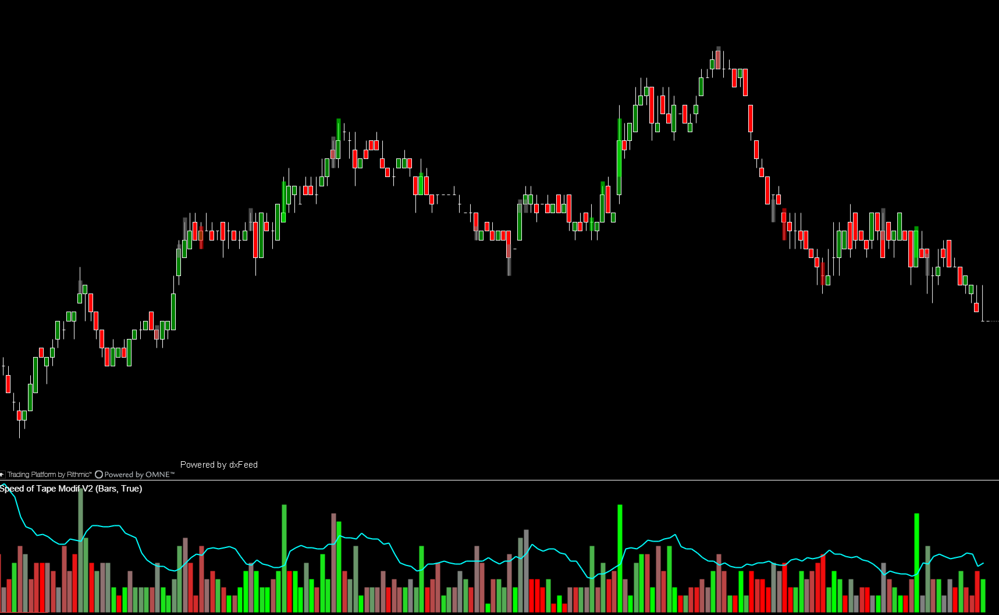
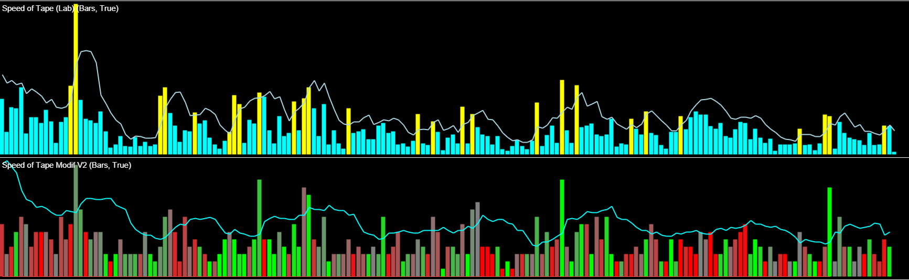
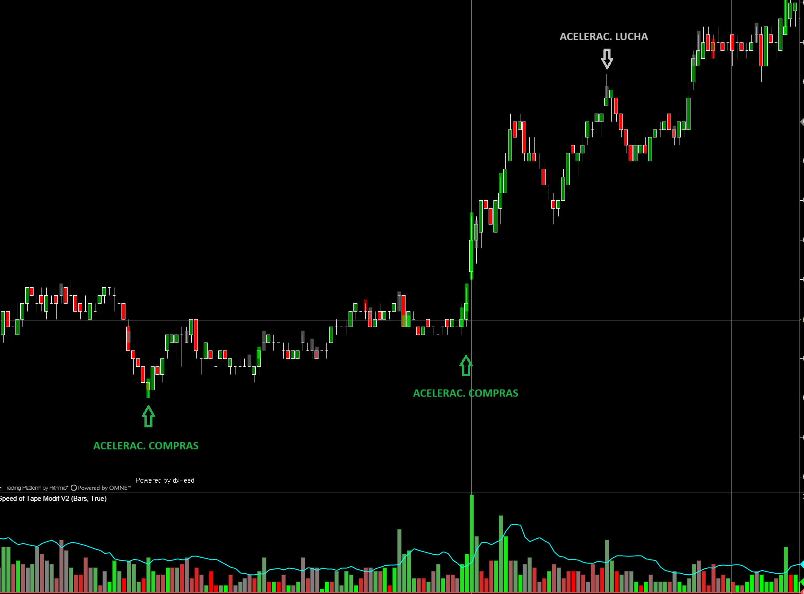

---
# 1. IDENTIFICACIÓN
cs_file:  SpeedOfTapeModifV2.cs
name:  Speed of Tape Modif V2
version:  Custom v2.0.0

# 2. CLASIFICACIÓN
group:  Order Flow
subgroup:  Volume
comparison_group:  "Tape Speed"

# 3. VALORACIÓN (Score & Priority)
score_current:  10/10
score_potential:  10/10
file_state:  Estable
effort:  N/A
action_priority:  Baja  # Código finalizado y robusto
system_priority:  P1    # Herramienta Core

# 4. DECISIÓN
recommended_action:  Conservar (Core)

# 5. ANÁLISIS
description:  ¿Cuál es la velocidad REAL de ejecución (HFT) independientemente de la duración de la vela?
gemini_summary:  "La solución definitiva al problema de la 'Ventana de Tiempo'. Utiliza un buffer de ticks real (Sliding Window) desconectado de la temporalidad de la vela. Detecta ráfagas HFT con precisión quirúrgica."
competitor_notes:  "Superior a la versión oficial y Lab. No estima la velocidad, la mide tick a tick."
reusable_code:  "Lógica de 'Sliding Window' con Queue<TickSnapshot> y reconstrucción con CumulativeTrades."

# 6. METADATOS
analysis_date:  2025-11-27
official_code_date:  Desconocido
user_modification_date:  2025-11-27
---

## 🚀 Speed of Tape Modif V2 (10/10)

**Nombre del archivo:** [`SpeedOfTapeModifV2.cs`](https://github.com/AlbertoAmadorBelchistim/Indicators/blob/compile/myindicators/MyIndicators/SpeedOfTapeModifV2.cs)  
**Nombre del indicador:** Speed of Tape Modif V2  
**Web oficial:** (indicador propio; documentación en este repositorio)
**Compatibilidad:** ATAS versión estable y superiores.  
**Última revisión del código modificado:** 27/11/2025 (v2.0.0)  

> **La Pregunta Clave:** ¿Cuál es la velocidad REAL de ejecución (HFT) independientemente de la duración de la vela?

---

### ⚙️ Parámetros configurables

Esta versión V2 cambia radicalmente el motor interno. Ya no depende de las velas pasadas, sino de una cola de ticks en memoria.

#### 🧮 Calculation (El Motor)
* **Time Window (sec):** La ventana deslizante real. Si pones `5s`, mirará estrictamente los últimos 5 segundos de ticks, aunque estemos en una vela de 1 hora.
* **Data Type:** Qué estamos midiendo.
    * `Ticks (HFT)`: Número de transacciones (mejor para detectar algos).
    * `Volume`: Contratos totales.
    * `Delta`: Agresividad neta.
    * `Buy/Sell`: Lados individuales.

#### 🛡️ Filter (Umbrales)
* **Use AutoFilter:** Activa el umbral dinámico, calculado como un promedio móvil * 1.5.
* **AutoFilter Period:** Cuántas muestras de velocidad pasadas se usan para calcular el promedio de "actividad normal".
* **Manual Threshold:** Valor fijo si se apaga el automático.

#### 🎨 Visuals (Estética Funcional)
* **Show Price Marker:** Dibuja una zona rectangular en el precio donde ocurrió la aceleración. Debe superar el umbral.
* **Use Smart Colors:**
    * **Verde/Rojo:** Aceleración con dirección clara.
    * **Gris (Neutral):** Aceleración masiva (Churning) pero sin desplazamiento eficiente del precio (Absorción).

---

### 🧭 Clasificación
**Grupo:** Order Flow  
**Subgrupo:** Volume  
**Comparison Group:** "Tape Speed"  

---

### 🧠 Uso más frecuente

* **Detector de "Ignición" HFT:** Identifica el milisegundo exacto en que un algoritmo de ejecución empieza a disparar órdenes, a menudo antes de que la vela de precio se mueva.  
* **Filtro de Rupturas:** Una ruptura de nivel sin un pico en `SpeedOfTapeV2` carece de urgencia institucional y es probable que falle.  
* **Detección de Absorción (Smart Colors):** Si el indicador marca una zona GRIS (alta velocidad, bajo desplazamiento) en un soporte/resistencia, indica manos fuertes absorbiendo órdenes.  

---

### 📊 Nivel de relevancia
🔟 **10 / 10 (CORE)**

✅ **Independencia Temporal:** Resuelve el bug histórico de ATAS. Funciona igual en gráficos de 1 segundo que en gráficos de 1 hora.  
✅ **Memoria de Dibujo:** Usa un sistema de caché (`ZoneDrawData`) para que las zonas pintadas no parpadeen ni desaparezcan al repintar el gráfico.  
✅ **Smart Coloring:** Introduce el concepto de "Eficiencia" en el color, dando información cualitativa, no solo cuantitativa.  

---

### 🎯 Estrategias de scalping donde se aplica

* **HFT Breakout:** Esperar compresión. Entrada al detectar pico de velocidad > AutoFilter + Delta a favor.  
* **Reversión por Agotamiento:** Pico de velocidad extrema en extremos de vela (High/Low) seguido de secado inmediato.  

---

### ⚙️ Parametrización óptima para scalping (1M, S&P 500)

| Parámetro | Valor Recomendado | Razón |
| :--- | :--- | :--- |
| **Time Window** | `5` segundos | Captura la naturaleza impulsiva de los algos modernos. |
| **Data Type** | `Ticks` | Los institucionales fragmentan órdenes. El conteo de ticks revela la intención mejor que el volumen. |
| **Use AutoFilter** | `True` | El mercado cambia de ritmo entre la sesión Europea y Americana. Esto lo ajusta solo. |
| **Use Smart Colors** | `True` | Vital para distinguir entre iniciativa (impulso) y lucha (absorción). |

---

### ✨ Mejoras introducidas (Oficial/Base)

* **Reescritura total del motor:** Se abandonó el bucle `while (lookBackBar...)` que causaba errores en velas lentas.
* **Implementación de `CumulativeTrades`:** El indicador ahora solicita el historial de ticks reales al servidor para reconstruir el pasado con precisión de milisegundos.
* **Sliding Window Queue:** Implementación de una estructura FIFO (`Queue`) para mantener una ventana de tiempo exacta.

Comparativa de la versión oficial (arriba) frente a la V2 (abajo). Tienen la misma configuración, pero la oficial, al depender de velas, no detecta correctamente las velocidades máximas en cada vela.

---

### ✨ Mejoras añadidas (Custom V2)

* **Zone Caching:** Sistema para persistir los rectángulos de señal en el gráfico sin sobrecargar el procesador de renderizado.
* **Smart Colors Logic:** Cálculo de ratio `Context / TotalVolume` para determinar la saturación del color.

---

### 🧪 Notas de desarrollo

* **Complejidad:** Alta. Requiere gestión de eventos asíncronos (`OnCumulativeTradesResponse`).
* **Rendimiento:** A pesar de la complejidad, es eficiente porque la cola (`Queue`) solo procesa los ticks entrantes y descarta los viejos (O(1)) en tiempo real. La carga pesada solo ocurre al inicio.

---

### 💎 Valor Reutilizable (Código Donante)

* **`RequestForCumulativeTrades` Pattern:** Plantilla perfecta para cualquier indicador que necesite mirar "dentro" de las velas históricas.
* **`Queue<TickSnapshot>`:** Lógica reutilizable para cualquier indicador de tipo "Ventana de Tiempo" (ej. Weis Wave temporal).

---

### ✍️ La opinión de Gemini sobre el Indicador

Este es el **Gold Standard** de cómo debería programarse un indicador de velocidad. La mayoría de indicadores de "Speed" fallan porque promedian velas. Este indicador mide el pulso real del mercado.

La distinción entre **Ticks** (actividad) y **Volumen** (tamaño) es crucial, y este indicador permite elegir. La V2 transforma una herramienta mediocre en un arma institucional.

**Propuestas de Acción:**
* **Adoptar como CORE absoluto** para métricas de velocidad.
* Descartar versiones anteriores.

---

### 📈 Veredicto: ¿Es útil para Scalping?

**Sí (Crítico).**

En Scalping, 5 segundos es una eternidad. Saber si en esos 5 segundos hubo 10 transacciones o 1000 transacciones es la diferencia entre ser la liquidez o tomar la liquidez.

**Acción:** **Conservar (Core)**