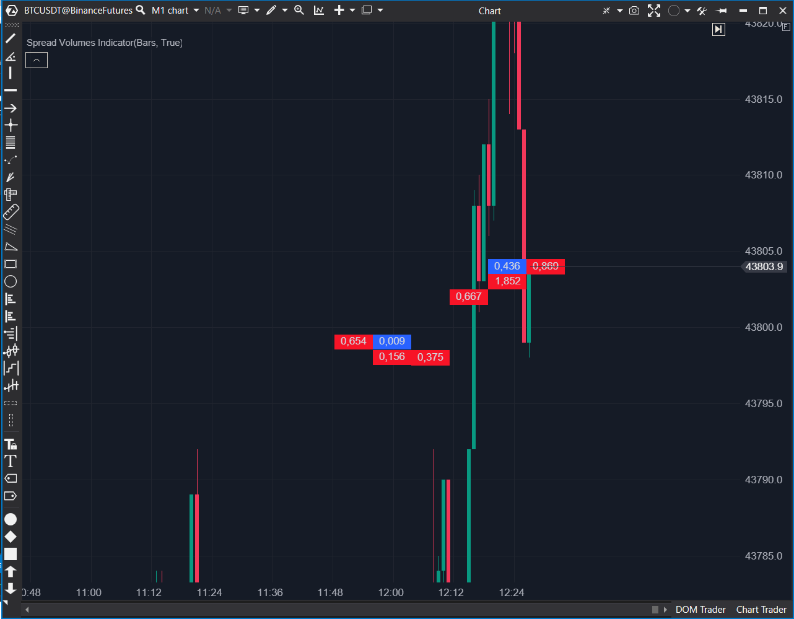

---
cs_file: SpreadVolume.cs
name: Spread Volume
group: Order Flow
subgroup: Volume
score_current: 7/10
version: Stable
recommended_action: Conservar (Reserva)
description: ¿Quién está agrediendo más dentro del spread actual?
gemini_summary: "Microscopio de agresión. Dibuja rectángulos de volumen Bid/Ask flotando en el gráfico. Excelente para ver absorción en tiempo real, aunque puede ensuciar el gráfico."
comparison_group: "VSA & Anomalies"
competitor_notes: "Único. Compite visualmente con el Footprint pero es más ligero."
reusable_code: null
file_state: Estable
score_potential: 8/10
effort: Medio
action_priority: P3
analysis_date: 2025-11-18
official_code_date: 20/10/2025
---

## 🛡️ Spread Volume (7/10)

**Nombre del archivo:** [`SpreadVolume.cs`](https://github.com/AlbertoAmadorBelchistim/Indicators/blob/Develop/Technical/SpreadVolume.cs)  
**Nombre del indicador:** Spread Volume  
**Web oficial:** [ATAS — Spread Volume](https://help.atas.net/support/solutions/articles/72000602630)  
**Compatibilidad:** ATAS versión estable y superiores.  
**Última revisión del código oficial:** 20/10/2025  

> **La Pregunta Clave:** ¿Quién está agrediendo más dentro del spread actual, los compradores (Ask) o los vendedores (Bid)?

---

### ⚙️ Parámetros configurables

* **Visuals:** Ancho, Espaciado, Offset, Colores.  

---

### 🧭 Clasificación
**Grupo:** Order Flow  
**Subgrupo:** Volume  
**Comparison Group:** "VSA & Anomalies"  

---

### 🧠 Uso más frecuente

* **Absorción en Vivo:** Ver crecer una barra roja (Ventas) en un soporte que no se rompe.  
* **Tick Scalping:** Operar el desequilibrio inmediato del spread.  

---

### 📊 Nivel de relevancia
🔟 **7 / 10**

✅ **Detalle:** Muestra la "pelea" dentro de la vela actual.  
✅ **Eficiente:** Limpia datos viejos automáticamente para ahorrar memoria.  
⛔ **Ruido:** Puede tapar el precio si no se configura bien.  

---

### 🎯 Estrategias de scalping donde se aplica

* **Rejection:** Gran volumen en un lado del spread sin movimiento de precio -> Contraataque.  

---

### ⚙️ Parametrización óptima para scalping (1M, S&P 500)

* **Width:** `15`.  
* **Offset:** `50`.  

---

### 🧪 Notas de desarrollo

* Construye su base de datos en memoria (`_prints`) escuchando `OnCumulativeTrade`.  
* Renderizado manual.  

---

### ❗ Incoherencias o aspectos mejorables detectados

* **Ninguna.** ---

### 🛠️ Propuestas de mejora

* **Filtro (P3):** Ocultar barras pequeñas para ver solo grandes agresiones.  

---

### 💎 Valor Reutilizable (Código Donante)

* **Ninguno.** ---

### ✍️ La opinión de Gemini sobre el Indicador

Es una herramienta de nicho para scalpers muy rápidos. Si operas mirando el DOM, esto te da una referencia visual en el chart.

**Propuestas de Acción:**
* **Conservar como Reserva.**

---

### 📈 Veredicto: ¿Es útil para Scalping?

**Sí.**

Para ver la agresión tick a tick.

**Acción:** **Conservar (Reserva).**

