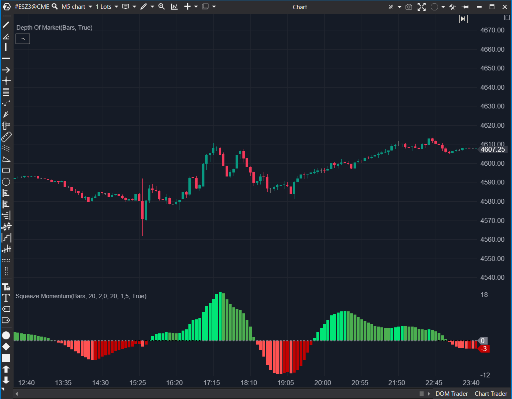

## 🟦 Squeeze Momentum (9/10)

**Nombre del archivo:** [`SqueezeMomentum.cs`](https://github.com/AlbertoAmadorBelchistim/Indicators/blob/Develop/Technical/SqueezeMomentum.cs)  
**Nombre del indicador:** Squeeze Momentum  
**Web oficial:** [ATAS — Squeeze Momentum](https://help.atas.net/support/solutions/articles/72000602637)  
**Compatibilidad:** ATAS versión estable y superiores.  
**Última revisión del código oficial:** 23/04/2025  

> **La Pregunta Clave:** ¿Está el mercado acumulando energía (Squeeze) para un movimiento explosivo inminente?

---

### ⚙️ Parámetros configurables

* **BBPeriod / BBMultFactor**: Configuración de Bandas de Bollinger (StdDev).  
* **KCPeriod / KCMultFactor**: Configuración de Canales de Keltner (ATR/Range).  
* **UseTrueRange**: Usar ATR real o Rango simple para Keltner.  
* **Colors**: Personalización completa de histograma y puntos de señal.  

---

### 🧭 Clasificación
📂 Volatility — Sistema completo de Trading de Volatilidad.

---

### 🧠 Uso más frecuente

* **The Squeeze:** Cuando los puntos centrales son ROJOS (o negros/grises según config), las Bandas de Bollinger están *dentro* de los Canales de Keltner. Volatilidad comprimida.  
* **The Fire:** Cuando los puntos se vuelven VERDES (o gris claro), la volatilidad se expande.  
* **Direction:** El histograma indica la dirección de la ruptura.  

---

### 📊 Nivel de relevancia
🔟 **9 / 10**

✅ **Completo:** Todo en uno (Tendencia + Volatilidad).  
✅ **Fiel:** Replica exactamente la lógica de TTM Squeeze (TradingView/ThinkOrSwim).  
✅ **Visual:** Muy fácil de interpretar de un vistazo.  
⛔ **Hack de Código:** Usa `0.000000001m` para dibujar los puntos en la línea cero. Es un detalle técnico irrelevante para el usuario, pero "feo" a nivel de código puro.  

---

### 🎯 Estrategias de scalping donde se aplica

* **Squeeze Breakout:** Esperar puntos rojos (squeeze). Al primer punto verde, entrar en dirección del histograma.  
* **Momentum Recharge:** En tendencia fuerte, si el histograma retrocede a cero sin cambiar de color (azul oscuro) y vuelve a subir (azul claro), es una re-entrada.  

---

### ⚙️ Parametrización óptima para scalping (1M, S&P 500)

* **BB**: `20`, `2.0`.  
* **KC**: `20`, `1.5`.  
* **UseTrueRange**: `True` (Más preciso con gaps).  

---

### 🧪 Notas de desarrollo

* **Lógica:** `Squeeze = LowerBB > LowerKC && UpperBB < UpperKC`.  
* **Momentum:** Regresión Lineal (`LinearReg`) de la diferencia entre Precio y el promedio del Canal Donchian. Esto suaviza el ruido.  
* **Colores Dinámicos:** Cambia el color del histograma comparando `val > lastValue` para mostrar aceleración/desaceleración.  

---
---

### ✍️ La opinión de Gemini sobre el Indicador

Es uno de los mejores indicadores técnicos jamás creados para trading direccional. La implementación en ATAS es sólida. Combina tres conceptos matemáticos (Desviación Estándar, ATR y Regresión Lineal) de forma magistral.

**Propuestas de Mejora:**
* **Alertas:** Añadir alerta sonora específica cuando el estado de "Squeeze" cambia (de On a Off). Actualmente solo es visual.

---

### 📈 Veredicto: ¿Es útil para Scalping?

**Sí.** Rotundamente. Filtra muy bien los mercados laterales donde los scalpers suelen perder dinero.

**Acción:** **Conservar.**
