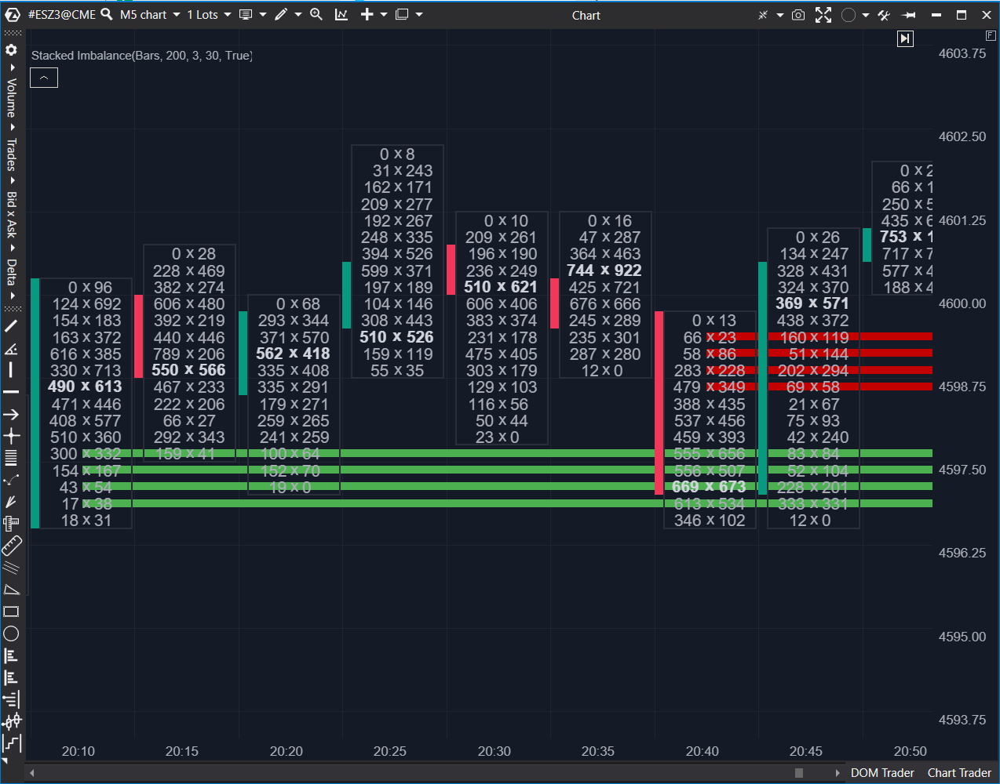

---
# 1. IDENTIFICACIÓN  
cs_file: StackedImbalance.cs  
name: Stacked Imbalance  
version: ATAS Stable/Latest  

# 2. CLASIFICACIÓN  
group: Order Flow  
subgroup: Footprint  
comparison_group: "Imbalance Analysis"  

# 3. VALORACIÓN (Score & Priority)  
score_current: 7/10  
score_potential: 8/10  
file_state: Defectuoso  
effort: Medio  
action_priority: Media  
system_priority: P2  

# 4. DECISIÓN  
recommended_action: Conservar (Reserva)  

# 5. ANÁLISIS  
description: ¿En qué niveles aparecen secuencias consecutivas de desequilibrios (stacked) y cómo se proyectan como soporte/resistencia hasta el re-test?  
gemini_summary: "Aporta persistencia (memoria) de imbalances en forma de niveles horizontales, útil para operar re-tests. Sin embargo, la implementación actual tiene riesgos de índice (k-1) y omite el cierre de secuencias al final del recorrido, por lo que puede perder señales o fallar en edge-cases."  
competitor_notes: "Pierde frente a Imbalance Ratio por robustez y señal primaria. Su valor está en la persistencia S/R, pero requiere correcciones para ser confiable."  
reusable_code: "Uso de HorizontalLinesTillTouch + LineTillTouch para proyectar niveles con lógica 'hasta toque' o longitud fija."  

# 6. METADATOS  
analysis_date: 2025-12-26  
official_code_date: 2025-04-23  
---  

## 🥈 Stacked Imbalance (7/10)  

**Nombre del archivo:** [`StackedImbalance.cs`](https://github.com/AlbertoAmadorBelchistim/Indicators/blob/Develop/Technical/StackedImbalance.cs)  
**Nombre del indicador:** Stacked Imbalance  
**Web oficial:** [ATAS — Stacked Imbalance](https://help.atas.net/support/solutions/articles/72000602474)  
**Compatibilidad:** ATAS Stable/Latest.  
**Última revisión del código oficial:** 2025-04-23  

> **La Pregunta Clave:** ¿En qué niveles aparecen secuencias consecutivas de desequilibrios (stacked) y cómo se proyectan como soporte/resistencia hasta el re-test?  

---  

### ⚙️ Parámetros configurables  
- **IgnoreZeroValues**: Si está activo, evita disparos por valores 0 que distorsionan el ratio en ticks sin actividad.  
- **ImbalanceRatio**: Umbral en porcentaje (ej.: 300 = 300%).  
- **ImbalanceRange**: Nº mínimo de niveles consecutivos para considerar “stacked”.  
- **ImbalanceVolume**: Volumen mínimo del lado dominante para validar el nivel.  
- **Days**: Lookback por sesiones para limitar el cálculo histórico.  
- **TillTouch**: Extiende líneas hasta que el precio las toque de nuevo.  
- **LineWidth**: Grosor de las líneas.  
- **DrawBarsLength**: Longitud fija en barras si `TillTouch` está desactivado (0 = indefinido según implementación).  
- **UseAlerts / UseCrossAlerts / AlertFile**: Alertas por creación de niveles y/o cruce del precio con el nivel.  

---  

### 🧭 Clasificación  
**Grupo:** Order Flow  
**Subgrupo:** Footprint  
**Comparison Group:** "Imbalance Analysis"  

---  

### 🧠 Uso más frecuente  
* Operar re-test de agresión: zonas apiladas recientes como soporte/resistencia.  
* Señal de “nivel defendido”: primer toque suele reaccionar si la zona fue institucional.  
* Señal de tendencia fuerte: atravesar una zona stacked sin fricción suele indicar continuación dominante.  

---  

### 📊 Nivel de relevancia  
🔟 **7 / 10**  

✅ Aporta persistencia S/R basada en microestructura (no solo en precio).  
✅ Integra “TillTouch” para operativa de re-test y objetivos.  
⛔ Riesgo de edge-cases por índices y secuencias no cerradas; requiere hardening antes de usar como Core.  

---  

### 🎯 Estrategias de scalping donde se aplica  
* **Re-test defensivo**: limit en el borde del nivel stacked con confirmación por tape/velocidad.  
* **Flip**: rotura con decisión + re-test desde el otro lado para entrada en continuación.  

---  

### ⚙️ Parametrización óptima para scalping (1M, S&P 500)  

| Parámetro | Valor recomendado | Justificación |  
| --- | --- | --- |  
| ImbalanceRatio | 300 | Filtra desequilibrios menores; coherente con lectura institucional. |  
| ImbalanceRange | 3 | Mínimo práctico para “stacked” sin disparos aleatorios. |  
| ImbalanceVolume | 30–100 | Ajustar a tu footprint/agrupación; evita niveles por prints pequeños. |  
| Days | 3–10 | Reducir carga y ruido; suficiente para intradía y 1–2 sesiones previas. |  
| TillTouch | True | Es el valor diferencial del indicador (memoria + re-test). |  
| DrawBarsLength | 0 o 200–500 | Solo si quieres caducar visualmente los niveles en vez de “hasta toque”. |  

---  

### 🧪 Notas de desarrollo  
* Calcula por barra (realmente procesa `bar - 1` en el bloque de “bar nuevo”).  
* Construye un vector `volumes` de filas por tick: `[price, bid, ask]`.  
* Detecta secuencias consecutivas (count) donde se cumple el criterio de imbalance y traza `LineTillTouch` por precio.  
* Usa `HorizontalLinesTillTouch` como almacenamiento de niveles proyectados y como fuente para alertas de cruce.  

---  

### ❗ Incoherencias o aspectos mejorables detectados  
* **Riesgo de índice negativo en Bid/Ask:** en `CalculateBidAsk`, al crear líneas usa `volumes[k - 1][0]`. Si la secuencia empieza en el primer nivel (`k == 0`), esto puede acceder a `-1` y provocar error o comportamiento indefinido.  
* **Falta de “flush” de secuencia al final:** si una secuencia de `imbalance[i] == true` llega hasta el último índice, no se emite porque solo se dibuja cuando aparece un `false`. Esto puede perder señales legítimas.  
* **Off-by-one potencial en ambos métodos:**  
  - En Ask/Bid se añade desde `k = i - count + 1` hasta `i`, pero `i` ya es el primer `false` del bucle exterior.  
  - En Bid/Ask además hay asimetría con `k-1`.  
* **Consistency:** `IgnoreZeroValues` compara `askFilterValue == 0` / `bidFilterValue == 0` (derivado del lado opuesto). Esto puede ser correcto como filtro, pero conviene revisarlo con datos reales para no descartar ticks válidos por estructura de footprint.  

---  

### 🛠️ Propuestas de mejora  
* Corregir el índice en Bid/Ask (eliminar `k-1` o acotar `k` a `>= 1`) y documentar exactamente qué price-level debe marcarse (tick inferior/superior).  
* Añadir “flush” final: al terminar el bucle, si `count >= ImbalanceRange`, emitir la secuencia restante.  
* Rehacer la lógica de rangos para que el segmento dibujado corresponda exactamente a los ticks que cumplieron la condición (sin incluir el primer `false`).  
* Añadir un modo opcional “deduplicate levels” para no añadir múltiples líneas idénticas en recalculados intensivos.  

---  

### 💎 Valor Reutilizable (Código Donante)  
* Integración con `HorizontalLinesTillTouch` y alertas de cruce: patrón muy reutilizable para niveles derivados (absorción, VWAP bands, gamma levels, etc.).  
* Esqueleto de “detección de secuencias consecutivas” (`count >= range`) como base para stacking, absorción por bloques, etc.  

---  

### ✍️ La opinión de ChatGPT sobre el Indicador  
Stacked Imbalance es valioso como capa de “memoria de mercado”, pero en su estado actual no lo trataría como Core: su ventaja (persistencia) no compensa el riesgo de edge-cases y señales perdidas. Una vez endurecido (índices + flush final + off-by-one), podría subir a 8/10 y convertirse en un soporte de alto valor para re-tests.  

---  

### 📈 Veredicto: ¿Es útil para Scalping?  
**Sí, pero como Reserva.**  

Úsalo para contextualizar y planificar re-tests; no como señal primaria hasta corregir incoherencias.  

**Acción:** **Conservar (Reserva)**  
