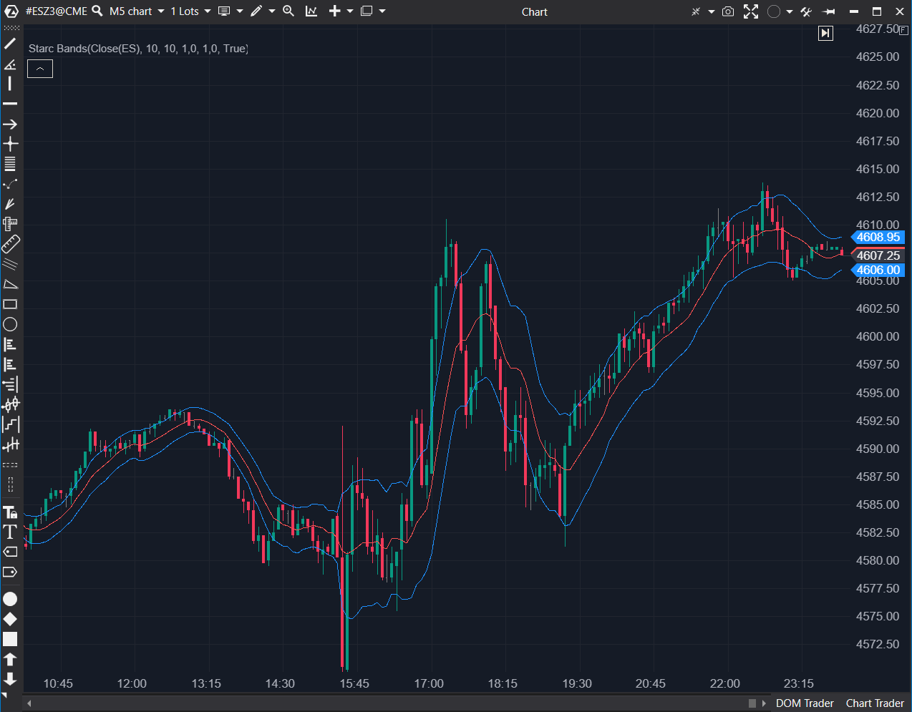

---
# --- Campos Públicos (Para INDICATORS.es) ---
cs_file: StarcBands.cs
name: Starc Bands
category: Volatility
score_current: 6/10
version: Stable
recommended_action: Mejorar
description: ¿Dónde están los límites de volatilidad basados en el rango medio verdadero (ATR) alrededor de la media?
# --- Campos de Triaje (Para ROADMAP.md) ---
gemini_summary: "Implementación funcional pero con código 'sucio' (parámetros obsoletos visibles en código)."
file_state: Mejorable
score_potential: 8/10
effort: Bajo
action_priority: P3
# --- Control de Versiones ---
analysis_date: 2025-11-18
official_code_date: 23/04/2025
user_modification_date: null
---

## 🟦 Starc Bands (6/10)

**Nombre del archivo:** [`StarcBands.cs`](https://github.com/AlbertoAmadorBelchistim/Indicators/blob/Develop/Technical/StarcBands.cs)  
**Nombre del indicador:** Starc Bands  
**Web oficial:** [ATAS — Starc Bands](https://help.atas.net/support/solutions/articles/72000602475)  
**Compatibilidad:** ATAS versión estable y superiores.  
**Última revisión del código oficial:** 23/04/2025  

> **La Pregunta Clave:** ¿Dónde están los límites de volatilidad basados en el rango medio verdadero (ATR) alrededor de la media?

---

### ⚙️ Parámetros configurables

* **Period**: Periodo de la Media Móvil Central (SMA).
* **SmaPeriod**: Periodo para el cálculo del ATR (Nombre confuso, debería ser `AtrPeriod`).
* **TopBand**: Multiplicador del ATR (Afecta a ambas bandas).
* **BotBand**: *Obsoleto/Ignorado*.

---

### 🧭 Clasificación
📂 Volatility — Bandas basadas en ATR (Stoller Average Range Channels).

---

### 🧠 Uso más frecuente

* **Límites de Rango:** A diferencia de Bollinger (que se contrae mucho), las STARC Bands son más estables porque el ATR cambia más suavemente que la desviación estándar.  
* **Stop Loss Dinámico:** Usar la banda exterior como trailing stop.  

---

### 📊 Nivel de relevancia
🔟 **6 / 10**

✅ **Estabilidad:** Ofrece canales más constantes que Bollinger.  
⛔ **Código Descuidado:** El parámetro `BotBand` está marcado como obsoleto pero sigue ahí, y el parámetro `SmaPeriod` en realidad controla el ATR, lo cual es confuso (`Display Name` es "ATR", pero la propiedad es `SmaPeriod`).  
⛔ **Simetría Forzada:** No permite tener un multiplicador diferente para arriba y abajo (usa `TopBand` para ambos).  

---

### 🎯 Estrategias de scalping donde se aplica

* **Entrada en Corrección:** En tendencia alcista, comprar cuando el precio toca la banda STARC inferior (zona de valor por ATR).  

---

### ⚙️ Parametrización óptima para scalping (1M, S&P 500)

* **Period (SMA)**: `20`.
* **ATR Period**: `10`.
* **Multiplier**: `2.0`.

---

### 🧪 Notas de desarrollo

* **Incoherencia:** La propiedad `SmaPeriod` se asigna a `_atr.Period`. Esto es un error de nombrado (naming convention bad practice). Debería llamarse `AtrPeriod`.
* **BotBand:** Existe `[Obsolete] public decimal BotBand`, pero en `OnCalculate` se usa `_topBand` para restar la banda inferior. El usuario no puede controlar la banda inferior independientemente.

---
---

### ✍️ La opinión de Gemini sobre el Indicador

Funciona, pero el código necesita una limpieza de refactorización ("Housekeeping"). Los nombres de variables son confusos y hay código muerto expuesto.

**Propuestas de Mejora:**
* **Limpieza:** Eliminar `BotBand` totalmente o reactivarlo para permitir bandas asimétricas.
* **Renombrado:** Cambiar `SmaPeriod` a `AtrPeriod` para claridad en el código.

---

### 📈 Veredicto: ¿Es útil para Scalping?

**Sí.** El ATR es una medida excelente para scalping, y estas bandas lo proyectan bien.

**Acción:** **Mejorar (Limpieza de código y parámetros).**