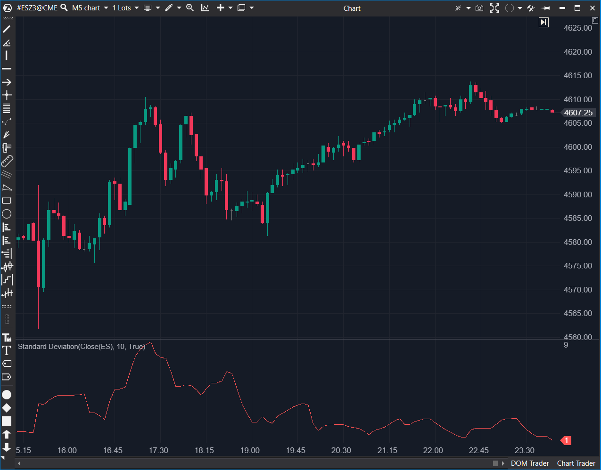

## 🟦 Standard Deviation (StdDev) (8/10)

**Nombre del archivo:** [`StdDev.cs`](https://github.com/AlbertoAmadorBelchistim/Indicators/blob/Develop/Technical/StdDev.cs)  
**Nombre del indicador:** Standard Deviation  
**Web oficial:** [ATAS — Standard Deviation](https://help.atas.net/support/solutions/articles/72000602477)  
**Compatibilidad:** ATAS versión estable y superiores.  
**Última revisión del código oficial:** 23/04/2025  

> **La Pregunta Clave:** ¿Cuánto se está alejando el precio de su media (volatilidad absoluta)?

---

### ⚙️ Parámetros configurables

* **Period**: Número de barras para calcular la media y la varianza.

---

### 🧭 Clasificación
📂 Volatility — Medida estadística de dispersión.

---

### 🧠 Uso más frecuente

* **Detección de Squeeze:** Valores extremadamente bajos indican compresión y posible explosión inminente.  
* **Final de Tendencia:** Valores extremadamente altos indican pánico o euforia insostenible.  

---

### 📊 Nivel de relevancia
🔟 **8 / 10**

✅ **Universal:** Es la base de las Bandas de Bollinger y muchos algoritmos de riesgo.  
✅ **Código Limpio:** Implementación canónica de la fórmula de raíz cuadrada de la varianza.  
⛔ **Interpretación:** El valor es absoluto (en precio), no porcentual, lo que dificulta comparar activos de distinto valor nominal.  

---

### 🎯 Estrategias de scalping donde se aplica

* **Volatilidad Cíclica:** El mercado alterna entre baja y alta volatilidad. Si StdDev está en mínimos de sesión, prepárate para un breakout.  
* **Filtro de Ruido:** Si StdDev es muy alto, ampliar Stops.  

---

### ⚙️ Parametrización óptima para scalping (1M, S&P 500)

* **Period**: `20` (Estándar de Bollinger).

---

### 🧪 Notas de desarrollo

* **Fórmula:** $\sqrt{\frac{\sum(x - \mu)^2}{N}}$.
* **Implementación:** Usa un bucle simple `for` en cada cálculo. No es la implementación más optimizada (Welford's algorithm sería O(1)), pero dado que N suele ser pequeño, O(N) es aceptable y más fácil de leer.

---
---

### ✍️ La opinión de Gemini sobre el Indicador

Es un componente fundamental. No tiene nada especial, pero hace exactamente lo que dice la teoría estadística. Es sólido.

**Propuestas de Mejora:**
* **Normalización:** Añadir opción para mostrarlo como porcentaje del precio (Coeficiente de Variación) para comparar volatilidad entre activos.

---

### 📈 Veredicto: ¿Es útil para Scalping?

**Sí.** Principalmente para saber cuándo *no* operar (volatilidad muerta) o cuándo esperar latigazos.

**Acción:** **Conservar.**