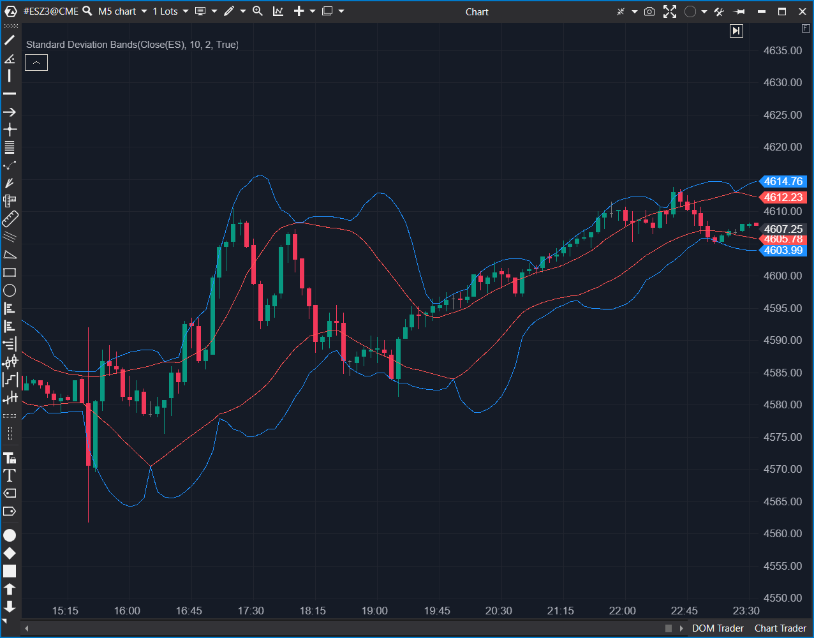

## 🟦 Standard Deviation Bands (StdDev Bands) (8/10)

**Nombre del archivo:** [`StdDevBands.cs`](https://github.com/AlbertoAmadorBelchistim/Indicators/blob/Develop/Technical/StdDevBands.cs)  
**Nombre del indicador:** Standard Deviation Bands  
**Web oficial:** [ATAS — Standard Deviation Bands](https://help.atas.net/support/solutions/articles/72000602614)  
**Compatibilidad:** ATAS versión estable y superiores.  
**Última revisión del código oficial:** 23/04/2025  

> **La Pregunta Clave:** ¿Está el precio alcanzando extremos estadísticos de volatilidad basados en máximos y mínimos?

---

### ⚙️ Parámetros configurables

* **Period**: Ventana de cálculo (Estándar: 10).
* **BBandsWidth**: Multiplicador de desviación estándar (Estándar: 2).
* **Alerts**: Configuración exhaustiva de alertas para banda superior, inferior y medias.

---

### 🧭 Clasificación
📂 Volatility — Canal de precios estadístico. Similar a Bollinger Bands pero usando High/Low.

---

### 🧠 Uso más frecuente

* **Contención de Precio:** Al usar High/Low para el cálculo, las bandas "encierran" mejor la acción del precio que las Bollinger tradicionales (basadas en Close).  
* **Reversión a la Media:** Toque de banda superior + patrón de giro = Venta hacia la media.  

---

### 📊 Nivel de relevancia
🔟 **8 / 10**

✅ **Precisión en Mechas:** Al calcular la desviación sobre máximos y mínimos, se adapta mejor a la volatilidad intradía real que las Bollinger.  
✅ **Sistema de Alertas:** Muy completo, permite alertar cruces de cada línea individualmente.  
⛔ **Redundancia:** Se solapa conceptualmente con las Bandas de Bollinger, aunque el cálculo interno difiere ligeramente.  

---

### 🎯 Estrategias de scalping donde se aplica

* **Scalping de Bordes:** Vender cuando el precio toca la banda superior en un mercado lateral. Esta versión es mejor que Bollinger para esto porque las bandas son más "anchas" y filtran mejor los toques falsos.  

---

### ⚙️ Parametrización óptima para scalping (1M, S&P 500)

* **Period**: `20`.
* **Width**: `2.0` o `2.5` (Para asegurar que solo capturamos extremos reales).

---

### 🧪 Notas de desarrollo

* **Arquitectura Interna:** Instancia múltiples objetos: `Highest`, `Lowest`, `SMA` (High/Low), `StdDev` (High/Low). Es un ensamblaje de otros indicadores.
* **Cálculo:** `Top = SMA(High) + Width * StdDev(High)`. Esto es diferente a Bollinger (`SMA(Close) + Width * StdDev(Close)`). Es una distinción técnica importante.

---
---

### ✍️ La opinión de Gemini sobre el Indicador

Es una mejora técnica sobre las Bandas de Bollinger para traders que operan mirando las mechas de las velas. El código es limpio y reutiliza componentes existentes.

**Propuestas de Mejora:**
* Ninguna crítica significativa. Es una variante útil bien implementada.

---

### 📈 Veredicto: ¿Es útil para Scalping?

**Sí.** Mejor que Bollinger para mercados con muchas "mechas" largas (como Crypto o NQ).

**Acción:** **Conservar.**