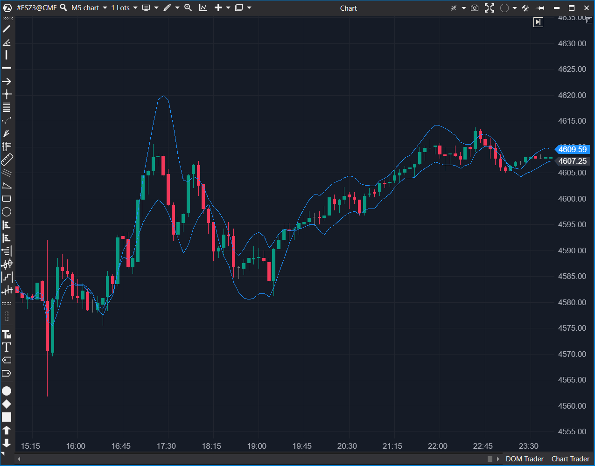

---
cs_file: StdErrBands.cs
name: Standard Error Bands
category: Trend
group: Trend
subgroup: Volatility
score_current: 8/10
version: Stable
recommended_action: Conservar
description: ¿Cuál es el rango de error estadístico esperado alrededor de la tendencia?
gemini_summary: "Bandas basadas en Regresión Lineal y Error Estándar. Matemáticamente denso pero correcto."
comparison_group: "Volatility Bands"
competitor_notes: "Alternativa a LinReg Channel."
reusable_code: null
file_state: Estable
score_potential: 8/10
effort: Medio
action_priority: N/A
analysis_date: 2025-11-18
official_code_date: 23/04/2025
---

## 🟦 Standard Error Bands (StdErr Bands) (8/10)

**Nombre del archivo:** [`StdErrBands.cs`](https://github.com/AlbertoAmadorBelchistim/Indicators/blob/Develop/Technical/StdErrBands.cs)  
**Nombre del indicador:** Standard Error Bands  
**Web oficial:** [ATAS — Standard Error Bands](https://help.atas.net/support/solutions/articles/72000602232)  
**Compatibilidad:** ATAS versión estable y superiores.  
**Última revisión del código oficial:** 23/04/2025  

> **La Pregunta Clave:** ¿Cuál es el rango de error estadístico esperado alrededor de la tendencia de regresión actual?

---

### ⚙️ Parámetros configurables

* **Period**: Ventana para la regresión lineal (Estándar: 10).
* **StdDev**: Multiplicador del Error Estándar (no desviación típica) para el ancho.

---

### 🧭 Clasificación
📂 Volatility — Canal de tendencia basado en estadística de regresión.

---

### 🧠 Uso más frecuente

* **Tendencia Definida:** A diferencia de las bandas basadas en medias (que tienen lag), las bandas de regresión se ajustan a la pendiente actual del precio.  
* **Trading de Canal:** El precio tiende a oscilar alrededor de la línea de regresión dentro del error estándar.  

---

### 📊 Nivel de relevancia
🔟 **8 / 10**

✅ **Reactividad:** La línea central (Linear Regression) reacciona más rápido a cambios de dirección que una SMA.  
✅ **Rigor Matemático:** Implementa correctamente el cálculo de Error Estándar de la Estimación ($SEE$).  
⛔ **Repintado (Visual):** Aunque el indicador no repinta el pasado, la naturaleza de la regresión lineal puede hacer parecer que el canal "predijo" el movimiento mejor de lo que lo hizo en tiempo real (ilusión visual del ajuste).  

---

### 🎯 Estrategias de scalping donde se aplica

* **Trend Following:** Mientras el precio se mantenga dentro del canal inclinado, mantener la posición. Salir si rompe el canal en contra de la pendiente.  

---

### ⚙️ Parametrización óptima para scalping (1M, S&P 500)

* **Period**: `21`.
* **StdDev**: `2`.

---

### 🧪 Notas de desarrollo

* **Matemáticas:** Calcula la suma de cuadrados de los residuos (`diffSum`) respecto a la línea de regresión.
* **Complejidad:** El cálculo manual dentro de `OnCalculate` es un poco denso, pero necesario ya que ATAS no parece exponer una función nativa pública de "StandardError".
* **Código:** `_linReg[bar] + _stdDev * se`. Correcto.

---
---

### ✍️ La opinión de Gemini sobre el Indicador

Es una herramienta sofisticada. Muchos traders confunden "Desviación Estándar" con "Error Estándar". Este indicador usa el segundo, que es la medida correcta cuando se usa una línea de regresión como base.

**Propuestas de Mejora:**
* **Visualización:** Añadir una opción para colorear el fondo del canal (relleno semitransparente) para resaltar la tendencia.

---

### 📈 Veredicto: ¿Es útil para Scalping?

**Sí.** Especialmente en tendencias fuertes y ordenadas.

**Acción:** **Conservar.**