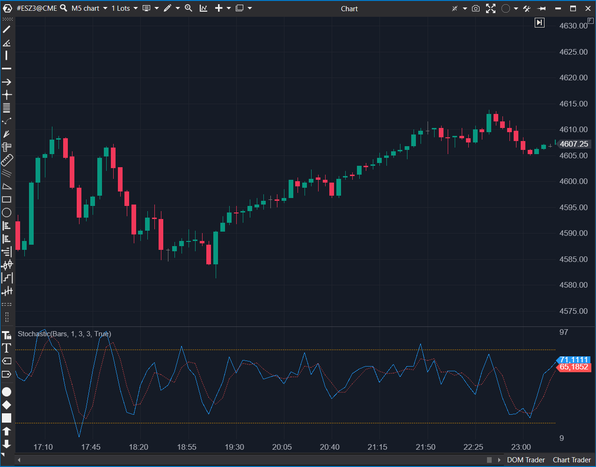

## 🟦 Stochastic (8/10)

**Nombre del archivo:** [`Stochastic.cs`](https://github.com/AlbertoAmadorBelchistim/Indicators/blob/Develop/Technical/Stochastic.cs)  
**Nombre del indicador:** Stochastic  
**Web oficial:** [ATAS — Stochastic](https://help.atas.net/support/solutions/articles/72000602478)  
**Compatibilidad:** ATAS versión estable y superiores.  
**Última revisión del código oficial:** 23/04/2025  

> **La Pregunta Clave:** ¿Dónde cerró el precio en relación con su rango High-Low reciente?

---

### ⚙️ Parámetros configurables

* **Period**: Ventana de observación (ej. 14).  
* **Smooth**: Suavizado de la línea %K (slowing). Si es 1 = Fast Stochastic. Si es 3 = Slow Stochastic.  
* **AveragePeriod**: Suavizado para la línea %D (Señal).  
* **DrawLines**: Mostrar niveles 80/20.  

---

### 🧭 Clasificación
📂 Momentum — El oscilador clásico de George Lane.

---

### 🧠 Uso más frecuente

* **Sobrecompra/Venta:** >80 Venta, <20 Compra.  
* **Cruce %K / %D:** Señal de gatillo.  
* **Divergencia:** La señal más potente del estocástico. Precio sube, Estocástico baja.  

---

### 📊 Nivel de relevancia
🔟 **8 / 10**

✅ **Estándar de Oro:** Implementa correctamente las variantes Fast, Slow y Full mediante los parámetros `Smooth` y `AveragePeriod`.  
✅ **Código Limpio:** Estructura clara, uso de clases `Highest` y `Lowest`.  
✅ **Seguridad:** Maneja rangos planos (`highest - lowest == 0`) manteniendo el valor anterior.  

---

### 🎯 Estrategias de scalping donde se aplica

* **Flag Limit:** En tendencia fuerte, entrar cuando el estocástico retrocede a 50 y rebota, o cuando baja a 20 y cruza al alza (Pullback).  
* **Rango:** Comprar en 20, Vender en 80 en mercados laterales.  

---

### ⚙️ Parametrización óptima para scalping (1M, S&P 500)

* **Full Stochastic:** `14`, `3`, `3` (Estándar).  
* **Fast Scalp:** `5`, `3`, `3` (Más reactivo).  

---

### 🧪 Notas de desarrollo

* **Lógica:** `RawK = 100 * (C - Low) / (High - Low)`.
* **Suavizado:** `K = SMA(RawK, Smooth)`. `D = SMA(K, AveragePeriod)`.
* **Implementación:** Correcta. Usa `ValueDataSeries` separadas para K y D.

---
---

### ✍️ La opinión de Gemini sobre el Indicador

Es el indicador que esperas encontrar. Cumple todas las expectativas de un trader profesional. No hay sorpresas ni fallos.

**Propuestas de Mejora:**
* **Color Dinámico:** Opción para pintar la zona entre 20 y 80 o rellenar el espacio entre K y D ("Cloud").

---

### 📈 Veredicto: ¿Es útil para Scalping?

**Sí.** Esencial para medir ciclos de oscilación cortos.

**Acción:** **Conservar.**