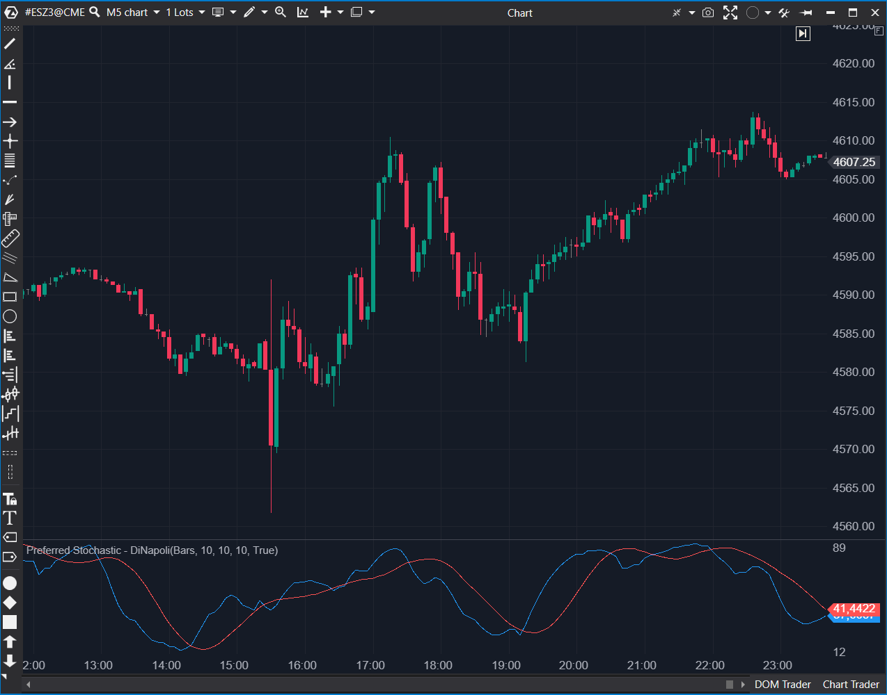

## 🟦 Preferred Stochastic - DiNapoli (7/10)

**Nombre del archivo:** [`StochasticDiNapoli.cs`](https://github.com/AlbertoAmadorBelchistim/Indicators/blob/Develop/Technical/StochasticDiNapoli.cs)  
**Nombre del indicador:** Preferred Stochastic - DiNapoli  
**Web oficial:** [ATAS — Preferred Stochastic](https://help.atas.net/support/solutions/articles/72000602575)  
**Compatibilidad:** ATAS versión estable y superiores.  
**Última revisión del código oficial:** 23/04/2025  

> **La Pregunta Clave:** ¿Cómo filtrar el ruido del estocástico usando el método de suavizado de DiNapoli?

---

### ⚙️ Parámetros configurables

* **PeriodK**: Periodo base.  
* **PeriodD**: Primer suavizado.  
* **SlowPeriodD**: Suavizado final para la línea de señal.  

---

### 🧭 Clasificación
📂 Momentum — Estocástico modificado para evitar señales falsas en tendencias fuertes ("Preferred Stochastic").

---

### 🧠 Uso más frecuente

* **Técnica DiNapoli:** Joe DiNapoli usa esto para filtrar tendencias. La configuración clásica es 8-3-3.  
* **Cruce Confirmado:** Debido a su suavizado especial, los cruces suelen ser más fiables que en el estocástico estándar.  

---

### 📊 Nivel de relevancia
🔟 **7 / 10**

✅ **Suavizado Superior:** Reduce las "sierras" (whipsaws) del mercado.  
✅ **Especificidad:** Implementa exactamente la lógica descrita por DiNapoli.  
⛔ **Caja Negra:** El código depende de `KdFast` y `KdSlow`, clases no visibles en el script, lo que impide auditar la fórmula exacta del suavizado inicial.  

---

### 🎯 Estrategias de scalping donde se aplica

* **DiNapoli Levels:** Usar en conjunción con retrocesos de Fibonacci (38.2 / 61.8). Si el precio toca el Fib y el Estocástico cruza, es entrada de alta probabilidad.  

---

### ⚙️ Parametrización óptima para scalping (1M, S&P 500)

* **Configuración Clásica:** `8`, `3`, `3`. No reinventar la rueda aquí, usar los valores del autor.

---

### 🧪 Notas de desarrollo

* **Dependencias:** Usa `KdFast` y `KdSlow` como indicadores hijos (`Add(_kdFast)`). Esto es una arquitectura de composición.  
* **Cálculo Manual:** Calcula la línea lenta manualmente: `prev + (fast - prev) / Period`. Esto es matemáticamente una SMMA (Smoothed Moving Average), consistente con la teoría de DiNapoli.  

---
---

### ✍️ La opinión de Gemini sobre el Indicador

Es un indicador de nicho para seguidores de la metodología DiNapoli. Funciona bien y es más estable que el estocástico estándar.

**Propuestas de Mejora:**
* Ninguna. Debe mantenerse fiel al método original.

---

### 📈 Veredicto: ¿Es útil para Scalping?

**Sí.** Especialmente para setups de retroceso profundo.

**Acción:** **Conservar.**
