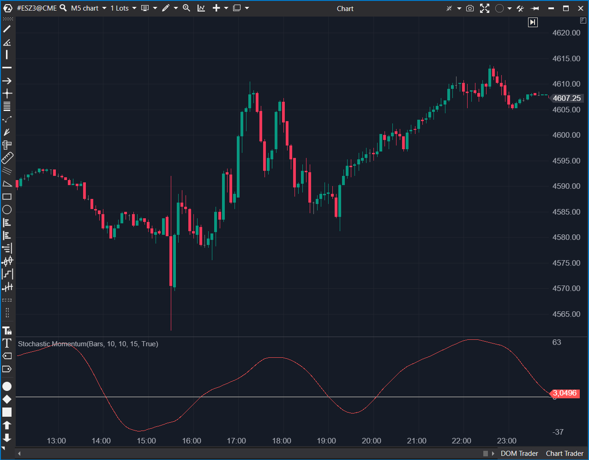

## 🟦 Stochastic Momentum (7/10)

**Nombre del archivo:** [`StochasticMomentum.cs`](https://github.com/AlbertoAmadorBelchistim/Indicators/blob/Develop/Technical/StochasticMomentum.cs)  
**Nombre del indicador:** Stochastic Momentum  
**Web oficial:** [ATAS — Stochastic Momentum](https://help.atas.net/support/solutions/articles/72000602480)  
**Compatibilidad:** ATAS versión estable y superiores.  
**Última revisión del código oficial:** 23/04/2025  

> **La Pregunta Clave:** ¿Cuál es el impulso del precio relativo al centro de su rango (SMI) en lugar de al mínimo?

---

### ⚙️ Parámetros configurables

* **PeriodK**: Ventana para el cálculo de máximos y mínimos (Rango).  
* **PeriodD**: Periodo de suavizado doble (EMA) para el rango y la distancia al centro.  
* **EMA**: Periodo de suavizado final de la línea SMI resultante.  

---

### 🧭 Clasificación
📂 Momentum — Oscilador refinado que mide la distancia del cierre respecto al punto medio del rango (High-Low).

---

### 🧠 Uso más frecuente

* **Detección de Extremos:** Funciona entre -100 y +100 (o valores escalados). Valores sobre +40 suelen ser sobrecompra extrema.  
* **Divergencias:** Al ser más suave que el estocástico normal, muestra divergencias más claras y con menos ruido.  

---

### 📊 Nivel de relevancia
🔟 **7 / 10**

✅ **Menos Ruido:** El uso de EMAs en cascada filtra mejor el ruido que el Estocástico simple.  
✅ **Centro de Gravedad:** Al usar el punto medio `(H+L)/2`, da una visión más centrada del mercado.  
⛔ **Sin Señal:** Esta implementación dibuja una sola línea. Falta una línea de señal para cruces directos.  
⛔ **Riesgo Matemático:** Divide por el rango suavizado sin una comprobación explícita de seguridad contra cero (aunque es improbable con EMAs).  

---

### 🎯 Estrategias de scalping donde se aplica

* **Trend Re-entry:** En tendencia alcista, esperar a que el SMI baje de cero y gire hacia arriba.  
* **Divergencia de Momentum:** Precio hace nuevo máximo, SMI hace máximo menor → Venta.  

---

### ⚙️ Parametrización óptima para scalping (1M, S&P 500)

* **PeriodK**: `10`.  
* **PeriodD**: `3`.  
* **EMA**: `3` (Para hacerlo más reactivo).  

---

### 🧪 Notas de desarrollo

* **Fórmula SMI:** $100 \times \frac{EMA(EMA(C - 0.5(H+L)))}{0.5 \times EMA(EMA(H-L))}$. El código usa un multiplicador de 200 que matemáticamente compensa el 0.5 del denominador. Correcto.  
* **Visualización:** Renderiza una sola serie (`_renderSeries`). Sería ideal tener una segunda serie como señal.  

---
---

### ✍️ La opinión de Gemini sobre el Indicador

Es una herramienta técnica superior al Estocástico clásico para determinar la tendencia del oscilador, pero inferior para señales de gatillo (trigger) debido a la falta de una línea de señal explícita en esta versión.

**Propuestas de Mejora:**
* **Línea de Señal:** Añadir una EMA del SMI como segunda línea para permitir cruces de compra/venta.

---

### 📈 Veredicto: ¿Es útil para Scalping?

**Sí.** Muy limpio para leer la inercia del precio.

**Acción:** **Conservar.**
