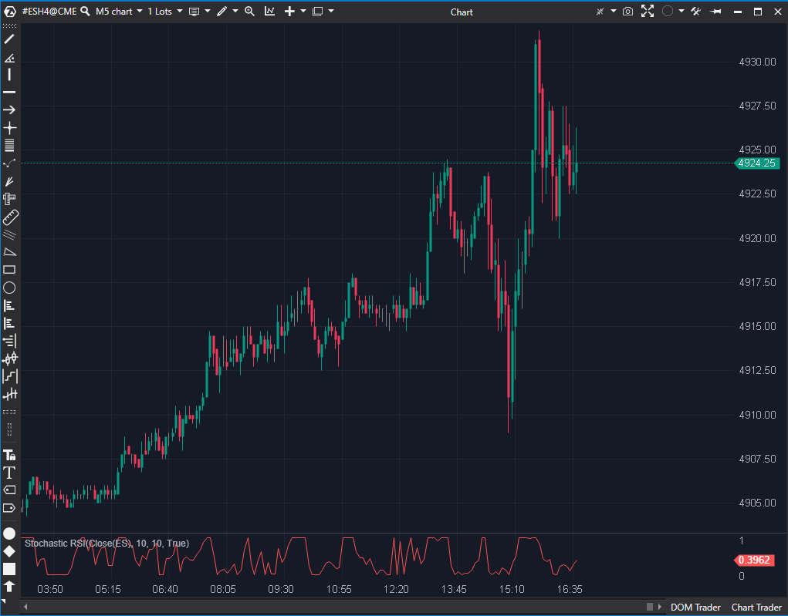

## 🟦 Stochastic RSI (6/10)

**Nombre del archivo:** [`StochasticRsi.cs`](https://github.com/AlbertoAmadorBelchistim/Indicators/blob/Develop/Technical/StochasticRsi.cs)  
**Nombre del indicador:** Stochastic RSI  
**Web oficial:** [ATAS — Stochastic RSI](https://help.atas.net/support/solutions/articles/72000602481)  
**Compatibilidad:** ATAS versión estable y superiores.  
**Última revisión del código oficial:** 23/04/2025  

> **La Pregunta Clave:** ¿En qué parte de su rango reciente se encuentra el RSI actual (Sensibilidad extrema)?

---

### ⚙️ Parámetros configurables

* **RsiPeriod**: Longitud del RSI base.  
* **Period**: Longitud del Estocástico aplicado al RSI.  

---

### 🧭 Clasificación
📂 Momentum — Indicador de "segunda derivada" (indicador de un indicador). Extremadamente sensible.

---

### 🧠 Uso más frecuente

* **Timing de Precisión:** El StochRSI se mueve de 0 a 1 (o 0 a 100) muy rápido. Sirve para entrar *exactamente* en el giro.  
* **Señales Rápidas:** En scalping, el RSI normal a veces no llega a extremos. El StochRSI siempre llega.  

---

### 📊 Nivel de relevancia
🔟 **6 / 10**

✅ **Concepto Potente:** Es el indicador favorito de muchos crypto-scalpers por su rapidez.  
✅ **Protección:** Código robusto ante valores planos (`maxRsi - minRsi == 0`).  
⛔ **Incompleto:** Esta versión solo dibuja la línea rápida (%K). Un StochRSI estándar tiene una línea de señal (%D) para operar el cruce. Sin ella, es demasiado ruidoso.  
⛔ **Escala:** Usa escala 0-1 internamente, aunque a veces se espera 0-100.  

---

### 🎯 Estrategias de scalping donde se aplica

* **Scalping de Rebote:** Comprar cuando StochRSI sale de 0.20 hacia arriba.  
* **Filtro de Cortos:** Si StochRSI > 0.80, prohibido vender hasta que gire.  

---

### ⚙️ Parametrización óptima para scalping (1M, S&P 500)

* **RSI**: `14`.  
* **Stoch**: `14`.  
* **Uso**: Necesita añadirse una media móvil simple de 3 periodos sobre este indicador para tener señales operables.  

---

### 🧪 Notas de desarrollo

* **Cálculo:** `(RSI - MinRSI) / (MaxRSI - MinRSI)`. Fórmula correcta.  
* **Clamp:** `Math.Max(0.01m, ...)` fuerza el valor mínimo a 0.01. Probablemente para evitar problemas de renderizado en log-scale o divisiones externas, aunque el StochRSI matemático puede ser 0 absoluto.  

---
---

### ✍️ La opinión de Gemini sobre el Indicador

Es una implementación "a medias". El StochRSI es útil por sus cruces. Al dar solo la línea cruda, obligas al usuario a añadir manualmente una SMA sobre el indicador para crear su propia señal. Debería venir de fábrica.

**Propuestas de Mejora:**
* **Añadir %D:** Incluir parámetro `Smooth` y `SignalPeriod` para dibujar la línea lenta y la de señal, como en TradingView.
* **Escala:** Estandarizar a 0-100 para consistencia con otros osciladores.

---

### 📈 Veredicto: ¿Es útil para Scalping?

**Sí, pero...** requiere configuración extra o mejoras en el código para ser cómodo.

**Acción:** **Mejorar (Añadir líneas de señal y suavizado).**