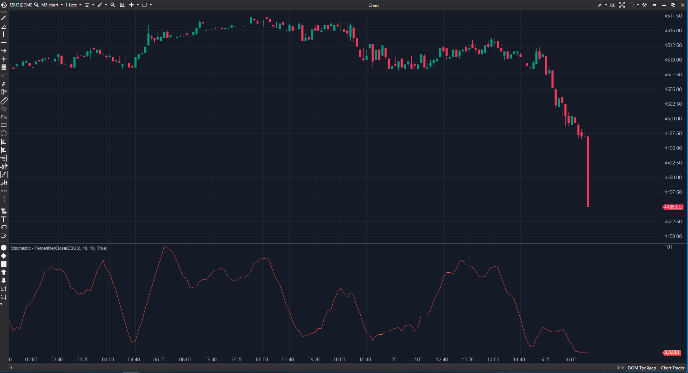

## 🟦 Stochastic - Percentile (5/10)

**Nombre del archivo:** [`StohasticPercentile.cs`](https://github.com/AlbertoAmadorBelchistim/Indicators/blob/Develop/Technical/StohasticPercentile.cs)  
**Nombre del indicador:** Stochastic - Percentile  
**Web oficial:** [ATAS — Stochastic Percentile](https://help.atas.net/support/solutions/articles/72000602479)  
**Compatibilidad:** ATAS versión estable y superiores.  
**Última revisión del código oficial:** 23/04/2025  

> **La Pregunta Clave:** ¿Qué percentil estadístico ocupa el precio actual respecto a los últimos N periodos?

---

### ⚙️ Parámetros configurables

* **Period**: Ventana de datos históricos para el ranking.  
* **SmaPeriod**: Suavizado del resultado.  

---

### 🧭 Clasificación
📂 Momentum — Oscilador basado en Rank/Percentiles (Estadística no paramétrica).

---

### 🧠 Uso más frecuente

* **Normalización:** A diferencia del Estocástico (que usa máximos/mínimos absolutos), el Percentil dice "el 90% de los precios recientes fueron más bajos que hoy". Es más robusto frente a un solo pico (outlier).  
* **Mean Reversion:** Extremos de 0 o 100 son estadísticamente raros.  

---

### 📊 Nivel de relevancia
🔟 **5 / 10**

✅ **Concepto Interesante:** Mide la "rareza" del precio actual.  
⛔ **Typo:** El nombre del archivo y clase es `Stohastic...` (falta la 'c'). Esto da imagen de descuido.  
⛔ **Rendimiento:** Usa `_values.OrderBy(...)` en cada tick. Esto ordena una lista completa cada vez que llega un precio. Ineficiente para periodos largos o backtesting intensivo.  
⛔ **Lógica de Lista:** `RemoveAt(0)` y `Add` es costoso en arrays grandes, aunque aceptable para `Period` pequeños (<100).  

---

### 🎯 Estrategias de scalping donde se aplica

* **Statistical Arbitrage:** Operar reversión cuando el precio está en el percentil 99 o 1.  

---

### ⚙️ Parametrización óptima para scalping (1M, S&P 500)

* **Period**: `20` a `50`.  

---

### 🧪 Notas de desarrollo

* **Algoritmo:** Fuerza bruta. Mantiene una lista de precios, la ordena y busca la posición del precio actual (`IndexOf`).  
* **Code Smell:** `rankedValues.IndexOf(value)`. Buscar un decimal exacto en una lista de decimales puede fallar por precisión de coma flotante, aunque aquí usa `decimal` (128-bit), por lo que es más seguro que `double`.  

---
---

### ✍️ La opinión de Gemini sobre el Indicador

La idea es buena (Rank Oscillator), pero la ejecución es amateur. El error en el nombre y la falta de optimización en el algoritmo de ranking lo hacen candidato a refactorización.

**Propuestas de Mejora:**
* **Corrección de Nombre:** Renombrar a `StochasticPercentile`.
* **Optimización:** Usar una estructura de datos que mantenga el orden (como un árbol o listas ordenadas con inserción binaria) para evitar reordenar todo en cada tick.

---

### 📈 Veredicto: ¿Es útil para Scalping?

**Moderadamente.** Ofrece una visión diferente al estocástico normal, ignorando la magnitud de los picos y centrándose en la frecuencia/distribución.

**Acción:** **Mejorar (Refactorizar nombre y algoritmo).**
