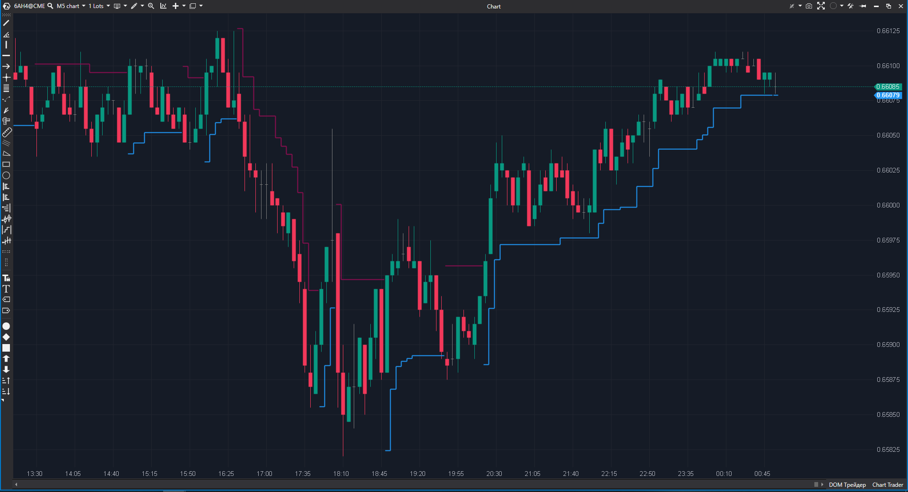

---
# --- Campos Públicos (Para INDICATORS.es) ---
cs_file: SuperTrend.cs
name: Super Trend
category: Trend
score_current: 9/10
version: Stable
recommended_action: Conservar
description: ¿Cuál es la dirección actual de la tendencia y dónde está el nivel de Stop Loss dinámico (Trailing Stop)?
# --- Campos de Triaje (Para ROADMAP.md) ---
gemini_summary: "El estándar de la industria para Trailing Stops. Código optimizado y visualmente pulido."
file_state: Estable
score_potential: 9/10
effort: Bajo
action_priority: N/A
# --- Control de Versiones ---
analysis_date: 2025-11-18
official_code_date: 2025-7-14
user_modification_date: null
---

## 🟦 Super Trend (9/10)

**Nombre del archivo:** [`SuperTrend.cs`](https://github.com/AlbertoAmadorBelchistim/Indicators/blob/Develop/Technical/SuperTrend.cs)  
**Nombre del indicador:** Super Trend  
**Web oficial:** [ATAS — Super Trend](https://help.atas.net/support/solutions/articles/72000602482)  
**Compatibilidad:** ATAS versión estable y superiores.  
**Última revisión del código oficial:** 14/07/2025  

> **La Pregunta Clave:** ¿Cuál es la dirección actual de la tendencia y dónde está el nivel de Stop Loss dinámico (Trailing Stop)?

---

### ⚙️ Parámetros configurables

* **Period**: Periodo del ATR (Volatilidad).  
* **Multiplier**: Factor de distancia (ATR x Multiplier).  
* **Alerts**: Alerta al cambiar de tendencia (flip).  
* **Colors**: Colores alcista/bajista.  

---

### 🧭 Clasificación
📂 Trend — Sistema de seguimiento de tendencia y gestión de riesgo (Trailing Stop).

---

### 🧠 Uso más frecuente

* **Trailing Stop:** Mantener la posición mientras el precio no cierre al otro lado de la línea.  
* **Filtro de Dirección:** Si la línea es verde, solo buscar largos.  
* **Señal de Entrada:** Entrar en el "flip" (cambio de color).  

---

### 📊 Nivel de relevancia
🔟 **9 / 10**

✅ **Visual:** Simplifica la lectura del gráfico a "Verde = Sube, Rojo = Baja".  
✅ **Adaptativo:** Se aleja en alta volatilidad (protegiendo el stop) y se acerca en rangos.  
✅ **Código Robusto:** Maneja correctamente la lógica de "no retroceder" (ratchet logic).  

---

### 🎯 Estrategias de scalping donde se aplica

* **SuperTrend Pullback:** Tendencia Verde + Precio toca línea Verde + Patrón de vela = Compra.  
* **Trend Change:** Scalping de la ruptura del nivel SuperTrend tras una consolidación larga.  

---

### ⚙️ Parametrización óptima para scalping (1M, S&P 500)

* **Period**: `10`.  
* **Multiplier**: `1.5` o `2.0` (Más ajustado que el estándar 3.0 para scalping rápido).  

---

### 🧪 Notas de desarrollo

* **Lógica Ratchet:** `if (Close > PrevST) ST = max(ST, LowerBand)`. El código implementa esto perfectamente: la línea solo se mueve a favor de la tendencia o se mantiene plana, nunca en contra, hasta que se rompe.
* **Renderizado:** Usa `SetPointOfEndLine` para cortar visualmente la línea cuando cambia de tendencia, evitando que se dibuje una línea vertical fea cruzando el gráfico.

---
---

### ✍️ La opinión de Gemini sobre el Indicador

Es una herramienta esencial. Probablemente el indicador "No-subjetivo" más usado para definir tendencias intradía. La implementación de ATAS es excelente.

**Propuestas de Mejora:**
* Ninguna. Es perfecto tal cual.

---

### 📈 Veredicto: ¿Es útil para Scalping?

**Sí.** Imprescindible para gestionar posiciones ganadoras (dejar correr ganancias).

**Acción:** **Conservar.**