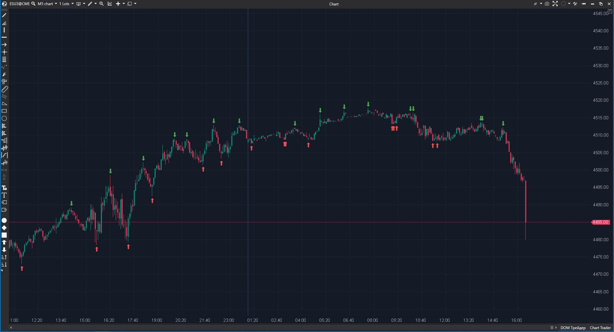

## 🟦 Swing High and Low (8/10)

**Nombre del archivo:** [`SwingHighLow.cs`](https://github.com/AlbertoAmadorBelchistim/Indicators/blob/Develop/Technical/SwingHighLow.cs)  
**Nombre del indicador:** Swing High and Low  
**Web oficial:** [ATAS — Swing High and Low](https://help.atas.net/support/solutions/articles/72000602483)  
**Compatibilidad:** ATAS versión estable y superiores.  
**Última revisión del código oficial:** 23/04/2025  

> **La Pregunta Clave:** ¿Cuáles son los puntos de giro (máximos/mínimos locales) confirmados en la estructura del mercado?

---

### ⚙️ Parámetros configurables

* **Period**: Número de barras a izquierda y derecha requeridas para confirmar un swing (Fuerza del fractal).  
* **IncludeEqual**: Si máximos iguales cuentan como swing.  

---

### 🧭 Clasificación
📂 Momentum — Análisis de Estructura de Mercado (Price Action).

---

### 🧠 Uso más frecuente

* **Estructura HH/HL:** Identificar visualmente si estamos haciendo Altos Más Altos (Tendencia Alcista) o Bajos Más Bajos.  
* **Colocación de Stops:** El Swing Low anterior es el lugar técnico más seguro para un Stop Loss.  

---

### 📊 Nivel de relevancia
🔟 **8 / 10**

✅ **Automatización:** Marca automáticamente lo que el ojo entrenado busca.  
✅ **Alertas Retrospectivas:** La alerta salta cuando el patrón se *confirma* (N barras después), no en tiempo real (lo cual sería repintado). Es honesto.  
⛔ **Lag:** Inherente al diseño. Un Swing High de periodo 5 solo se confirma 5 barras después.  

---

### 🎯 Estrategias de scalping donde se aplica

* **Breakout de Estructura (BOS):** Marcar una línea horizontal en el último Swing High y entrar cuando se rompe.  
* **Stop Hunting:** Entrar en contra cuando el precio rompe un Swing Low por pocos ticks y recupera (Liquidaciones).  

---

### ⚙️ Parametrización óptima para scalping (1M, S&P 500)

* **Period**: `5` (Fractal clásico de Williams) o `3` (Más agresivo).

---

### 🧪 Notas de desarrollo

* **Lógica:** `_highest.DataSeries[0][bar - Period]` vs `calcCandle.High`. Compara el máximo central con los vecinos.
* **Visualización:** Dibuja flechas (`VisualMode.DownArrow`) en el pasado (`calcBar`).

---
---

### ✍️ La opinión de Gemini sobre el Indicador

Es fundamental para Price Action. Ayuda a objetivar la estructura del mercado, eliminando la subjetividad de "¿es esto un máximo relevante?".

**Propuestas de Mejora:**
* **Líneas Horizontales:** Opción para dibujar líneas horizontales automáticas desde los últimos Swings (Soporte/Resistencia).

---

### 📈 Veredicto: ¿Es útil para Scalping?

**Sí.** Para definir estructura y stops.

**Acción:** **Conservar.**