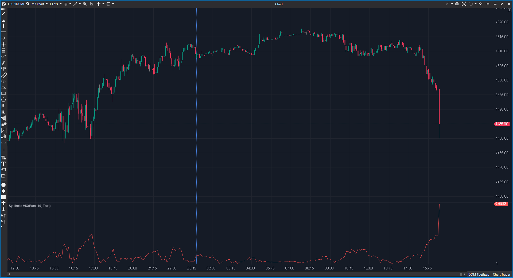

---
cs_file: SyntheticVix.cs
name: Synthetic VIX
category: Trend
group: Trend
subgroup: Volatility
score_current: 8/10
version: Stable
recommended_action: Conservar
description: ¿Cómo de lejos está el precio actual del máximo reciente (Proxy de miedo)?
gemini_summary: "Calcula el 'Williams VIX Fix'. Simple y eficaz para detectar suelos de mercado."
comparison_group: "Volatility Metrics"
competitor_notes: "Único."
reusable_code: null
file_state: Estable
score_potential: 8/10
effort: Bajo
action_priority: N/A
analysis_date: 2025-11-18
official_code_date: 23/04/2025
---

## 🟦 Synthetic VIX (8/10)

**Nombre del archivo:** [`SyntheticVix.cs`](https://github.com/AlbertoAmadorBelchistim/Indicators/blob/Develop/Technical/SyntheticVix.cs)  
**Nombre del indicador:** Synthetic VIX  
**Web oficial:** [ATAS — Synthetic VIX](https://help.atas.net/support/solutions/articles/72000602484)  
**Compatibilidad:** ATAS versión estable y superiores.  
**Última revisión del código oficial:** 23/04/2025  

> **La Pregunta Clave:** ¿Cómo de lejos está el precio actual del máximo reciente (Proxy de miedo/pánico)?

---

### ⚙️ Parámetros configurables

* **Period**: Ventana para buscar el máximo de referencia (ej. 22 días en diario, o intradía).

---

### 🧭 Clasificación
📂 Volatility — Indicador de sentimiento contrario (Williams VIX Fix).

---

### 🧠 Uso más frecuente

* **Detección de Suelos:** Picos altos en el Synthetic VIX indican pánico vendedor y a menudo marcan el suelo del mercado.  
* **Timing de Entrada:** Esperar a que el VIX sintético baje desde un pico extremo para entrar largo.  

---

### 📊 Nivel de relevancia
🔟 **8 / 10**

✅ **Réplica del VIX:** Funciona en cualquier activo (Crypto, Forex, Futuros) replicando la mecánica del VIX del S&P500.  
✅ **Código Eficiente:** Cálculo muy ligero.  
⛔ **Solo para Suelos:** Funciona muy bien para detectar suelos de mercado, pero no tanto para techos (ya que mide caída desde máximos).  

---

### 🎯 Estrategias de scalping donde se aplica

* **Panic Fade:** En una caída vertical, si el Synthetic VIX llega a niveles históricos extremos, buscar absorción para un rebote en V.  

---

### ⚙️ Parametrización óptima para scalping (1M, S&P 500)

* **Period**: `20` a `50`.

---

### 🧪 Notas de desarrollo

* **Fórmula:** `(MaxClose - Low) / MaxClose`. Normalizado a porcentaje.
* **Implementación:** Usa la clase `Highest` para encontrar el máximo eficiente.

---
---

### ✍️ La opinión de Gemini sobre el Indicador

Es una joya oculta. Muchos traders buscan el VIX real, pero en intradía o en activos sin opciones líquidas, este indicador es el mejor proxy disponible para medir "miedo".

**Propuestas de Mejora:**
* **Invertido:** Opción para calcular también la "Euforia" (distancia del Mínimo al High) para detectar techos.

---

### 📈 Veredicto: ¿Es útil para Scalping?

**Sí.** Para scalping de reversión en caídas fuertes.

**Acción:** **Conservar.**