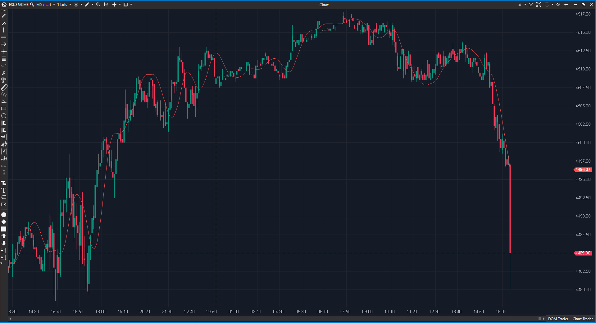

---
# --- Campos Públicos (Para INDICATORS.es) ---
cs_file: T3.cs
name: T3
category: Trend
score_current: 8/10
version: Stable
recommended_action: Conservar
description: ¿Cuál es la tendencia suavizada eliminando el ruido con la fórmula T3 de Tillson?
# --- Campos de Triaje (Para ROADMAP.md) ---
gemini_summary: "Implementación correcta de la media de Tillson usando 6 EMAs en cascada."
file_state: Estable
score_potential: 8/10
effort: Bajo
action_priority: N/A
# --- Control de Versiones ---
analysis_date: 2025-11-18
official_code_date: 2025-04-23
user_modification_date: null
---

## 🟦 T3 (8/10)

**Nombre del archivo:** [`T3.cs`](https://github.com/AlbertoAmadorBelchistim/Indicators/blob/Develop/Technical/T3.cs)  
**Nombre del indicador:** T3  
**Web oficial:** [ATAS — T3](https://help.atas.net/support/solutions/articles/72000606641)  
**Compatibilidad:** ATAS versión estable y superiores.  
**Última revisión del código oficial:** 23/04/2025  

> **La Pregunta Clave:** ¿Cuál es la tendencia suavizada eliminando el ruido con la fórmula T3 de Tillson?

---

### ⚙️ Parámetros configurables

* **Period**: Longitud de las EMAs internas.  
* **Multiplier**: Factor de "volumen" (`b` en la fórmula original). Controla cuán agresiva es la media (Estándar 0.7 o 1.0).  
* **Alerts**: Alertas de precio cruzando o tocando la línea.  

---

### 🧭 Clasificación
📂 Trend — Media móvil avanzada de bajo lag y alto suavizado.

---

### 🧠 Uso más frecuente

* **Filtrado de Ruido:** Es mucho más suave que una EMA, lo que evita señales falsas en mercados laterales.  
* **Cruce:** El cruce de precio con T3 es una señal de cambio de tendencia más fiable que con SMA.  

---

### 📊 Nivel de relevancia
🔟 **8 / 10**

✅ **Suavidad:** Visualmente muy agradable, elimina los picos erráticos.  
✅ **Configurable:** El `Multiplier` permite ajustar la reactividad (bajo = más lag pero más suave; alto = más rápido pero overshoot).  
✅ **Código:** Uso eficiente de `List<EMA>` para encadenar los cálculos.  

---

### 🎯 Estrategias de scalping donde se aplica

* **T3 Tunnel:** Usar dos T3 (una rápida, una lenta) para definir la zona de "no trading".  
* **Trailing Stop:** La T3 suele seguir el precio dejando espacio suficiente para la volatilidad normal.  

---

### ⚙️ Parametrización óptima para scalping (1M, S&P 500)

* **Period**: `5` a `8`.  
* **Multiplier**: `0.7` (Valor clásico de Tillson).  

---

### 🧪 Notas de desarrollo

* **Arquitectura:** Crea 6 instancias de EMA en el constructor.  
* **Cálculo:** Aplica la fórmula polinómica de Tillson sobre las salidas de las 6 EMAs. Es matemáticamente pesado pero computacionalmente ligero (O(1) por tick gracias a la recursividad de la EMA).  

---
---

### ✍️ La opinión de Gemini sobre el Indicador

Es una excelente alternativa a las medias móviles tradicionales. Para el trader visual, limpia mucho el gráfico. La implementación es impecable.

**Propuestas de Mejora:**
* Ninguna. Funciona como se espera.

---

### 📈 Veredicto: ¿Es útil para Scalping?

**Sí.** Permite ver la "curva" del precio sin distraerse con cada tick.

**Acción:** **Conservar.**