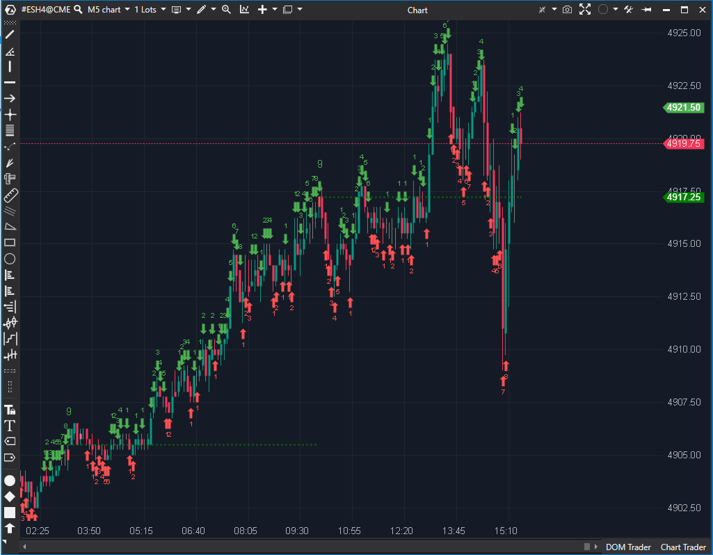

## 🟦 TD Sequential (8/10)

**Nombre del archivo:** [`TDSequential.cs`](https://github.com/AlbertoAmadorBelchistim/Indicators/blob/Develop/Technical/TDSequential.cs)  
**Nombre del indicador:** TD Sequential  
**Web oficial:** [ATAS — TD Sequential](https://help.atas.net/support/solutions/articles/72000619193)  
**Compatibilidad:** ATAS versión estable y superiores.  
**Última revisión del código oficial:** 27/05/2025  

> **La Pregunta Clave:** ¿En qué punto del ciclo de agotamiento (Setup/Countdown) se encuentra la tendencia actual?

---

### ⚙️ Parámetros configurables

* **Visualización**: Mostrar números, colores de barras, niveles S/R.  
* **Colores**: Personalización completa para señales de compra/venta y overshoots (velas 13+).  

---

### 🧭 Clasificación
📂 Momentum — Sistema de market timing basado en conteo de velas (DeMark Indicators).

---

### 🧠 Uso más frecuente

* **TD Setup (9):** Cuando aparecen 9 velas consecutivas con cierre mayor/menor a la vela de hace 4 periodos, se espera una corrección menor (1-4 velas).  
* **TD Countdown (13):** Indica agotamiento mayor de la tendencia.  
* **Soporte/Resistencia:** Los niveles donde se completa un 9 actúan como soporte/resistencia (TDST Levels).  

---

### 📊 Nivel de relevancia
🔟 **8 / 10**

✅ **Fidelidad:** Replica la lógica exacta de los contadores TD (Setup y Countdown simplificado).  
✅ **Visual:** Pinta los números sobre las velas, lo cual es la forma correcta de usar este indicador.  
✅ **Niveles TDST:** Dibuja líneas de soporte/resistencia punteadas automáticamente desde los setups completados.  

---

### 🎯 Estrategias de scalping donde se aplica

* **Counter-Trend Scalp:** Vender en un "Verde 9" perfecto en resistencia.  
* **Trend Continuation:** Si el precio rompe un nivel de resistencia TDST, la tendencia es fuerte, ignorar el 9.  

---

### ⚙️ Parametrización óptima para scalping (1M, S&P 500)

* **IsBarColor**: `True` (Ayuda a ver el conteo periféricamente).  
* **IsSr**: `True` (Los niveles de soporte/resistencia del TD son muy respetados en intradía).  

---

### 🧪 Notas de desarrollo

* **Lógica:** `if (curCandle.Close > candle.Close) ...`. Comparación con `bar - 4`. Es la definición de libro de TD Setup.
* **Countdown:** Implementa una versión simplificada del Countdown (no parece tener todas las reglas complejas de "intersección" de DeMark, pero sí la básica).
* **Visual:** Usa `AddText` para los números.

---
---

### ✍️ La opinión de Gemini sobre el Indicador

Es una herramienta de culto. Para quienes usan metodología DeMark, esta implementación es suficiente. No es el sistema "completo" (que vale miles de dólares en Bloomberg), pero tiene la esencia (Setup 9).

**Propuestas de Mejora:**
* **Alerta en 8:** Añadir opción de alertar en la vela 8 para prepararse para la 9.

---

### 📈 Veredicto: ¿Es útil para Scalping?

**Sí.** El "9" es mágico en gráficos de 1 minuto y 5 minutos para predecir pausas.

**Acción:** **Conservar.**