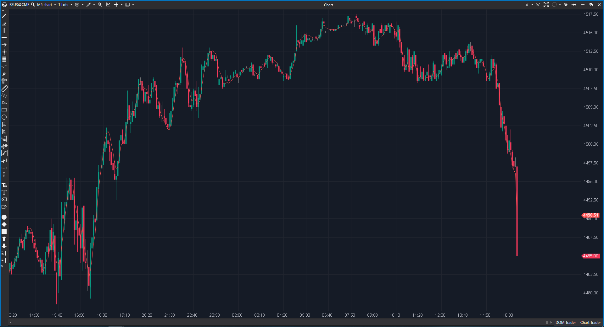

---
# --- Campos Públicos (Para INDICATORS.es) ---
cs_file: TEMA.cs
name: Triple Exponential Moving Average
category: Trend
score_current: 8/10
version: Stable
recommended_action: Conservar
description: ¿Cuál es la tendencia inmediata con el mínimo retraso posible (Lag casi cero)?
# --- Campos de Triaje (Para ROADMAP.md) ---
gemini_summary: "Media de Mulloy estándar. Implementación eficiente reusando la clase EMA."
file_state: Estable
score_potential: 8/10
effort: Bajo
action_priority: N/A
# --- Control de Versiones ---
analysis_date: 2025-11-18
official_code_date: 2025-04-23
user_modification_date: null
---

## 🟦 Triple Exponential Moving Average (TEMA) (8/10)

**Nombre del archivo:** [`TEMA.cs`](https://github.com/AlbertoAmadorBelchistim/Indicators/blob/Develop/Technical/TEMA.cs)  
**Nombre del indicador:** Triple Exponential Moving Average  
**Web oficial:** [ATAS — TEMA](https://help.atas.net/support/solutions/articles/72000602492)  
**Compatibilidad:** ATAS versión estable y superiores.  
**Última revisión del código oficial:** 23/04/2025  

> **La Pregunta Clave:** ¿Cuál es la tendencia inmediata con el mínimo retraso posible (Lag casi cero)?

---

### ⚙️ Parámetros configurables

* **Period**: Ventana de cálculo.

---

### 🧭 Clasificación
📂 Trend — Media móvil compuesta diseñada para reducir el lag.

---

### 🧠 Uso más frecuente

* **Trigger de Entrada:** Al ser tan rápida, su cruce con el precio o con una media más lenta da señales muy tempranas.  
* **Sustituto de Precio:** Algunos traders ocultan las velas y usan solo una TEMA(1) o TEMA(2) para ver el precio "limpio".  

---

### 📊 Nivel de relevancia
🔟 **8 / 10**

✅ **Rapidez:** Es más rápida que la EMA y la DEMA.  
✅ **Simplicidad:** Solo un parámetro.  
⛔ **Overshoot:** Al intentar compensar el lag, a veces "se pasa de frenada" y exagera el movimiento del precio.  

---

### 🎯 Estrategias de scalping donde se aplica

* **Cruce TEMA/SMA:** TEMA(10) cruzando SMA(20). Señal de scalping clásica.  

---

### ⚙️ Parametrización óptima para scalping (1M, S&P 500)

* **Period**: `14`.

---

### 🧪 Notas de desarrollo

* **Fórmula:** `3*EMA1 - 3*EMA2 + EMA3`. Donde EMA2 es EMA(EMA1) y EMA3 es EMA(EMA2).
* **Código:** Correcto y conciso.

---
---

### ✍️ La opinión de Gemini sobre el Indicador

Es una herramienta de precisión. Si necesitas velocidad de reacción sin mirar el precio crudo, la TEMA es la elección.

**Propuestas de Mejora:**
* Ninguna. Es un estándar.

---

### 📈 Veredicto: ¿Es útil para Scalping?

**Sí.** Muy apreciada por scalpers algorítmicos por su baja latencia.

**Acción:** **Conservar.**