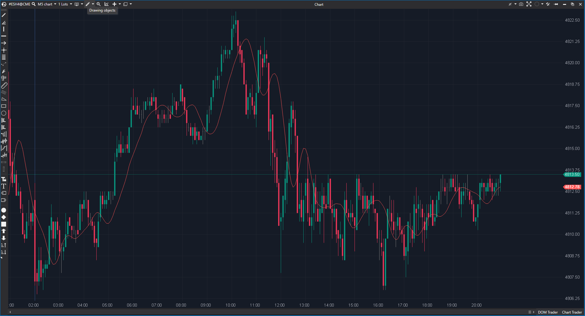

---
# --- Campos Públicos (Para INDICATORS.es) ---
cs_file: TMA.cs
name: Triangular Moving Average
category: Trend
score_current: 7/10
version: Stable
recommended_action: Conservar
description: ¿Cuál es la tendencia central "verdadera" con un suavizado extremo (doble promedio)?
# --- Campos de Triaje (Para ROADMAP.md) ---
gemini_summary: "Media doblemente suavizada. Código funcional pero con cálculo O(N) por tick (mejorable a O(1))."
file_state: Estable
score_potential: 8/10
effort: Bajo
action_priority: N/A
# --- Control de Versiones ---
analysis_date: 2025-11-18
official_code_date: 2025-04-23
user_modification_date: null
---

## 🟦 Triangular Moving Average (TMA) (7/10)

**Nombre del archivo:** [`TMA.cs`](https://github.com/AlbertoAmadorBelchistim/Indicators/blob/Develop/Technical/TMA.cs)  
**Nombre del indicador:** Triangular Moving Average  
**Web oficial:** [ATAS — TMA](https://help.atas.net/support/solutions/articles/72000602233)  
**Compatibilidad:** ATAS versión estable y superiores.  
**Última revisión del código oficial:** 23/04/2025  

> **La Pregunta Clave:** ¿Cuál es la tendencia central "verdadera" con un suavizado extremo (doble promedio)?

---

### ⚙️ Parámetros configurables

* **Period**: Ventana de cálculo.

---

### 🧭 Clasificación
📂 Trend — Media móvil con peso triangular (mayor peso en el centro de la ventana).

---

### 🧠 Uso más frecuente

* **Canales TMA:** Es la línea central favorita para canales de regresión o bandas de volatilidad extremas (TMA Bands), ya que es muy estable.  
* **Tendencia de Fondo:** No sirve para gatillos (demasiado lenta), sino para ver la dirección general.  

---

### 📊 Nivel de relevancia
🔟 **7 / 10**

✅ **Suavidad Máxima:** Crea una línea casi recta en mercados ruidosos.  
⛔ **Lag:** Tiene mucho retraso, el doble que una SMA aproximadamente.  
⛔ **Eficiencia:** El cálculo `DynamicSma` itera sobre el periodo en cada tick. Podría optimizarse manteniendo una suma rodante.  

---

### 🎯 Estrategias de scalping donde se aplica

* **Mean Reversion:** Si el precio se aleja mucho de la TMA, tiende a volver a ella (como un imán lento).  

---

### ⚙️ Parametrización óptima para scalping (1M, S&P 500)

* **Period**: `50` o más. (Para usar como filtro de tendencia de fondo).

---

### 🧪 Notas de desarrollo

* **Algoritmo:** Calcula el tamaño de dos SMAs (`n1`, `n2`) basándose en si el periodo es par o impar, y aplica una sobre la otra. Matemáticamente equivalente a una convolución triangular.  

---
---

### ✍️ La opinión de Gemini sobre el Indicador

Es una herramienta especialista. No la uses para entrar, úsala para saber dónde está el "centro" del río de precios.

**Propuestas de Mejora:**
* **Optimización:** Reemplazar `DynamicSma` (bucle) por instancias de la clase `SMA` de ATAS, que ya están optimizadas.

---

### 📈 Veredicto: ¿Es útil para Scalping?

**Moderadamente.** Solo como referencia de estructura mayor.

**Acción:** **Conservar.**