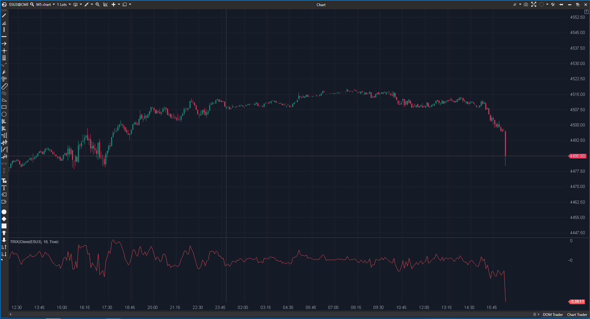

---
# --- Campos Públicos (Para INDICATORS.es) ---
cs_file: TRIX.cs
name: TRIX
category: Momentum
score_current: 7/10
version: Stable
recommended_action: 'Conservar'
description: >-
  ¿Cuál es la tasa de cambio (ROC) de una media móvil triplemente suavizada?
# --- Campos de Triaje (Para ROADMAP.md) ---
gemini_summary: >-
  Implementación estándar del TRIX. Triple EMA + ROC. Funcional pero con el lag inherente al método.
file_state: Estable
score_potential: 8/10
effort: Bajo
action_priority: N/A
# --- Control de Versiones ---
analysis_date: 2025-11-18
official_code_date: 2025-04-23
user_modification_date: null
---

## 🟦 TRIX (7/10)

**Nombre del archivo:** [`TRIX.cs`](https://github.com/AlbertoAmadorBelchistim/Indicators/blob/Develop/Technical/TRIX.cs)  
**Nombre del indicador:** TRIX  
**Web oficial:** [ATAS — TRIX](https://help.atas.net/support/solutions/articles/72000602493)  
**Compatibilidad:** ATAS versión estable y superiores.  
**Última revisión del código oficial:** 23/04/2025  

> **La Pregunta Clave:** ¿Cuál es la tasa de cambio (ROC) de una media móvil triplemente suavizada?

---

### ⚙️ Parámetros configurables

* **Period**: Ventana para las tres EMAs.

---

### 🧭 Clasificación
📂 Momentum — Oscilador de tendencia de muy bajo ruido.

---

### 🧠 Uso más frecuente

* **Tendencia Macro:** Al filtrar ciclos menores, el TRIX muestra la "marea" de fondo.  
* **Cruce de Cero:** Cambio de tendencia mayor.  
* **Divergencias:** Muy fiables en marcos temporales altos.  

---

### 📊 Nivel de relevancia
🔟 **7 / 10**

✅ **Filtrado:** Elimina casi todo el ruido de mercado. Si el TRIX gira, es que algo importante ha cambiado.  
⛔ **Lag:** Triple suavizado implica triple retraso. Pésimo para entradas precisas en scalping.  
⛔ **Sin Señal:** Falta una línea de señal para cruces (TRIX Signal Line).  

---

### 🎯 Estrategias de scalping donde se aplica

* **Filtro de Dirección:** Si TRIX(15) > 0 en gráfico de 5 minutos, en el gráfico de 1 minuto solo buscar largos.  

---

### ⚙️ Parametrización óptima para scalping (1M, S&P 500)

* **Period**: `5` a `9` (Mantenerlo muy corto para reducir el lag).

---

### 🧪 Notas de desarrollo

* **Fórmula:** $EMA_1 = EMA(P)$, $EMA_2 = EMA(EMA_1)$, $EMA_3 = EMA(EMA_2)$. $TRIX = \%Chg(EMA_3)$.
* **Implementación:** Correcta.

---
---

### ✍️ La opinión de Gemini sobre el Indicador

Es un indicador "vieja escuela". Bueno para acciones o tendencias largas, pero un poco lento para el ritmo frenético de los futuros modernos.

**Propuestas de Mejora:**
* **Línea de Señal:** Añadir una SMA del TRIX para tener cruces tempranos.

---

### 📈 Veredicto: ¿Es útil para Scalping?

**Moderadamente.** Solo como filtro de contexto.

**Acción:** **Conservar.**