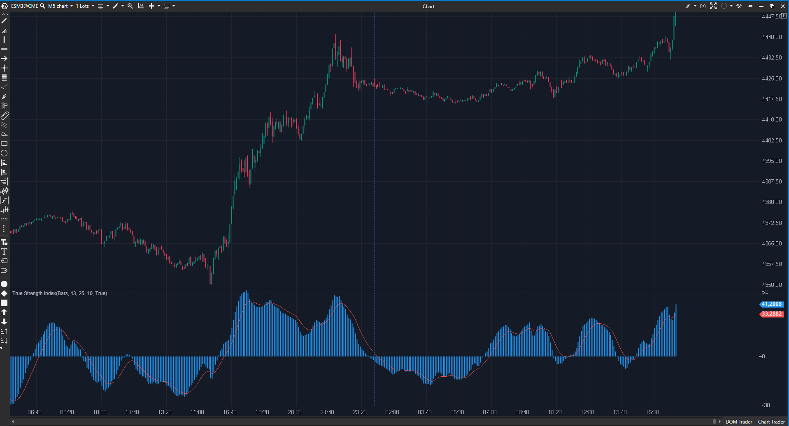

---
# --- Campos Públicos (Para INDICATORS.es) ---
cs_file: TSI.cs
name: True Strength Index
category: Momentum
score_current: 8/10
version: Stable
recommended_action: 'Conservar'
description: >-
  ¿Cuál es el momentum del precio libre de ruido gracias a un doble suavizado exponencial?
# --- Campos de Triaje (Para ROADMAP.md) ---
gemini_summary: >-
  Oscilador de momentum robusto. Código limpio con línea de señal y doble suavizado.
file_state: Estable
score_potential: 8/10
effort: Bajo
action_priority: N/A
# --- Control de Versiones ---
analysis_date: 2025-11-18
official_code_date: 2025-04-23
user_modification_date: null
---

## 🟦 True Strength Index (TSI) (8/10)

**Nombre del archivo:** [`TSI.cs`](https://github.com/AlbertoAmadorBelchistim/Indicators/blob/Develop/Technical/TSI.cs)  
**Nombre del indicador:** True Strength Index  
**Web oficial:** [ATAS — True Strength Index](https://help.atas.net/support/solutions/articles/72000602631)  
**Compatibilidad:** ATAS versión estable y superiores.  
**Última revisión del código oficial:** 23/04/2025  

> **La Pregunta Clave:** ¿Cuál es el momentum del precio libre de ruido gracias a un doble suavizado exponencial?

---

### ⚙️ Parámetros configurables

* **EmaPeriod**: Primer suavizado (Momentum).  
* **EmaSecPeriod**: Segundo suavizado (Suavizado del Momentum).  
* **SmoothPeriod**: Suavizado de la línea de señal.  

---

### 🧭 Clasificación
📂 Momentum — Oscilador centrado (similar al MACD pero normalizado).

---

### 🧠 Uso más frecuente

* **Cruces:** Cruce de la línea TSI (azul) con su señal (roja).  
* **Divergencias:** Muy claras debido a la suavidad de la curva.  
* **Línea Cero:** Tendencia alcista > 0, bajista < 0.  

---

### 📊 Nivel de relevancia
🔟 **8 / 10**

✅ **Calidad de Señal:** Produce menos señales falsas que el MACD en mercados laterales.  
✅ **Implementación Completa:** Incluye la línea de señal, que a menudo se omite en versiones básicas.  
✅ **Visual:** Histograma opcional ayuda a ver la fuerza del cruce.  

---

### 🎯 Estrategias de scalping donde se aplica

* **TSI Cross:** Entrar en el cruce a favor de la tendencia de una media móvil de 50 periodos.  
* **Exit:** Salir cuando el histograma del TSI empieza a decaer.  

---

### ⚙️ Parametrización óptima para scalping (1M, S&P 500)

* **Ema1**: `7`.  
* **Ema2**: `14` (Más rápido que el estándar 13/25).  
* **Signal**: `5`.  

---

### 🧪 Notas de desarrollo

* **Cálculo:** El TSI es el numerador (doble suavizado del cambio de precio) dividido por el denominador (doble suavizado del valor absoluto del cambio). Esto lo normaliza entre -100 y +100.  
* **Código:** Usa `_renderSmoothedSeries` para la señal. Correcto.

---
---

### ✍️ La opinión de Gemini sobre el Indicador

Es uno de los mejores osciladores de momentum modernos. Muy superior al RSI para determinar la "inercia" de una tendencia.

**Propuestas de Mejora:**
* **Niveles:** Añadir líneas en +25 y -25 para marcar zonas de sobre-extensión.

---

### 📈 Veredicto: ¿Es útil para Scalping?

**Sí.** Muy fiable para confirmar entradas.

**Acción:** **Conservar.**