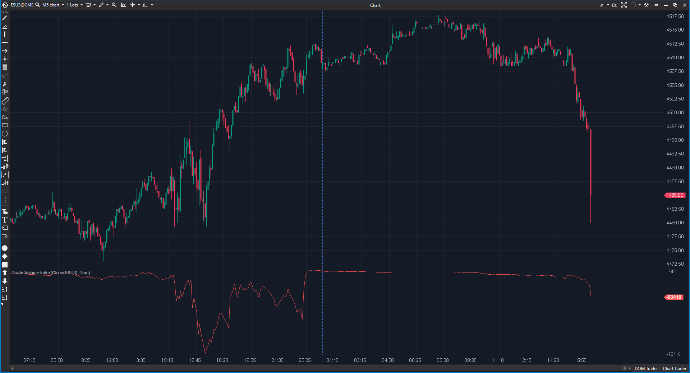

---
# 1. IDENTIFICACIÓN  
cs_file: TVI.cs  
name: Trade Volume Index  
version: ATAS Stable/Latest  

# 2. CLASIFICACIÓN  
group: Order Flow  
subgroup: Volume  
comparison_group: "Volume Oscillators"  

# 3. VALORACIÓN (Score & Priority)  
score_current: 4.5/10  
score_potential: 6.5/10  
file_state: Estable  
effort: N/A  
action_priority: Nula  
system_priority: NA  

# 4. DECISIÓN  
recommended_action: Descartar  

# 5. ANÁLISIS  
description: ¿Se está acumulando o distribuyendo el volumen asignándolo tick a tick según la dirección del precio respecto al tick size?  
gemini_summary: "Indicador clásico tipo OBV intra-vela. Funciona correctamente a nivel técnico, pero su lectura es redundante y está claramente superada por métricas modernas de Order Flow disponibles en ATAS."  
competitor_notes: "Pierde frente a Up/Down Volume Ratio por falta de normalización, frente a Weis Wave por menor lectura estructural, y frente a MACD-VW por escasa capacidad de filtrado. En un stack moderno queda obsoleto."  
reusable_code: null  

# 6. METADATOS  
analysis_date: 2025-12-15  
official_code_date: 2025-04-23  

  

---  

## ❌ Trade Volume Index (4.5/10)  

**Nombre del archivo:** [`TVI.cs`](https://github.com/AlbertoAmadorBelchistim/Indicators/blob/Develop/Technical/TVI.cs)  
**Nombre del indicador:** Trade Volume Index  
**Web oficial:** [ATAS — Trade Volume Index](https://help.atas.net/support/solutions/articles/72000602296)  
**Compatibilidad:** ATAS Stable/Latest.  
**Última revisión del código oficial:** 2025-04-23  

> **La Pregunta Clave:** ¿Se está acumulando o distribuyendo el volumen asignándolo tick a tick según la dirección del precio respecto al tick size?  

  

  

---  

### ⚙️ Parámetros configurables  

- **Sin parámetros configurables:** acumulador fijo.  

  

---  

### 🧭 Clasificación  
**Grupo:** Order Flow  
**Subgrupo:** Volume  
**Comparison Group:** "Volume Oscillators"  

  

---  

### 🧠 Uso más frecuente  

* Análisis histórico o educativo de acumulación/distribución tipo OBV.  
* Entornos sin acceso a delta, bid/ask o métricas de order flow avanzadas.  

  

---  

### 📊 Nivel de relevancia  
🔟 **4.5 / 10**  

✅ Implementación extremadamente simple y estable (bajo coste computacional).  
✅ Históricamente útil como aproximación básica de presión compradora/vendedora.  
⛔ **Deriva (drift):** el acumulador crece sin anclaje ni normalización.  
⛔ **Redundancia:** totalmente superado por delta, ratios normalizados y tape speed en ATAS.  
⛔ **Baja capacidad operativa:** no genera eventos claros ni niveles accionables.  

  

---  

### 🎯 Estrategias de scalping donde se aplica  

* **Ninguna recomendada** en un entorno moderno de Order Flow.  
* Su uso operativo queda obsoleto frente a herramientas actuales.  

  

---  

### ⚙️ Parametrización óptima para scalping (1M, S&P 500)  

| Parámetro | Valor recomendado | Justificación |  
|---|---:|---|  
| N/A | N/A | No existen parámetros; el diseño no permite optimización real. |  

  

---  

### 🧪 Notas de desarrollo  

* Lógica base:  
  - Si `value − Source[bar-1] > TickSize` → suma volumen.  
  - Si es igual → mantiene.  
  - Si es menor → resta volumen.  
* El uso de `InstrumentInfo.TickSize` hace el cálculo sensible a microvariaciones y precisión decimal.  

  

---  

### ❗ Incoherencias o aspectos mejorables detectados  

* No dispone de reset por sesión (RTH/ETH).  
* No existe normalización ni escalado relativo, lo que invalida comparaciones temporales.  
* Comparaciones estrictas con `== TickSize` son frágiles numéricamente.  

  

---  

### 🛠️ Propuestas de mejora  

* **P2 (Media):** añadir reset por sesión y modo “From time”.  
* **P2 (Media):** normalización por sesión (z-score, percentil).  
* **P3 (Baja):** tolerancia en comparaciones con `TickSize`.  

> *Nota:* incluso con estas mejoras, seguiría solapándose con herramientas superiores ya presentes en ATAS.  

  

---  

### 💎 Valor Reutilizable (Código Donante)  

* Patrón minimalista de acumulador direccional basado en tick size (útil solo como ejemplo didáctico).  

  

---  

### ✍️ La opinión de ChatGPT sobre el Indicador  

Trade Volume Index es un producto de otra época. No está “mal hecho”, pero **no compite** en un entorno 2025 con delta bid/ask, ratios normalizados, footprint y tape speed. Mantenerlo en el set añade ruido cognitivo sin aportar edge. La decisión correcta en este sistema es descartarlo sin remordimientos.  

  

---  

### 📈 Veredicto: ¿Es útil para Scalping?  

**No.**  

Está claramente superado por métricas modernas de Order Flow disponibles en ATAS.  

**Acción:** **Descartar**  

