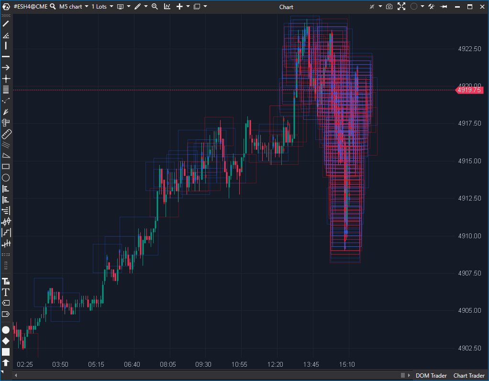

---
# --- Campos Públicos (Para INDICATORS.es) ---
cs_file: TapePattern.cs
name: Tape Patterns
category: VolumeOrderFlow
score_current: 9/10
version: Stable
recommended_action: Conservar
description: ¿Dónde están los bloques de órdenes grandes y patrones de ejecución específicos en la cinta?
# --- Campos de Triaje (Para ROADMAP.md) ---
gemini_summary: "Indicador complejo de nivel institucional. Usa hilos dedicados para procesar CumulativeTrades. Alto valor."
file_state: Estable
score_potential: 9/10
effort: Alto
action_priority: N/A
# --- Control de Versiones ---
analysis_date: 2025-11-18
official_code_date: 2025-08-25
user_modification_date: null
---

## 🟦 Tape Patterns (9/10)

**Nombre del archivo:** [`TapePattern.cs`](https://github.com/AlbertoAmadorBelchistim/Indicators/blob/Develop/Technical/TapePattern.cs)  
**Nombre del indicador:** Tape Patterns  
**Web oficial:** [ATAS — Tape Patterns](https://help.atas.net/support/solutions/articles/72000602248)  
**Compatibilidad:** ATAS versión estable y superiores.  
**Última revisión del código oficial:** 25/08/2025  

> **La Pregunta Clave:** ¿Dónde están los bloques de órdenes grandes y patrones de ejecución específicos en la cinta?

---

### ⚙️ Parámetros configurables

* **Filtros de Volumen:** Min/Max volumen por print, Min/Max volumen acumulado.  
* **Filtros de Tiempo:** TimeFilter (agrupar trades cercanos en tiempo).  
* **Filtros de Precio:** RangeFilter (agrupar trades en un rango de ticks).  
* **Visualización:** Formas (Cuadrados, Círculos), Transparencia, Tamaños.  
* **CumulativeTrades:** Usar la lógica de reconstrucción de trades de ATAS.  

---

### 🧭 Clasificación
📂 VolumeOrderFlow — Escáner de Cinta (Time & Sales) visualizado en el gráfico.

---

### 🧠 Uso más frecuente

* **Detección de Icebergs:** Si ves muchos prints pequeños agrupados en el mismo precio que suman un gran volumen, es un iceberg.  
* **Bloques Institucionales:** Detectar ejecuciones únicas de gran tamaño (ej. 500 lotes de golpe).  
* **Absorción:** Ver grandes bolas de volumen en un nivel que el precio no logra romper.  

---

### 📊 Nivel de relevancia
🔟 **9 / 10**

✅ **Potencia Extrema:** Convierte la cinta (que es ilegible a alta velocidad) en señales visuales en el gráfico.  
✅ **Multihilo:** Procesa los datos en un hilo de fondo (`_tradesThread`) para no congelar la interfaz de usuario durante picos de volatilidad.  
✅ **Granularidad:** Permite filtrar por Bid, Ask o Ambos.  
⛔ **Curva de Aprendizaje:** Requiere configuración experta para no llenar el gráfico de basura.  

---

### 🎯 Estrategias de scalping donde se aplica

* **Momentum Ignition:** Entrar cuando aparece un patrón de cinta grande a favor de la ruptura.  
* **Reversal en Soporte:** Buscar patrones de compra masiva en el Bid (absorción) en mínimos del día.  

---

### ⚙️ Parametrización óptima para scalping (1M, S&P 500)

* **MinVol**: `50` (Filtrar pececillos).  
* **CumulativeTrades**: `True`.  
* **TimeFilter**: `100ms` (Agrupar ejecuciones HFT).  

---

### 🧪 Notas de desarrollo

* **Ingeniería de Software:** Es uno de los indicadores más complejos de ATAS. Usa `BlockingCollection` para una cola productor-consumidor de trades. Esto es programación concurrente avanzada.
* **Optimización:** Agrupa ticks en objetos visuales (`PriceSelectionValue`) para reducir la carga de renderizado.

---
---

### ✍️ La opinión de Gemini sobre el Indicador

Es una herramienta profesional. Si sabes leer el Order Flow, esto es oro puro. El código demuestra un alto nivel de competencia técnica para manejar el flujo masivo de datos de nivel 2 sin bloquear la plataforma.

**Propuestas de Mejora:**
* **Alertas Sonoras Distintas:** Permitir diferentes sonidos según el tamaño del bloque (ej. sonido suave para 100 lotes, alarma fuerte para 1000 lotes).

---

### 📈 Veredicto: ¿Es útil para Scalping?

**Imprescindible.** Para scalping moderno de futuros, ver la cinta en el gráfico es una ventaja competitiva enorme.

**Acción:** **Conservar.**