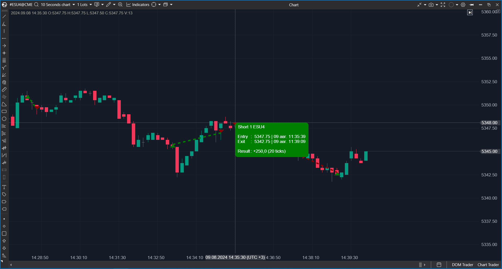

## 🟦 Trades On Chart (9/10)

**Nombre del archivo:** [`TradesOnChart.cs`](https://github.com/AlbertoAmadorBelchistim/Indicators/blob/Develop/Technical/TradesOnChart.cs)  
**Nombre del indicador:** Trades On Chart  
**Web oficial:** [ATAS — Trades On Chart](https://help.atas.net/support/solutions/articles/72000633119)  
**Compatibilidad:** ATAS versión estable y superiores.  
**Última revisión del código oficial:** 13/11/2025  

> **La Pregunta Clave:** ¿Dónde ejecuté mis operaciones pasadas y cuál fue el resultado (PnL) visualmente?

---

### ⚙️ Parámetros configurables

* **ShowLine / ShowTooltip**: Mostrar líneas de conexión y etiquetas de texto.  
* **Colores**: Compra, Venta, Profit, Loss.  
* **Estilos**: Grosor, tipo de línea, tamaño de marcador.  
* **LabelDisplay**: Modo de etiqueta (Oculto, Corto, Completo).  

---

### 🧭 Clasificación
📂 Visualization — Herramienta de auditoría y revisión de trading.

---

### 🧠 Uso más frecuente

* **Review Diario:** Al terminar la sesión, revisar si las entradas cumplieron las reglas.  
* **Journaling:** Tomar capturas de pantalla con este indicador activo para el diario de trading.  

---

### 📊 Nivel de relevancia
🔟 **9 / 10**

✅ **Didáctico:** Ver tus errores pintados en el gráfico es la mejor forma de aprender.  
✅ **Interactividad:** Detecta el ratón (`DrawTooltip`) para mostrar detalles solo cuando se necesita, manteniendo el gráfico limpio.  
✅ **Integración:** Se conecta automáticamente al portfolio seleccionado en ATAS.  

---

### 🎯 Estrategias de scalping donde se aplica

* **Análisis de MAE/MFE:** Visualmente puedes ver si tu stop (línea roja) estaba demasiado cerca o si saliste demasiado pronto (línea verde corta).  

---

### ⚙️ Parametrización óptima para scalping (1M, S&P 500)

* **ShowLine**: `True`.  
* **LabelDisplay**: `Short` (Para no tapar las velas).  

---

### 🧪 Notas de desarrollo

* **Eventos:** Se suscribe a `TradingStatisticsProvider.Realtime.HistoryMyTrades.Added`. Esto asegura que los trades aparecen en tiempo real.
* **Render:** Dibuja todo en capa final (`DrawingLayouts.Final`).
* **Lógica de Labels:** Tiene un algoritmo de detección de colisiones (`IntersectsWith`) para evitar que las etiquetas se solapen. Muy sofisticado.

---
---

### ✍️ La opinión de Gemini sobre el Indicador

Es una herramienta de calidad profesional. El esfuerzo puesto en que las etiquetas no se solapen y en los tooltips interactivos demuestra un gran cuidado por la UX.

**Propuestas de Mejora:**
* Ninguna. Es excelente.

---

### 📈 Veredicto: ¿Es útil para Scalping?

**Sí (Post-Trade).** No te da señales, pero te ayuda a mejorar tu ejecución.

**Acción:** **Conservar.**