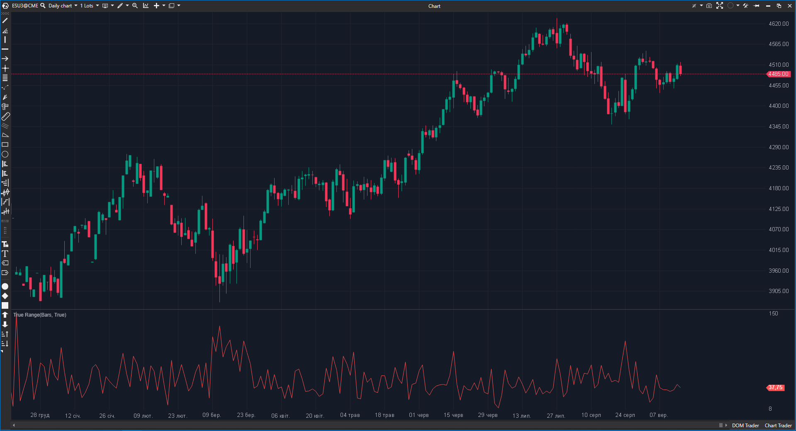

---
# --- Campos Públicos (Para INDICATORS.es) ---
cs_file: TrueRange.cs
name: True Range
category: Volatility
score_current: 8/10
version: Stable
recommended_action: 'Conservar'
description: >-
  ¿Cuál es la volatilidad real de la vela actual incluyendo los gaps de apertura?
# --- Campos de Triaje (Para ROADMAP.md) ---
gemini_summary: >-
  Cálculo base de volatilidad. Código simple y sin errores.
file_state: Estable
score_potential: 8/10
effort: Bajo
action_priority: N/A
# --- Control de Versiones ---
analysis_date: 2025-11-18
official_code_date: 2025-04-23
user_modification_date: null
---

## 🟦 True Range (8/10)

**Nombre del archivo:** [`TrueRange.cs`](https://github.com/AlbertoAmadorBelchistim/Indicators/blob/Develop/Technical/TrueRange.cs)  
**Nombre del indicador:** True Range  
**Web oficial:** [ATAS — True Range](https://help.atas.net/support/solutions/articles/72000602234)  
**Compatibilidad:** ATAS versión estable y superiores.  
**Última revisión del código oficial:** 23/04/2025  

> **La Pregunta Clave:** ¿Cuál es la volatilidad real de la vela actual incluyendo los gaps de apertura?

---

### ⚙️ Parámetros configurables

* **Ninguno**: Es un cálculo puro sin periodo de suavizado (eso sería el ATR).

---

### 🧭 Clasificación
📂 Volatility — Medida de rango expandido.

---

### 🧠 Uso más frecuente

* **Detección de Expansión:** Un pico en el True Range indica pánico o euforia (velas de rango amplio o gaps).  
* **Cálculo de Riesgo:** Usar el valor actual para definir el stop loss mínimo (ej. 1x TR).  

---

### 📊 Nivel de relevancia
🔟 **8 / 10**

✅ **Precisión:** Captura la volatilidad de los gaps que el rango simple (High-Low) ignora.  
✅ **Base:** Es el componente fundamental de indicadores como ATR, SuperTrend y Keltner Channels.  
⛔ **Ruido:** Al no tener suavizado, es muy errático para usarlo como señal directa.  

---

### 🎯 Estrategias de scalping donde se aplica

* **Volatilidad de Apertura:** Observar el TR de la primera vela. Si es muy alto, esperar reversión a la media. Si es bajo, esperar expansión.  

---

### ⚙️ Parametrización óptima para scalping (1M, S&P 500)

* **N/A**: No tiene parámetros.

---

### 🧪 Notas de desarrollo

* **Fórmula:** `Max(High-Low, Abs(High-PrevClose), Abs(Low-PrevClose))`.  
* **Implementación:** Correcta.

---
---

### ✍️ La opinión de Gemini sobre el Indicador

Es un bloque de construcción. Esencial para desarrolladores o traders que construyen sus propias métricas de riesgo.

**Propuestas de Mejora:**
* **Suavizado Opcional:** Añadir una opción para convertirlo en ATR (aplicar SMA al resultado) directamente desde este indicador para no tener dos indicadores separados.

---

### 📈 Veredicto: ¿Es útil para Scalping?

**Sí.** Para medir el "ruido" actual tick a tick.

**Acción:** **Conservar.**