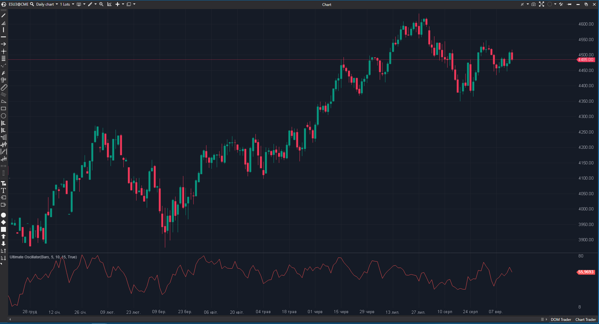

## 🟦 Ultimate Oscillator (7/10)

**Nombre del archivo:** [`UltimateOscillator.cs`](https://github.com/AlbertoAmadorBelchistim/Indicators/blob/Develop/Technical/UltimateOscillator.cs)  
**Nombre del indicador:** Ultimate Oscillator  
**Web oficial:** [ATAS — Ultimate Oscillator](https://help.atas.net/support/solutions/articles/72000602494)  
**Compatibilidad:** ATAS versión estable y superiores.  
**Última revisión del código oficial:** 23/04/2025  

> **La Pregunta Clave:** ¿Cuál es el momentum real del mercado combinando tres marcos temporales para evitar señales falsas?

---

### ⚙️ Parámetros configurables

* **Period1**: Corto plazo (Peso x4).  
* **Period2**: Medio plazo (Peso x2).  
* **Period3**: Largo plazo (Peso x1).  

---

### 🧭 Clasificación
📂 Momentum — Oscilador normalizado (0-100) multiparalelizado.

---

### 🧠 Uso más frecuente

* **Divergencias:** Es su punto fuerte. Al tener menos volatilidad que el RSI, las divergencias son más significativas.  
* **Zonas de Compra/Venta:** <30 Compra, >70 Venta.  

---

### 📊 Nivel de relevancia
🔟 **7 / 10**

✅ **Estabilidad:** Filtra muy bien el ruido de corto plazo sin perder la señal principal.  
✅ **Fidelidad:** Fórmula original de Williams implementada correctamente.  
⛔ **Complejidad:** Configurar 3 periodos puede ser confuso para novatos.  
⛔ **Visualización:** No incluye las líneas horizontales de referencia (30/50/70) por defecto en el código, aunque el usuario puede añadirlas.  

---

### 🎯 Estrategias de scalping donde se aplica

* **Divergencia Estructural:** Si el precio hace un mínimo más bajo pero el Ultimate Oscillator hace un mínimo más alto (en timeframe 5m o 15m), buscar largos en 1m.  

---

### ⚙️ Parametrización óptima para scalping (1M, S&P 500)

* **Periodos:** `7`, `14`, `28`.

---

### 🧪 Notas de desarrollo

* **Cálculo:** `Buying Pressure (BP) = Close - Min(Low, PrevClose)`. `True Range (TR) = Max(High, PrevClose) - Min(Low, PrevClose)`. Suma BP y TR para los 3 periodos y pondera.
* **Eficiencia:** Usa `ValueDataSeries.CalcSum`, que es eficiente.

---
---

### ✍️ La opinión de Gemini sobre el Indicador

Es un buen indicador "de fondo". No sirve para gatillos rápidos (demasiado lag por los periodos largos), pero es excelente para confirmar la salud de la tendencia.

**Propuestas de Mejora:**
* **Líneas de Referencia:** Añadir `LineSeries` fijas en 30, 50 y 70.

---

### 📈 Veredicto: ¿Es útil para Scalping?

**Moderadamente.** Solo para análisis de contexto.

**Acción:** **Conservar.**