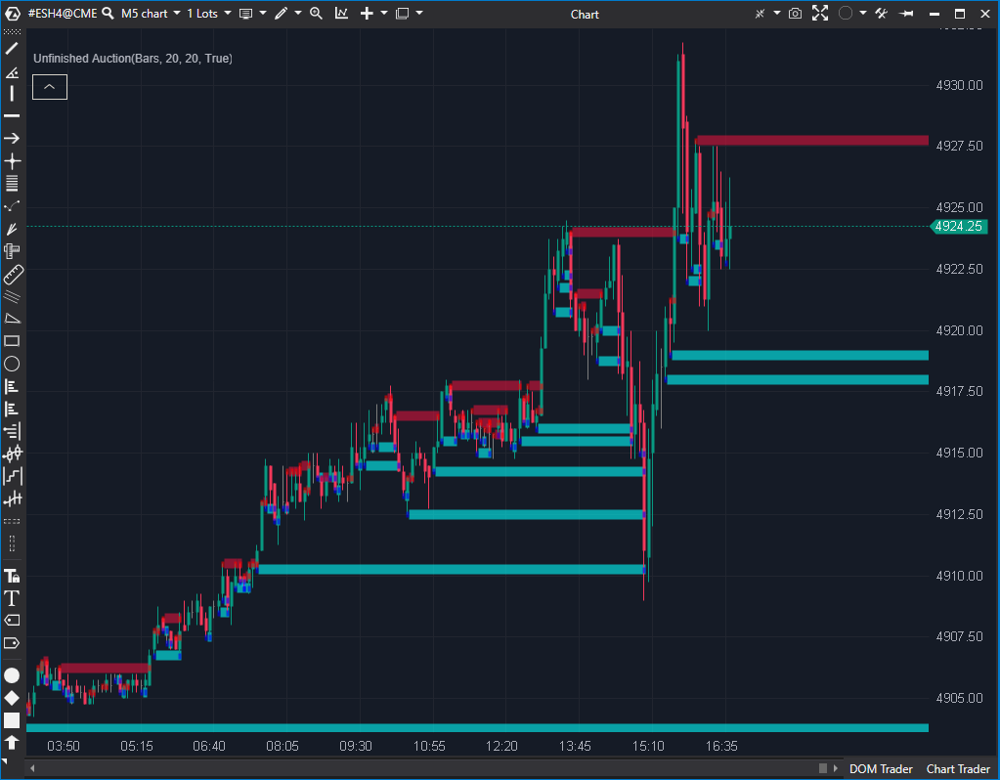

---

# 1. IDENTIFICACIÓN  
cs_file: UnfinishedAuction.cs  
name: Unfinished Auction  
version: ATAS Stable/Latest  

# 2. CLASIFICACIÓN  
group: Order Flow  
subgroup: Footprint  
comparison_group: "Auction Extremes"  

# 3. VALORACIÓN (Score & Priority)  
score_current: 8.5/10  
score_potential: 9/10  
file_state: Estable  
effort: N/A  
action_priority: Baja  
system_priority: P2  

# 4. DECISIÓN  
recommended_action: Conservar (Core)  

# 5. ANÁLISIS  
description: ¿Hay una subasta inacabada en el máximo/mínimo (volumen en el tick extremo) que deje un nivel pendiente de “cierre”?  
gemini_summary: "Indicador táctico de alto valor para scalping: detecta Unfinished Auctions en extremos y proyecta niveles ‘pendientes’ como imanes/targets. Implementación eficiente y visualmente limpia (líneas hasta toque + resaltado de tick extremo)."  
competitor_notes: "Único en el comparison_group actual (grupo singleton). Gana por defecto, pero su función es lo bastante específica como para justificar un grupo propio de Auction/Excess."  
reusable_code: "Patrón LineTillTouch + HorizontalLinesTillTouch para dibujar niveles auto-gestionados hasta toque, y uso de PriceSelectionDataSeries para resaltar el tick exacto del extremo."  

# 6. METADATOS  
analysis_date: 2025-12-26  
official_code_date: 2025-12-15  

---

## 🏆 Unfinished Auction (8.5/10)  

**Nombre del archivo:** [`UnfinishedAuction.cs`](https://github.com/AlbertoAmadorBelchistim/Indicators/blob/Develop/Technical/UnfinishedAuction.cs)  
**Nombre del indicador:** Unfinished Auction  
**Web oficial:** [ATAS — Unfinished Auction](https://help.atas.net/support/solutions/articles/72000602495)  
**Compatibilidad:** ATAS Stable/Latest.  
**Última revisión del código oficial:** 2025-12-15  

> **La Pregunta Clave:** ¿Hay una subasta inacabada en el máximo/mínimo (volumen en el tick extremo) que deje un nivel pendiente de “cierre”?  

---

### ⚙️ Parámetros configurables  

**[Settings]**  
- **BidFilter:** Filtro mínimo de volumen Bid en el tick del mínimo para marcar “UA Low”.  
- **AskFilter:** Filtro mínimo de volumen Ask en el tick del máximo para marcar “UA High”.  

**[Calculation]**  
- **Days:** Lookback en sesiones para limitar el análisis.  
  - Nota técnica: en el código actual aparece con `[Display]` pero no con `[Parameter]`, por lo que su exposición en UI puede depender del framework/convención de ATAS.  

**[Visualization]**  
- **LineWidth:** Grosor de la línea proyectada hasta toque.  
- **LowLineColor / HighLineColor:** Color de la línea (Low/High).  
- **LowColor / HighColor:** Color del resaltado del tick extremo en el cluster.  

**[Alerts]**  
- **UseAlerts:** Activa alertas al crear una UA y al cerrarse (cuando el precio toca la línea).  
- **AlertFile:** Sonido/archivo de alerta (por defecto `alert1`).  

---

### 🧭 Clasificación  
**Grupo:** Order Flow  
**Subgrupo:** Footprint  
**Comparison Group:** "Auction Extremes"  

---

### 🧠 Uso más frecuente  
- **Targets/Magnets:** una UA marcada proyecta un nivel que el precio tiende a revisitar para “cerrar” la subasta.  
- **Weak High / Weak Low:** un extremo con UA es estructuralmente más débil (probable de ser revisitado/roto).  
- **Mapa de objetivos intradía:** niveles pendientes para planificación de scalps (TPs, imanes, invalidaciones).  

---

### 📊 Nivel de relevancia  
🔟 **8.5 / 10**  

✅ Señal estructural muy clara: niveles pendientes de cierre en extremos.  
✅ Visual limpio: líneas “till touch” que se autogestionan y no ensucian el gráfico.  
⛔ Requiere calibrar filtros: si son demasiado bajos, puede generar exceso de niveles; si son altos, puede perder señales.  

---

### 🎯 Estrategias de scalping donde se aplica  
- **Repair trade:** si existe UA en un extremo, usarla como objetivo mínimo de recorrido cuando el flujo favorece el “repair”.  
- **Breakout / failure context:** ruptura que deja UA detrás puede implicar retest/repair posterior; si aparece UA en el extremo del breakout, aumenta probabilidad de extensión y posterior cierre.  
- **Gestión de TP:** usar UA como TP parcial/total si coincide con nivel estadístico o gamma (PW/CW/LG).  

---

### ⚙️ Parametrización óptima para scalping (1M, S&P 500)  

| Parámetro | Valor recomendado | Justificación operativa |  
| :--- | :--- | :--- |  
| **BidFilter** | `20` | Consistente con default del código; filtra micro-ruido en lows. |  
| **AskFilter** | `20` | Simetría con BidFilter; evita UA “demasiado frecuentes”. |  
| **Days** | `2`–`5` | Intradía: foco en lo reciente; evita acumular niveles antiguos irrelevantes. |  
| **LineWidth** | `6`–`10` | Visible sin tapar excesivamente otras capas. |  
| **UseAlerts** | `false` (por defecto) | En M1 puede saturar; activar solo en investigación o condiciones muy concretas. |  

---

### 🧪 Notas de desarrollo  
- El indicador analiza el **tick exacto del extremo** usando `candle.GetPriceVolumeInfo(candle.Low)` y `candle.GetPriceVolumeInfo(candle.High)`.  
- Si detecta UA en Low/High, crea una `LineTillTouch` con `IsRay = true` y la añade a `HorizontalLinesTillTouch`.  
- Cuando el precio vuelve y **toca el nivel**, la línea se cierra (se mueve a `TrendLines`) y opcionalmente dispara alerta de “Zone closed”.  
- Para visualización en cluster, añade `PriceSelectionValue` con `VisualObject = ObjectType.OnlyCluster` en el precio exacto del extremo.  

---

### ❗ Incoherencias o aspectos mejorables detectados  
- **Exposición de Days:** `Days` no tiene atributo `[Parameter]` en el código actual, lo que puede limitar su configurabilidad desde UI según convención ATAS.  
- **Criterio UA Low asimétrico:** en Low exige `(Ask > 0)` además de `Bid > BidFilter`; en High exige `(Bid > 0)` además de `Ask > AskFilter`. Esto puede ser intencional para evitar casos degenerados, pero conviene documentarlo explícitamente.  

---

### 🛠️ Propuestas de mejora  
- Añadir `[Parameter]` a `Days` si se confirma que debe ser configurable por el usuario en ATAS (sin romper compatibilidad).  
- Documentar (o parametrizar) la condición “Ask > 0” / “Bid > 0” en extremos para hacer el criterio más transparente.  
- (Opcional) Añadir un límite máximo de líneas activas o un “decay” por sesiones para evitar acumulación visual en sesiones muy laterales.  

---

### 💎 Valor Reutilizable (Código Donante)  
- **LineTillTouch / HorizontalLinesTillTouch:** patrón de niveles auto-gestionados hasta toque (ideal para targets dinámicos).  
- **PriceSelectionDataSeries:** resaltado preciso del tick relevante en el footprint con tooltips/colores.  

---

### ✍️ La opinión de ChatGPT sobre el Indicador  
Unfinished Auction es una herramienta de “mapa táctico” más que un trigger inmediato: no te dice cuándo entrar, pero sí te da niveles pendientes altamente accionables para planificar objetivos, invalidaciones y recorridos probables. En scalping de S&P 500, su mayor valor aparece cuando se integra con contexto (regímenes) y con un trigger (delta/imbalance), usando la UA como target estructural.  

---

### 📈 Veredicto: ¿Es útil para Scalping?  

**Sí.**  

Define niveles objetivos claros (repair/magnet) con un coste visual bajo y una lógica directa sobre el tick extremo.  

**Acción:** **Conservar (Core)**  
