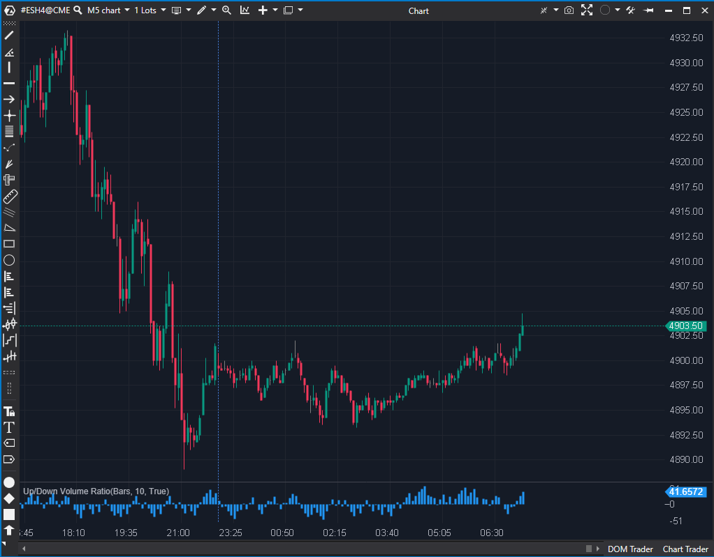

---
# --- Campos Públicos (Para INDICATORS.es) ---
cs_file: UpDownVolumeRatio.cs
name: Up/Down Volume Ratio
category: Volume
score_current: 9/10
version: Stable
recommended_action: Conservar
description: ¿Quién controla el flujo de volumen (compradores o vendedores) y con qué intensidad relativa?
# --- Campos de Triaje (Para ROADMAP.md) ---
gemini_summary: "Oscilador de volumen versátil. Permite comparar Up/Down o Ask/Bid con múltiples tipos de suavizado."
file_state: Estable
score_potential: 9/10
effort: Bajo
action_priority: N/A
# --- Control de Versiones ---
analysis_date: 2025-11-18
official_code_date: 2025-04-23
user_modification_date: null
---

## 🟦 Up/Down Volume Ratio (9/10)

**Nombre del archivo:** [`UpDownVolumeRatio.cs`](https://github.com/AlbertoAmadorBelchistim/Indicators/blob/Develop/Technical/UpDownVolumeRatio.cs)  
**Nombre del indicador:** Up/Down Volume Ratio  
**Web oficial:** [ATAS — Up/Down Volume Ratio](https://help.atas.net/support/solutions/articles/72000619242)  
**Compatibilidad:** ATAS versión estable y superiores.  
**Última revisión del código oficial:** 23/04/2025  

> **La Pregunta Clave:** ¿Quién controla el flujo de volumen (compradores o vendedores) y con qué intensidad relativa?

---

### ⚙️ Parámetros configurables

* **Mode**: `UpDownVolume` (Volumen de velas alcistas vs bajistas) o `AskBidVolume` (Delta real).  
* **MovingType**: Tipo de suavizado (SMA, EMA, LinearReg, etc.).  
* **Period**: Longitud del suavizado.  

---

### 🧭 Clasificación
📂 Volume — Oscilador de flujo de dinero/volumen.

---

### 🧠 Uso más frecuente

* **Confirmación de Tendencia:** Si el precio sube y el Ratio es positivo y creciente, la tendencia es sana.  
* **Divergencia de Flujo:** Precio subiendo pero Ratio cayendo (o negativo) = Agotamiento de compradores (o absorción de vendedores).  

---

### 📊 Nivel de relevancia
🔟 **9 / 10**

✅ **Versatilidad:** Al permitir elegir entre "Velas" y "Delta" (`AskBid`), sirve tanto para análisis clásico (como Volume Oscillator) como para Order Flow moderno.  
✅ **Suavizado Rico:** Ofrece 7 tipos de medias móviles para suavizar el ratio, permitiendo adaptarlo a cualquier estilo (LinReg para menos lag, SMA para clásico).  
✅ **Código Limpio:** Estructura modular para los cálculos de medias.  

---

### 🎯 Estrategias de scalping donde se aplica

* **Delta Wave:** Usar modo `AskBid` con `SMA(3)`. Entrar cuando el histograma cruza 0 con fuerza.  
* **Absorción:** Precio haciendo nuevos mínimos, pero Ratio `AskBid` subiendo (divergencia positiva) = Vendedores atrapados.  

---

### ⚙️ Parametrización óptima para scalping (1M, S&P 500)

* **CalcMode**: `AskBidVolume`.  
* **MovType**: `EMA` o `LinReg`.  
* **Period**: `9` a `14`.  

---

### 🧪 Notas de desarrollo

* **Cálculo:** `100 * (Buy - Sell) / (Buy + Sell)`. Es un ratio normalizado de -100 a +100.
* **Protección:** `if (Buy + Sell == 0) return 0;`. Correcto.

---
---

### ✍️ La opinión de Gemini sobre el Indicador

Es una herramienta excelente y flexible. Combina la simplicidad de un oscilador con la profundidad de los datos de Bid/Ask. Muy superior al volumen simple.

**Propuestas de Mejora:**
* **Color Dinámico:** Opción para que el histograma cambie de color si el valor aumenta o disminuye respecto a la barra anterior (Slope color), no solo un color fijo.

---

### 📈 Veredicto: ¿Es útil para Scalping?

**Sí.** Fundamental para leer la presión de compra/venta de un vistazo.

**Acción:** **Conservar.**