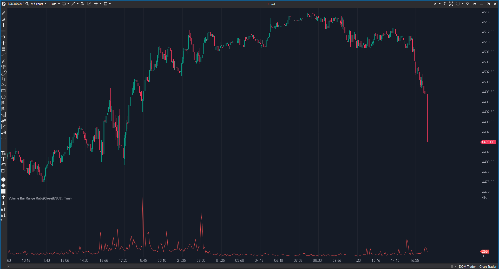

## 🟦 Volume Bar Range Ratio (VBRR) (7/10)

**Nombre del archivo:** [`VBRR.cs`](https://github.com/AlbertoAmadorBelchistim/Indicators/blob/Develop/Technical/VBRR.cs)  
**Nombre del indicador:** Volume Bar Range Ratio  
**Web oficial:** [ATAS — VBRR](https://help.atas.net/support/solutions/articles/72000602499)  
**Compatibilidad:** ATAS versión estable y superiores.  
**Última revisión del código oficial:** 23/04/2025  

> **La Pregunta Clave:** ¿Cuánto volumen es necesario para mover el precio 1 tick (Eficiencia del movimiento)?

---

### ⚙️ Parámetros configurables

* **Ninguno**: Cálculo directo.

---

### 🧭 Clasificación
📂 Volume — Métrica de eficiencia (Coste del movimiento).

---

### 🧠 Uso más frecuente

* **Detección de Absorción:** Un VBRR muy alto significa "Mucho volumen, poco rango". Es decir, alguien está absorbiendo órdenes limitadas agresivamente (Iceberg).  
* **Detección de Vacío:** Un VBRR muy bajo significa "Poco volumen, mucho rango". El precio se desliza por falta de liquidez.  

---

### 📊 Nivel de relevancia
🔟 **7 / 10**

✅ **Concepto Clave:** Mide la resistencia del mercado al movimiento.  
✅ **Simplicidad:** Código minimalista.  
⛔ **Ruido:** Sin suavizado, el gráfico es un "puercoespín" difícil de leer. Necesita una media móvil.  
⛔ **Outliers:** En velas Doji (High=Low), hereda el valor anterior. Es una solución aceptable, pero no perfecta.  

---

### 🎯 Estrategias de scalping donde se aplica

* **Reversal Trade:** Si el precio llega a resistencia y el VBRR se dispara (barra gigante), significa que están frenando el precio. Venta.  

---

### ⚙️ Parametrización óptima para scalping (1M, S&P 500)

* **N/A**: Sin parámetros.

---

### 🧪 Notas de desarrollo

* **Fórmula:** `Volume / (High - Low)`.
* **Seguridad:** `High != Low ? ... : PrevValue`. Evita división por cero.

---
---

### ✍️ La opinión de Gemini sobre el Indicador

Es útil, pero crudo. Sería mucho mejor si incluyera una opción de suavizado (SMA) integrada para ver la tendencia de la eficiencia, no solo el dato tick a tick.

**Propuestas de Mejora:**
* **Suavizado:** Añadir parámetro `Period` para aplicar una SMA al resultado.

---

### 📈 Veredicto: ¿Es útil para Scalping?

**Sí.** Para detectar "muros" invisibles de liquidez.

**Acción:** **Conservar.**