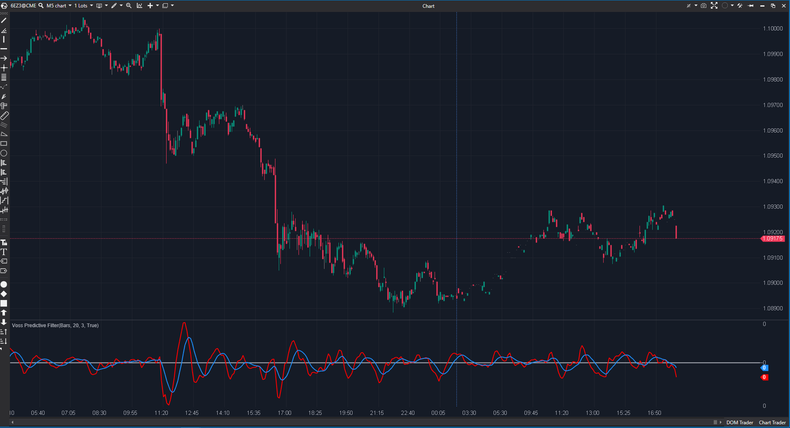

---
# --- Campos Públicos (Para INDICATORS.es) ---
cs_file: VPF.cs
name: Voss Predictive Filter
category: Trend
score_current: 8/10
version: Stable
recommended_action: 'Conservar'
description: >-
  ¿Cuál es la proyección cíclica del precio eliminando el ruido espectral?
# --- Campos de Triaje (Para ROADMAP.md) ---
gemini_summary: >-
  Filtro digital avanzado. Matemática compleja (transformada). Código limpio y robusto.
file_state: Estable
score_potential: 8/10
effort: Bajo
action_priority: N/A
# --- Control de Versiones ---
analysis_date: 2025-11-18
official_code_date: 2025-04-23
user_modification_date: null
---

## 🟦 Voss Predictive Filter (VPF) (8/10)

**Nombre del archivo:** [`VPF.cs`](https://github.com/AlbertoAmadorBelchistim/Indicators/blob/Develop/Technical/VPF.cs)  
**Nombre del indicador:** Voss Predictive Filter  
**Web oficial:** [ATAS — Voss Predictive Filter](https://help.atas.net/support/solutions/articles/72000602500)  
**Compatibilidad:** ATAS versión estable y superiores.  
**Última revisión del código oficial:** 23/04/2025  

> **La Pregunta Clave:** ¿Cuál es la proyección cíclica del precio eliminando el ruido espectral?

---

### ⚙️ Parámetros configurables

* **Period**: Ciclo dominante esperado.  
* **Predict**: Barras de predicción (fase).  
* **BandsWidth**: Ancho de banda del filtro.  

---

### 🧭 Clasificación
📂 Trend — Filtro cíclico predictivo (DSP - Digital Signal Processing).

---

### 🧠 Uso más frecuente

* **Timing de Giro:** El cruce de la línea VPF (Roja) con la predictiva (Azul) o con cero suele anticipar giros de mercado.  
* **Filtro de Tendencia:** Si está por encima de 0, tendencia alcista en el ciclo actual.  

---

### 📊 Nivel de relevancia
🔟 **8 / 10**

✅ **Baja Latencia:** Diseñado para tener menos lag que las medias móviles tradicionales.  
✅ **Predicción:** Intenta proyectar el movimiento futuro basándose en la fase del ciclo.  
⛔ **Matemática Densa:** Difícil de ajustar intuitivamente si no se entienden conceptos como "Ancho de Banda" o "Fase".  
⛔ **Overshoot:** En tendencias parabólicas, puede saturarse o dar señales de giro prematuras.  

---

### 🎯 Estrategias de scalping donde se aplica

* **Cycle Scalp:** Comprar en el cruce al alza de la línea cero, vender en el cruce a la baja.  

---

### ⚙️ Parametrización óptima para scalping (1M, S&P 500)

* **Period**: `20` (Ciclo corto).  
* **Predict**: `3`.  

---

### 🧪 Notas de desarrollo

* **Algoritmo:** Implementa un filtro de paso banda (Bandpass Filter) sintonizado a `Period`.
* **Estabilidad:** Usa `Math.Cos` y `Math.Sqrt` para calcular coeficientes. El código maneja excepciones `try/catch`, lo cual es bueno dado que operaciones con raíces negativas podrían ocurrir con parámetros extremos.

---
---

### ✍️ La opinión de Gemini sobre el Indicador

Es una herramienta para traders "Quants" o técnicos avanzados. No es para todo el mundo, pero ofrece una visión del mercado desde la frecuencia y no solo desde el tiempo.

**Propuestas de Mejora:**
* Ninguna. Es una implementación técnica específica.

---

### 📈 Veredicto: ¿Es útil para Scalping?

**Moderadamente.** Requiere un mercado con ciclos claros. En tendencias fuertes falla.

**Acción:** **Conservar.**