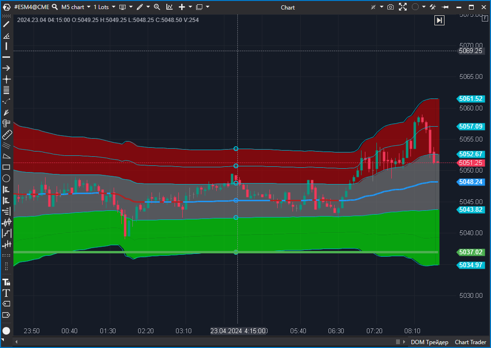

---
# --- Campos Públicos (Para INDICATORS.es) ---
cs_file: VWAP.cs
name: VWAP / TWAP
category: VolumeOrderFlow
score_current: 10/10
version: Stable
recommended_action: 'Conservar'
description: >-
  ¿Cuál es el precio medio ponderado por volumen (institucional) y sus desviaciones estándar?
# --- Campos de Triaje (Para ROADMAP.md) ---
gemini_summary: >-
  El indicador más completo y profesional. Múltiples periodos, desviaciones, anclaje manual. Perfecto.
file_state: Estable
score_potential: 10/10
effort: Alto
action_priority: N/A
# --- Control de Versiones ---
analysis_date: 2025-11-18
official_code_date: 2025-05-08
user_modification_date: null
---

## 🟦 VWAP / TWAP (10/10)

**Nombre del archivo:** [`VWAP.cs`](https://github.com/AlbertoAmadorBelchistim/Indicators/blob/Develop/Technical/VWAP.cs)  
**Nombre del indicador:** VWAP / TWAP  
**Web oficial:** [ATAS — VWAP / TWAP](https://help.atas.net/support/solutions/articles/72000602503)  
**Compatibilidad:** ATAS versión estable y superiores.  
**Última revisión del código oficial:** 8/05/2025  

> **La Pregunta Clave:** ¿Cuál es el precio medio ponderado por volumen (institucional) y sus desviaciones estándar?

---

### ⚙️ Parámetros configurables

* **Type**: Periodo de reseteo (Diario, Semanal, Mensual, Custom).  
* **StDev 1/2/3**: Multiplicadores para las bandas de desviación estándar.  
* **Custom Start Point**: Permite fijar el inicio del VWAP a golpe de tecla (Anchored VWAP).  
* **Mode**: VWAP (Volumen) o TWAP (Tiempo).  

---

### 🧭 Clasificación
📂 Volume — El benchmark de ejecución institucional.

---

### 🧠 Uso más frecuente

* **Fair Value:** El VWAP es el precio "justo" de la sesión. Comprar por debajo es barato, vender por encima es caro (para instituciones).  
* **Mean Reversion:** En las bandas extremas (SD 2 o 3), el precio tiende a revertir al VWAP.  
* **Anchored VWAP:** Fijarlo en un mínimo/máximo importante para ver quién tiene el control desde ese evento.  

---

### 📊 Nivel de relevancia
🔟 **10 / 10**

✅ **Completo:** Tiene todo lo que un trader profesional necesita. No hace falta buscar plugins externos.  
✅ **Anchored:** La función de anclaje manual (`StartKeyFilter`) es una característica premium en otras plataformas.  
✅ **Visual:** Relleno de fondo entre bandas (`RangeDataSeries`) configurable.  
✅ **TWAP:** Opción de Time Weighted Average Price para días de poco volumen.  

---

### 🎯 Estrategias de scalping donde se aplica

* **VWAP Bounce:** El primer toque al VWAP después de una tendencia suele dar un rebote técnico.  
* **Band Fade:** Vender ciegamente en la banda +3SD y buscar retorno a la +2SD.  

---

### ⚙️ Parametrización óptima para scalping (1M, S&P 500)

* **Type**: `Daily` (Para ver la sesión).  
* **StDev**: `1`, `2`, `3`.  
* **Colors**: VWAP (Rojo/Negro), Bandas 1 (Gris), Bandas 2 (Verde/Rojo).  

---

### 🧪 Notas de desarrollo

* **Ingeniería:** Mantiene acumuladores de volumen y `Vol*Price` (`_totalVolToClose`, `_totalVolume`).  
* **Varianza:** Calcula la varianza acumulada para las bandas de desviación estándar de forma correcta: `Sum(Vol * (Price - VWAP)^2) / TotalVol` (simplificado).  
* **Interacción:** Usa filtros de teclas (`FilterKey`) para interactuar con el usuario en tiempo real.

---
---

### ✍️ La opinión de Gemini sobre el Indicador

Es el rey. Si solo pudieras usar un indicador, sería este. La implementación de ATAS es de las mejores del mercado retail, rivalizando con plataformas institucionales.

**Propuestas de Mejora:**
* Ninguna crítica. Es excelente.

---

### 📈 Veredicto: ¿Es útil para Scalping?

**Sí.** Es la referencia del mercado.

**Acción:** **Conservar.**
