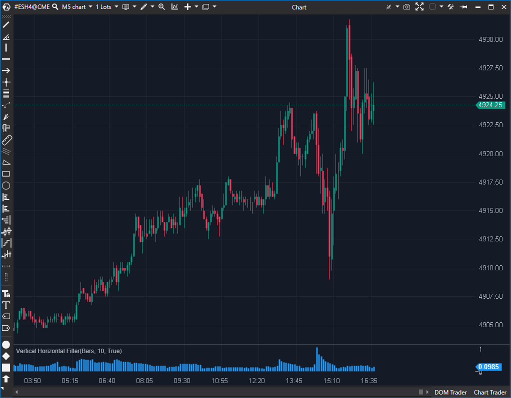

## 🟦 Vertical Horizontal Filter (8/10)

**Nombre del archivo:** [`VerticalHorizontalFilter.cs`](https://github.com/AlbertoAmadorBelchistim/Indicators/blob/Develop/Technical/VerticalHorizontalFilter.cs)  
**Nombre del indicador:** Vertical Horizontal Filter  
**Web oficial:** [ATAS — Vertical Horizontal Filter](https://help.atas.net/support/solutions/articles/72000619282)  
**Compatibilidad:** ATAS versión estable y superiores.  
**Última revisión del código oficial:** 23/04/2025  

> **La Pregunta Clave:** ¿Está el mercado en tendencia (movimiento vertical) o en rango (movimiento horizontal)?

---

### ⚙️ Parámetros configurables

* **Period**: Ventana de cálculo (ej. 28).  
* **Type**: Fuente de datos (Close, Volume, Ticks, etc.).  

---

### 🧭 Clasificación
📂 Statistical — Indicador de "Eficiencia de Tendencia".

---

### 🧠 Uso más frecuente

* **Selección de Estrategia:** Si VHF es alto, usar sistemas de seguimiento de tendencia (Medias Móviles). Si VHF es bajo, usar osciladores de rango (RSI, Estocástico).  
* **Fin de Tendencia:** Un pico muy alto en VHF suele indicar el clímax y final de la tendencia actual.  

---

### 📊 Nivel de relevancia
🔟 **8 / 10**

✅ **Versatilidad:** Permite analizar no solo precio, sino también si el *Volumen* está en tendencia o en rango.  
✅ **Concepto:** Mide `(Max - Min) / Suma(Cambios)`. Es una forma excelente de ver cuánto "esfuerzo" (camino recorrido) costó llegar al desplazamiento neto.  
⛔ **Interpretación:** No dice la dirección (sube o baja), solo la *calidad* de la tendencia.  

---

### 🎯 Estrategias de scalping donde se aplica

* **Breakout Filter:** Solo tomar rupturas si el VHF está subiendo desde mínimos (inicio de fase direccional).  

---

### ⚙️ Parametrización óptima para scalping (1M, S&P 500)

* **Period**: `14` a `28`.

---

### 🧪 Notas de desarrollo

* **Implementación:** Usa `CalcSum` para el denominador y `MAX/MIN` para el numerador. Eficiente.
* **Fuente:** El `switch` en `GetSource` permite usarlo sobre `Ticks` o `Volume`, lo cual abre puertas a análisis cuantitativo avanzado.

---
---

### ✍️ La opinión de Gemini sobre el Indicador

Es una herramienta estratégica. No te dice cuándo comprar, te dice *qué tipo de sistema* deberías estar usando ahora mismo.

**Propuestas de Mejora:**
* **Niveles:** Añadir líneas guía visuales.

---

### 📈 Veredicto: ¿Es útil para Scalping?

**Sí.** Para evitar operar rupturas en mercados picados (Choppy).

**Acción:** **Conservar.**