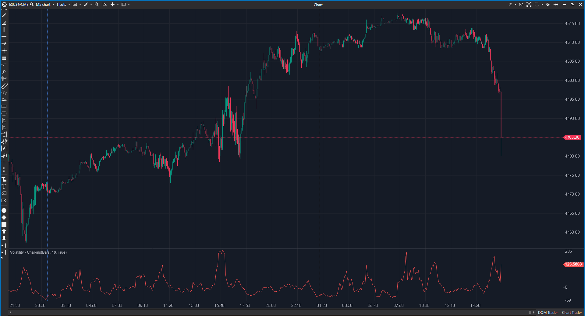

## 🟦 Volatility - Chaikins (7/10)

**Nombre del archivo:** [`VolatilityChaikins.cs`](https://github.com/AlbertoAmadorBelchistim/Indicators/blob/Develop/Technical/VolatilityChaikins.cs)  
**Nombre del indicador:** Volatility - Chaikins  
**Web oficial:** [ATAS — Volatility - Chaikins](https://help.atas.net/support/solutions/articles/72000602497)  
**Compatibilidad:** ATAS versión estable y superiores.  
**Última revisión del código oficial:** 23/04/2025  

> **La Pregunta Clave:** ¿Se está expandiendo o contrayendo el rango de precios (volatilidad) respecto al pasado reciente?

---

### ⚙️ Parámetros configurables

* **Period**: Ventana de suavizado y comparación.

---

### 🧭 Clasificación
📂 Volatility — Oscilador de expansión/contracción.

---

### 🧠 Uso más frecuente

* **Squeeze:** Valores muy bajos (negativos) indican que el rango se ha muerto. Esperar explosión.  
* **Clímax:** Picos altos indican pánico o euforia máxima. Suelen marcar techos/suelos de corto plazo.  

---

### 📊 Nivel de relevancia
🔟 **7 / 10**

✅ **Claridad:** Muestra el cambio porcentual. Fácil de leer.  
⛔ **Retardo:** Al comparar con `bar - Period`, la señal de expansión llega cuando el movimiento ya ha empezado.  

---

### 🎯 Estrategias de scalping donde se aplica

* **Volatilidad Cíclica:** No abrir operaciones nuevas si el Chaikin Volatility está en máximos y girando a la baja (el mercado se va a parar).  

---

### ⚙️ Parametrización óptima para scalping (1M, S&P 500)

* **Period**: `10`.

---

### 🧪 Notas de desarrollo

* **Fórmula:** `ROC(EMA(High-Low, Period), Period)`.
* **Código:** Correcto.

---
---

### ✍️ La opinión de Gemini sobre el Indicador

Es un clásico. Útil para entender el régimen de mercado.

**Propuestas de Mejora:**
* Ninguna.

---

### 📈 Veredicto: ¿Es útil para Scalping?

**Moderadamente.** Como filtro de contexto.

**Acción:** **Conservar.**