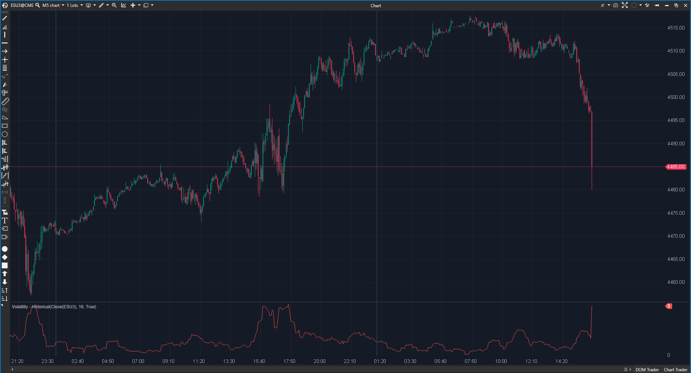

## 🟦 Volatility - Historical (4/10)

**Nombre del archivo:** [`VolatilityHist.cs`](https://github.com/AlbertoAmadorBelchistim/Indicators/blob/Develop/Technical/VolatilityHist.cs)  
**Nombre del indicador:** Volatility - Historical  
**Web oficial:** [ATAS — Volatility - Historical](https://help.atas.net/support/solutions/articles/72000602266)  
**Compatibilidad:** ATAS versión estable y superiores.  
**Última revisión del código oficial:** 23/04/2025  

> **La Pregunta Clave:** ¿Cuál es la volatilidad estadística histórica basada en los retornos logarítmicos?

---

### ⚙️ Parámetros configurables

* **Period**: Ventana de cálculo de la desviación estándar.

---

### 🧭 Clasificación
📂 Volatility — Medida estadística académica (HV).

---

### 🧠 Uso más frecuente

* **Trading de Opciones:** Comparar HV (Historical Volatility) con IV (Implied Volatility).  
* **Ajuste de Posición:** Reducir tamaño si HV se dispara.  

---

### 📊 Nivel de relevancia
🔟 **4 / 10**

✅ **Base Teórica:** Usa log-retornos (`ln(P/P_prev)`), que es lo correcto en finanzas.  
⛔ **BUG CRÍTICO:** La fórmula incluye `Math.Sqrt(CurrentBar)`. Esto hace que la volatilidad calculada aumente a medida que avanza el día simplemente porque el número de barra es mayor. Debería ser una constante de anualización (ej. $\sqrt{252}$ para días, o $\sqrt{N}$ para intradía fijo), no una variable creciente. Esto invalida el indicador para sesiones largas.  

---

### 🎯 Estrategias de scalping donde se aplica

* **N/A:** En su estado actual, los valores no son fiables intradía.

---

### ⚙️ Parametrización óptima para scalping (1M, S&P 500)

* **No usar** hasta que se repare.

---

### 🧪 Notas de desarrollo

* **Error:** `this[bar] = 100 * (decimal)(Math.Sqrt(CurrentBar) * ...`. `CurrentBar` es el índice de la barra actual desde el inicio de la carga. En la barra 1000 el valor será $\sqrt{10} \approx 3$ veces mayor que en la barra 100, aunque la volatilidad real sea la misma.
* **Corrección:** Reemplazar `CurrentBar` por una constante que represente el número de periodos en un año (si se quiere anualizar) o eliminarlo para tener volatilidad por periodo.

---
---

### ✍️ La opinión de Gemini sobre el Indicador

Está roto conceptualmente. El desarrollador probablemente confundió "Número de observaciones en la muestra anual" con "Número de barra actual".

**Propuestas de Mejora:**
* **REPARAR:** Cambiar la fórmula de escalado. Permitir al usuario definir el factor de anualización o usar volatilidad per-periodo.

---

### 📈 Veredicto: ¿Es útil para Scalping?

**No.** Da datos falsos crecientes.

**Acción:** **Reparar (Prioridad Alta).**