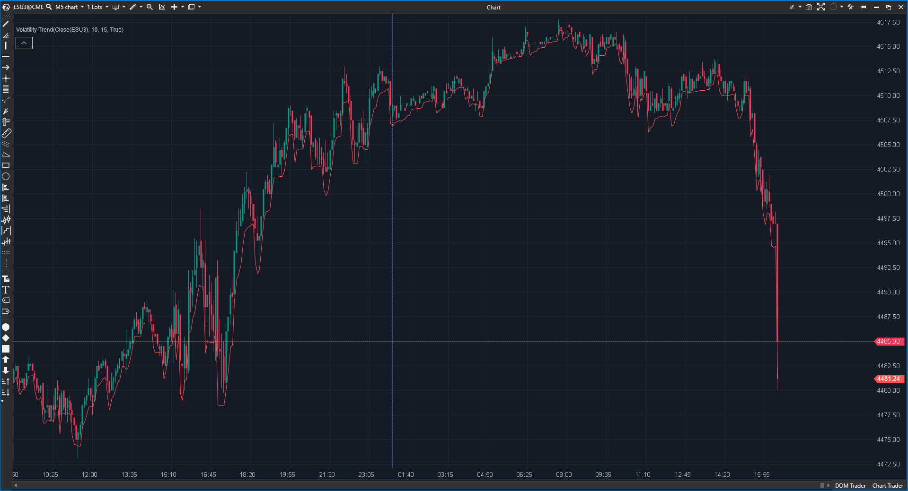

## 🟦 Volatility Trend (8/10)

**Nombre del archivo:** [`VolatilityTrend.cs`](https://github.com/AlbertoAmadorBelchistim/Indicators/blob/Develop/Technical/VolatilityTrend.cs)  
**Nombre del indicador:** Volatility Trend  
**Web oficial:** [ATAS — Volatility Trend](https://help.atas.net/support/solutions/articles/72000602267)  
**Compatibilidad:** ATAS versión estable y superiores.  
**Última revisión del código oficial:** 23/04/2025  

> **La Pregunta Clave:** ¿Cuál es el canal de tendencia dinámico ajustado por la persistencia de la dirección y la volatilidad?

---

### ⚙️ Parámetros configurables

* **Period**: Periodo del ATR.  
* **MaxDynamicPeriod**: Límite para el contador de persistencia.  

---

### 🧭 Clasificación
📂 Volatility — Sistema de seguimiento de tendencia (Trailing Stop) adaptativo.

---

### 🧠 Uso más frecuente

* **Trailing Stop:** La línea azul dibuja un nivel de stop que se ajusta a la volatilidad.  
* **Inversión:** Si el precio cruza la línea, la tendencia ha cambiado.  

---

### 📊 Nivel de relevancia
🔟 **8 / 10**

✅ **Lógica Dinámica:** Aumenta el periodo de búsqueda (`dynamicPeriod`) si la dirección del precio persiste. Esto hace que el stop sea más holgado en tendencias fuertes y más ajustado en giros.  
✅ **Originalidad:** Combina conceptos de Donchian Channel y SuperTrend de forma novedosa.  
⛔ **Visualización:** Solo dibuja una línea. Podría mejorar con cambio de color alcista/bajista.  

---

### 🎯 Estrategias de scalping donde se aplica

* **Tendencia Sostenida:** Mantener posición mientras el precio no cierre por debajo de la línea VolatilityTrend.  

---

### ⚙️ Parametrización óptima para scalping (1M, S&P 500)

* **Period**: `10`.  
* **MaxPeriod**: `20` (Para permitir correcciones menores sin saltar el stop).

---

### 🧪 Notas de desarrollo

* **Algoritmo:** `_dirSeries` detecta si Close > Prev. `_dplSeries` cuenta cuántas velas seguidas lleva en esa dirección (hasta `MaxDynamicPeriod`). Luego calcula `Max(High, count) - ATR` si sube, o `Min(Low, count) + ATR` si baja.
* **Elegante:** Una forma muy inteligente de adaptar la ventana de "Donchian" a la fuerza de la tendencia.

---
---

### ✍️ La opinión de Gemini sobre el Indicador

Es un indicador sofisticado y bien pensado. Ofrece una ventaja sobre el SuperTrend tradicional al incorporar la "persistencia" (tiempo) en la ecuación, no solo la volatilidad.

**Propuestas de Mejora:**
* **Coloreado:** Pintar la línea de verde/rojo según la dirección actual.

---

### 📈 Veredicto: ¿Es útil para Scalping?

**Sí.** Excelente para proteger beneficios en tendencias rápidas.

**Acción:** **Conservar.**