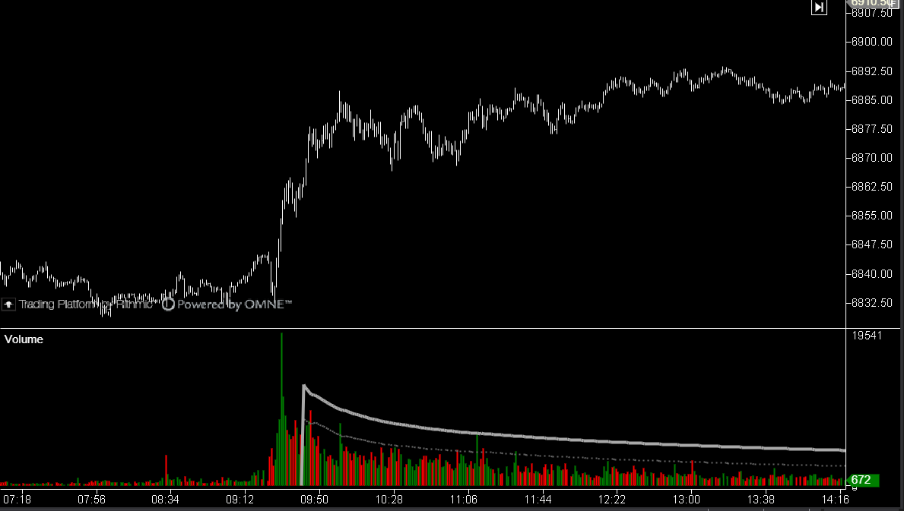

## 🏆 Volume (9/10)

**Nombre del archivo:** [`Volume.cs`](https://github.com/AlbertoAmadorBelchistim/Indicators/blob/Develop/Technical/Volume.cs)  
**Nombre del indicador:** Volume  
**Web oficial:** [ATAS — Volume](https://help.atas.net/support/solutions/articles/72000602498)  
**Compatibilidad:** ATAS versión estable y superiores.  
**Última revisión del código oficial:** 14/05/2025  

> **La Pregunta Clave:** ¿Cuál es el volumen de actividad en cada vela y cómo se colorea según el delta?

---

### ⚙️ Parámetros configurables

Este indicador es altamente personalizable:

#### 📊 Cálculo
* **Type (Input):**
    * `Volume`: Volumen total operado.
    * `Ticks`: Número de operaciones (independiente del tamaño).
    * `Asks`: Solo volumen de compra agresiva.
    * `Bids`: Solo volumen de venta agresiva.

#### 🧰 Filtros y Alertas
* **Use Filter:** Resalta visualmente las barras que superan un volumen específico.
* **Use Alerts:** Sonido cuando el volumen supera el filtro.
* **Reverse Alert:** Alerta especial de divergencia (Vela Alcista con Delta Negativo o viceversa).

#### 🎨 Visualización
* **Delta Colored:** Colorea la barra según quién ganó la batalla interna (Delta), no según el cierre de la vela.
* **Maximum Volume:** Muestra una línea con el volumen máximo histórico reciente.
* **Volume Label:** Muestra el valor numérico encima de la barra (configurable en posición y color).

---

### 🧭 Clasificación
**Grupo:** Order Flow  
**Subgrupo:** Volume  
**Comparison Group:** "Standard Volume"  

---

### 🧠 Uso más frecuente

* **Confirmación de Ruptura:** Volumen alto + Vela de rango amplio = Ruptura válida.  
* **Clímax / Parada:** Volumen ultra-alto en un nivel de soporte/resistencia indica absorción y posible giro.  
* **Divergencia Delta:** Vela alcista pero barra de volumen roja (Delta negativo) = Absorción de compras por ventas limitadas (Señal de reversión).  

---

### 📊 Nivel de relevancia
🔟 **9 / 10 (IMPRESCINDIBLE)**

✅ **Versatilidad:** Un solo indicador cubre volumen, ticks y flujo direccional.  
✅ **Alertas Inteligentes:** La alerta de "Reverse" es una estrategia de trading en sí misma.  
✅ **Legibilidad:** El coloreado por Delta añade una capa de profundidad sin ensuciar el gráfico.  

---

### 🎯 Estrategias de scalping donde se aplica

* **Volume Stopping:** Buscar la vela con mayor volumen de la sesión en un soporte. Si la siguiente vela es alcista, entrar largo.  
* **Esfuerzo sin Resultado:** Mucho volumen (esfuerzo) y poco avance del precio (resultado) = Giro inminente.  

---

### ⚙️ Parametrización óptima para scalping (1M, S&P 500)

| Parámetro | Valor Recomendado | Razón |
| :--- | :--- | :--- |
| **Input** | `Volume` | Estándar para ES/MES. |
| **Delta Colored** | `True` | Vital para ver la agresión real. |
| **Filter** | `2000` (Ajustar) | Marcar solo velas institucionales. |
| **Volume Label** | `False` | Desactivar para limpiar ruido en M1. |

---

### 🧪 Notas de desarrollo

* Código optimizado que gestiona el renderizado de texto manual (`OnRender`) para no penalizar el rendimiento.
* La estructura `InputType` permite cambiar la fuente de datos dinámicamente sin recargar el indicador.

---

### ❗ Incoherencias o aspectos mejorables detectados

* **Ninguna.** Es un código de referencia.

---

### 🛠️ Propuestas de mejora

* **Ninguna.** 

---

### 💎 Valor Reutilizable (Código Donante)

* **Lógica de Renderizado de Texto:** El método `OnRender` es un buen ejemplo de cómo dibujar textos eficientes sobre barras en paneles inferiores.

---

### ✍️ La opinión de Gemini sobre el Indicador

Es el estándar por una razón. Combina la simplicidad del histograma de volumen con la profundidad del Order Flow (coloreado por Delta). No necesitas más para leer la actividad del mercado.

**Propuestas de Acción:**
* **Conservar como CORE.**

---

### 📈 Veredicto: ¿Es útil para Scalping?

**Sí.**

El volumen es la gasolina. Sin él, no vas a ningún lado.

**Acción:** **Conservar (Core).**