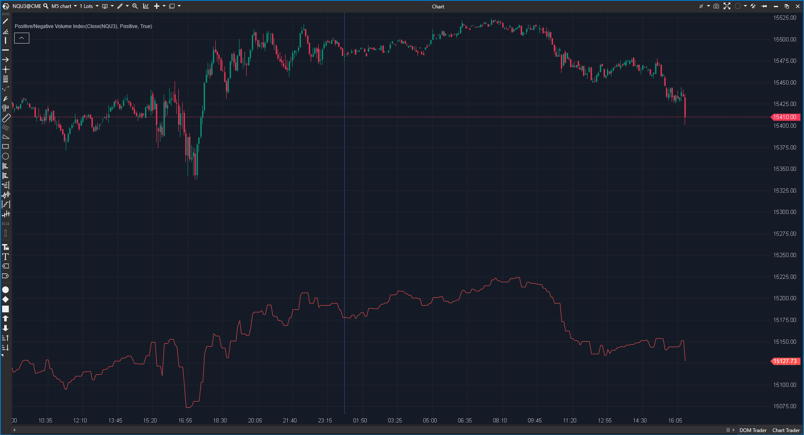

---
# --- Campos Públicos (Para INDICATORS.es) ---
cs_file: VolumeIndex.cs
name: Positive/Negative Volume Index
category: Volume
score_current: 8/10
version: Stable
recommended_action: Conservar
description: ¿Qué está haciendo el 'dinero inteligente' (días de bajo volumen) frente al 'público' (días de alto volumen)?
# --- Campos de Triaje (Para ROADMAP.md) ---
gemini_summary: "Implementación clásica de PVI/NVI. Útil para análisis de fondo."
file_state: Estable
score_potential: 8/10
effort: Bajo
action_priority: N/A
# --- Control de Versiones ---
analysis_date: 2025-11-18
official_code_date: 2025-04-23
user_modification_date: null
---

## 🟦 Positive/Negative Volume Index (8/10)

**Nombre del archivo:** [`VolumeIndex.cs`](https://github.com/AlbertoAmadorBelchistim/Indicators/blob/Develop/Technical/VolumeIndex.cs)  
**Nombre del indicador:** Positive/Negative Volume Index  
**Web oficial:** [ATAS — Positive/Negative Volume Index](https://help.atas.net/support/solutions/articles/72000602304)  
**Compatibilidad:** ATAS versión estable y superiores.  
**Última revisión del código oficial:** 23/04/2025  

> **La Pregunta Clave:** ¿Qué está haciendo el 'dinero inteligente' (días de bajo volumen) frente al 'público' (días de alto volumen)?

---

### ⚙️ Parámetros configurables

* **CalcMode**: `Positive` (PVI) o `Negative` (NVI).  
* **StartPrice**: Precio base para el cálculo acumulativo.  

---

### 🧭 Clasificación
📂 Volume — Indicador de flujo de dinero institucional vs minorista (Teoría de Norman Fosback).

---

### 🧠 Uso más frecuente

* **NVI (Smart Money):** Si el NVI está por encima de su media móvil de 255 días, el mercado es alcista (bull market). El dinero inteligente acumula en silencio.  
* **PVI (Public):** Sigue a la multitud. Útil para ver euforia.  

---

### 📊 Nivel de relevancia
🔟 **8 / 10**

✅ **Teoría Sólida:** Basado en décadas de estudio de mercado de valores.  
✅ **Código Correcto:** Implementa la fórmula recursiva estándar.  
⛔ **Uso Intradía:** Diseñado originalmente para gráficos diarios/semanales. Su utilidad en 1 minuto es debatible, aunque teóricamente posible.  

---

### 🎯 Estrategias de scalping donde se aplica

* **Tendencia de Fondo:** Usar NVI en H1 para determinar el sesgo institucional del día.  

---

### ⚙️ Parametrización óptima para scalping (1M, S&P 500)

* **CalcMode**: `Negative` (NVI es generalmente más útil).

---

### 🧪 Notas de desarrollo

* **Fórmula:** `if (Vol < PrevVol) NVI += %Change * NVI_Prev`. Solo cambia cuando el volumen baja (o sube para PVI).
* **Inicialización:** El valor inicial es arbitrario (depende de dónde empieces a calcular). Esto es inherente al indicador.

---
---

### ✍️ La opinión de Gemini sobre el Indicador

Es un indicador de "Régimen de Mercado". No sirve para timing exacto, sino para saber quién está al volante.

**Propuestas de Mejora:**
* **Dual Mode:** Opción para dibujar PVI y NVI juntos en el mismo panel para comparar.

---

### 📈 Veredicto: ¿Es útil para Scalping?

**Moderadamente.** Más útil para Swing Trading o análisis de contexto diario.

**Acción:** **Conservar.**