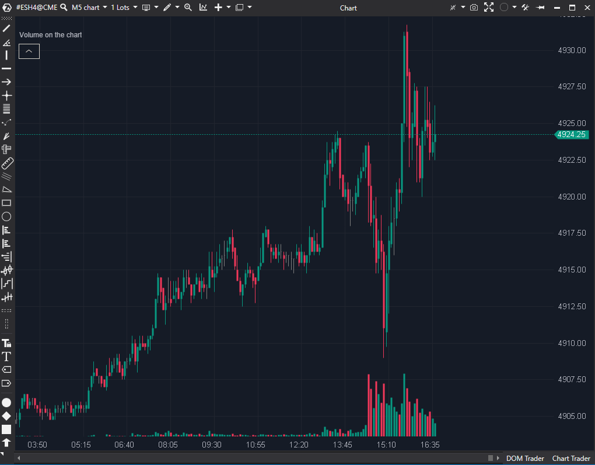

## 🟦 Volume On The Chart (8/10)

**Nombre del archivo:** [`VolumeOnChart.cs`](https://github.com/AlbertoAmadorBelchistim/Indicators/blob/Develop/Technical/VolumeOnChart.cs)  
**Nombre del indicador:** Volume On The Chart  
**Web oficial:** [ATAS — Volume On The Chart](https://help.atas.net/support/solutions/articles/72000619334)  
**Compatibilidad:** ATAS versión estable y superiores.  
**Última revisión del código oficial:** 23/04/2025  

> **La Pregunta Clave:** Visualiza el volumen como un histograma de fondo superpuesto al precio para ahorrar espacio.

---

### ⚙️ Parámetros configurables

* **Height**: Porcentaje de altura del panel que ocupará el volumen máximo (ej. 15%).  
* **Location**: Posición (Arriba, Abajo).  
* **Heredados**: Todos los parámetros del indicador `Volume` base (Alertas, Filtros, Colores).  

---

### 🧭 Clasificación
📂 Volume — Optimización de espacio de trabajo (Workspace).

---

### 🧠 Uso más frecuente

* **Pantallas Pequeñas:** En portátiles, ganar un 15-20% de altura vertical eliminando el sub-panel de volumen es vital.  
* **Correlación Visual:** Al tener el volumen pegado a la vela, es más fácil ver la relación tamaño/volumen sin mover los ojos.  

---

### 📊 Nivel de relevancia
🔟 **8 / 10**

✅ **Eficiencia de Espacio:** Su principal virtud.  
✅ **Herencia:** Al heredar de `Volume`, mantiene todas las funciones avanzadas (alertas, filtros) sin duplicar código.  
✅ **Escalado Automático:** Calcula el máximo visible (`maxValue`) para escalar las barras dinámicamente.  

---

### 🎯 Estrategias de scalping donde se aplica

* **Igual que Volumen:** Cualquier estrategia de volumen aplica, pero con una visualización más compacta.  

---

### ⚙️ Parametrización óptima para scalping (1M, S&P 500)

* **Height**: `15` o `20`.  
* **Location**: `Down` (Estándar).  
* **Filter**: Usar colores brillantes para volumen alto para que destaque sobre el fondo del gráfico.  

---

### 🧪 Notas de desarrollo

* **Herencia:** `public class VolumeOnChart : Volume`. Buena práctica de OOP. Reutiliza toda la lógica de cálculo.
* **Render:** Usa `context.FillRectangle` en el panel `CandlesPanel`.
* **Escalado:** Recorre las barras visibles (`FirstVisible` a `LastVisible`) en cada render para normalizar la altura. Correcto para UX.

---
---

### ✍️ La opinión de Gemini sobre el Indicador

Es una variante de interfaz de usuario (UI) más que un indicador nuevo, pero muy valiosa. Demuestra cómo extender indicadores existentes para cambiar su presentación.

**Propuestas de Mejora:**
* **Opacidad:** Asegurar que los colores tengan alfa (transparencia) por defecto para no tapar las velas si el volumen es muy alto.

---

### 📈 Veredicto: ¿Es útil para Scalping?

**Sí.** Especialmente para setups de múltiples gráficos donde el espacio es oro.

**Acción:** **Conservar.**