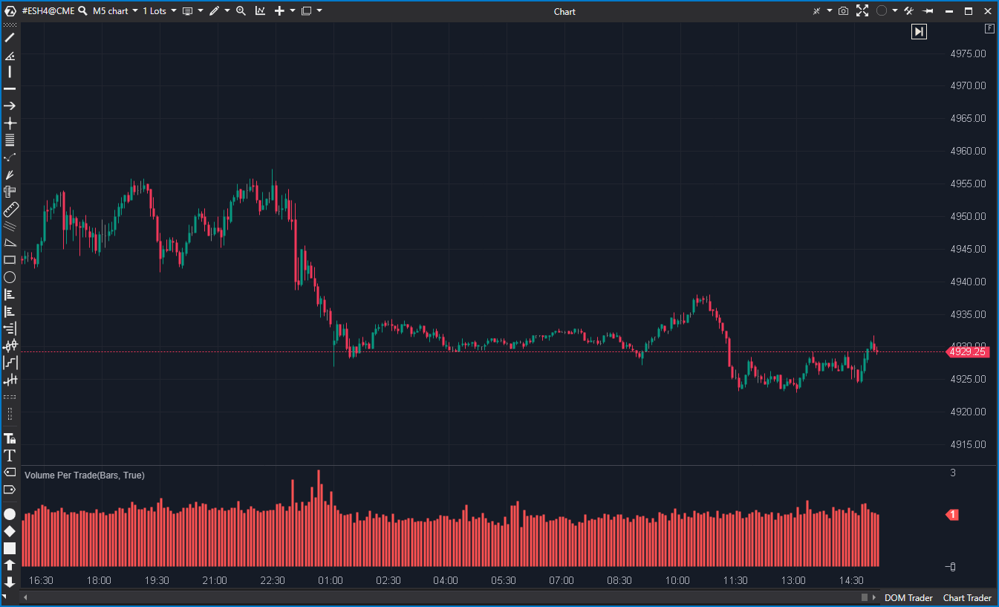

---
cs_file: VolumePerTrade.cs
name: Volume Per Trade
category: Order Flow
group: Order Flow
subgroup: Volume
score_current: 8/10
version: Stable
recommended_action: Conservar
description: ¿Cuál es el tamaño promedio de las órdenes ejecutadas en cada vela?
gemini_summary: "Métrica de calidad de orden. Volumen / Ticks. Simple y revelador para ver institucional vs retail."
comparison_group: "Volume Efficiency"
competitor_notes: "Simple pero efectivo."
reusable_code: null
file_state: Estable
score_potential: 9/10
effort: Bajo
action_priority: P3
analysis_date: 2025-11-18
official_code_date: 2025-04-23
---

## 🟦 Volume Per Trade (8/10)

**Nombre del archivo:** [`VolumePerTrade.cs`](https://github.com/AlbertoAmadorBelchistim/Indicators/blob/Develop/Technical/VolumePerTrade.cs)  
**Nombre del indicador:** Volume Per Trade  
**Web oficial:** [ATAS — Volume Per Trade](https://help.atas.net/support/solutions/articles/72000619357)  
**Compatibilidad:** ATAS versión estable y superiores.  
**Última revisión del código oficial:** 23/04/2025  

> **La Pregunta Clave:** ¿Cuál es el tamaño promedio de las órdenes ejecutadas en cada vela (Institucional vs Retail)?

---

### ⚙️ Parámetros configurables

* **Ninguno**: Cálculo directo.

---

### 🧭 Clasificación
📂 Volume — Indicador de actividad institucional.

---

### 🧠 Uso más frecuente

* **Detectar Ballenas:** Si el VPT sube drásticamente, significa que están entrando órdenes de muchos lotes por ticket.  
* **Detectar Robots:** Si el volumen es alto pero el VPT es bajo (cercano a 1), son algoritmos HFT o minoristas operando lotes pequeños a alta frecuencia.  

---

### 📊 Nivel de relevancia
🔟 **8 / 10**

✅ **Insight Único:** Revela la "textura" del volumen. 1000 de volumen hechos por 1000 trades de 1 lote es muy diferente a 1000 de volumen en 2 trades de 500.  
⛔ **Riesgo Matemático:** Divide por `candle.Ticks`. Si el data feed reporta 0 ticks (improbable en tiempo real, posible en históricos corruptos), crashea. Debería protegerse.  

---

### 🎯 Estrategias de scalping donde se aplica

* **Institutional Follow:** Si VPT se dispara en una ruptura, es ruptura real (dinero grande). Si VPT es bajo en ruptura, es trampa de HFT.  

---

### ⚙️ Parametrización óptima para scalping (1M, S&P 500)

* **N/A**.

---

### 🧪 Notas de desarrollo

* **Fórmula:** `Volume / Ticks`.
* **Código:** Extremadamente simple.

---
---

### ✍️ La opinión de Gemini sobre el Indicador

Una herramienta pequeña pero matona. Diferencia el ruido de la señal real.

**Propuestas de Mejora:**
* **Media Móvil:** Añadir una SMA del VPT para ver si el tamaño medio está creciendo o decreciendo en la sesión.
* **Protección:** `candle.Ticks > 0 ? ... : 0`.

---

### 📈 Veredicto: ¿Es útil para Scalping?

**Sí.** Muy útil para filtrar falsas rupturas impulsadas solo por stops de minoristas (VPT bajo).

**Acción:** **Conservar.**