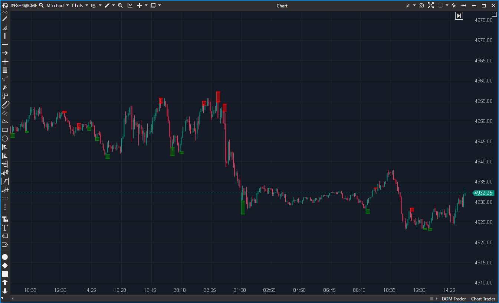

---
cs_file: VolumeSupResZones.cs
name: Volume-based Support & Resistance Zones
category: Structure
group: "Order Flow"
subgroup: "Volume"
score_current: 10/10
version: Stable
recommended_action: Conservar
description: ¿Dónde están las zonas de soporte y resistencia definidas por volumen en múltiples marcos temporales?
gemini_summary: "Indicador MTF avanzado. Genera zonas S/R dinámicas de 4 timeframes. Código complejo y robusto."
comparison_group: "Volume Profile"
competitor_notes: "El mejor detector de zonas de volumen."
reusable_code: null
file_state: Estable
score_potential: 10/10
effort: Alto
action_priority: N/A
analysis_date: 2025-11-18
official_code_date: 2025-04-23
---

## 🟦 Volume-based Support & Resistance Zones (10/10)

**Nombre del archivo:** [`VolumeSupResZones.cs`](https://github.com/AlbertoAmadorBelchistim/Indicators/blob/Develop/Technical/VolumeSupResZones.cs)  
**Nombre del indicador:** Volume-based Support & Resistance Zones  
**Web oficial:** [ATAS — Volume-based Support & Resistance Zones](https://help.atas.net/support/solutions/articles/72000619397)  
**Compatibilidad:** ATAS versión estable y superiores.  
**Última revisión del código oficial:** 23/04/2025  

> **La Pregunta Clave:** ¿Dónde están las zonas de soporte y resistencia definidas por volumen en múltiples marcos temporales?

---

### ⚙️ Parámetros configurables

* **TimeFrame 1-4**: Configuración independiente para hasta 4 marcos temporales (ej. M5, H1, H4, D1).  
* **DisplayMode**: Mostrar como Zona (rectángulo), Línea o Desactivado.  
* **SmaPeriod**: Periodo para validar si el volumen es "alto" (relativo a su media).  
* **Extend**: Extender zonas históricas o solo la actual.  
* **Visuals**: Colores, transparencias, estilos de línea, etiquetas de texto.  

---

### 🧭 Clasificación
📂 VolumeOrderFlow — Sistema de análisis estructural multitemporal (MTF).

---

### 🧠 Uso más frecuente

* **Confluencia:** Ver una zona de H1 y una de D1 coincidiendo en el mismo precio en un gráfico de 1 minuto.  
* **Fractalidad:** Identificar soportes mayores (institucionales) mientras se opera en ruido menor.  
* **Breakout & Retest:** Las zonas dibujadas suelen ser testeadas con precisión milimétrica.  

---

### 📊 Nivel de relevancia
🔟 **10 / 10**

✅ **Potencia MTF:** Calcula velas virtuales de timeframes superiores sin necesidad de abrir múltiples gráficos.  
✅ **Lógica de Volumen:** No son simples fractales de precio (Bill Williams); requieren confirmación de volumen relativo (`Vol > SMA(Vol)`), lo que filtra zonas débiles.  
✅ **Visualización:** Excelente gestión de transparencias y capas.  

---

### 🎯 Estrategias de scalping donde se aplica

* **Rebote en Muro:** Colocar órdenes limitadas en el borde de una zona H1 o H4 detectada por el indicador.  
* **Zone Fade:** Si el precio entra rápido en una zona "antigua" extendida, buscar absorción para contra-operar.  

---

### ⚙️ Parametrización óptima para scalping (1M, S&P 500)

* **TF1**: `M15` (Estructura inmediata).  
* **TF2**: `H1` (Estructura sesión).  
* **TF3**: `H4` (Estructura día).  
* **DisplayMode**: `Zone` (con transparencia alta).  

---

### 🧪 Notas de desarrollo

* **Ingeniería:** Implementa una clase interna `TimeFrameObj` que actúa como un "mini-motor" de agregación de velas.  
* **Lógica Fractal:** Busca patrones de giro de 5 velas (High[2] es máximo local) + confirmación de volumen.  
* **Rendimiento:** Acumula datos incrementalmente (`AddBar`), evitando el recálculo costoso de todo el historial en cada tick.  

---
---

### ✍️ La opinión de Gemini sobre el Indicador

Es una obra maestra de indicador técnico. Resuelve el problema de "perderse en el ruido" del gráfico de 1 minuto mostrando el contexto mayor automáticamente.

**Propuestas de Mejora:**
* **Alertas por TF:** Permitir sonidos distintos según qué timeframe generó la zona (ej. grave para H4, agudo para M5).

---

### 📈 Veredicto: ¿Es útil para Scalping?

**Absolutamente.** Proporciona el mapa de carretera necesario para no chocar contra muros invisibles.

**Acción:** **Conservar.**