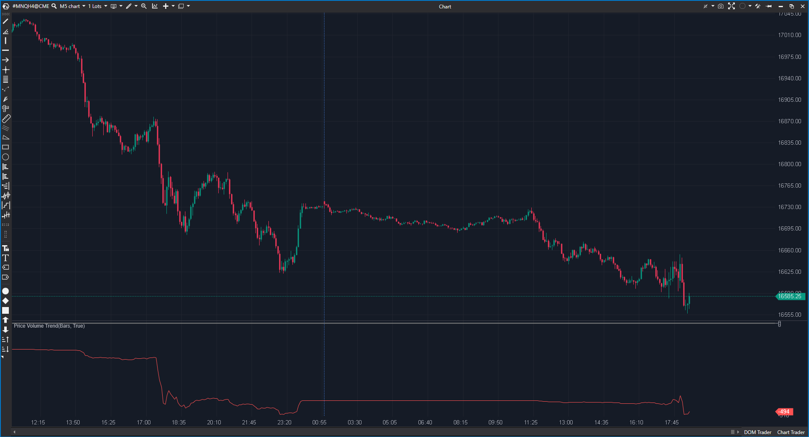

---
# --- Campos Públicos (Para INDICATORS.es) ---
cs_file: VolumeTrend.cs
name: Price Volume Trend
category: Volume
score_current: 8/10
version: Stable
recommended_action: Conservar
description: ¿Cuál es el flujo acumulado de volumen ponderado por la magnitud del movimiento del precio?
# --- Campos de Triaje (Para ROADMAP.md) ---
gemini_summary: "Variante mejorada del OBV. Pondera volumen por cambio porcentual de precio."
file_state: Estable
score_potential: 8/10
effort: Bajo
action_priority: N/A
# --- Control de Versiones ---
analysis_date: 2025-11-18
official_code_date: 2025-04-23
user_modification_date: null
---

## 🟦 Price Volume Trend (8/10)

**Nombre del archivo:** [`VolumeTrend.cs`](https://github.com/AlbertoAmadorBelchistim/Indicators/blob/Develop/Technical/VolumeTrend.cs)  
**Nombre del indicador:** Price Volume Trend  
**Web oficial:** [ATAS — Price Volume Trend](https://help.atas.net/support/solutions/articles/72000602450)  
**Compatibilidad:** ATAS versión estable y superiores.  
**Última revisión del código oficial:** 23/04/2025  

> **La Pregunta Clave:** ¿Cuál es el flujo acumulado de volumen ponderado por la magnitud del movimiento del precio?

---

### ⚙️ Parámetros configurables

* **Ninguno**: Cálculo directo acumulativo.

---

### 🧭 Clasificación
📂 Volume — Oscilador de flujo acumulado (Cumulative Flow).

---

### 🧠 Uso más frecuente

* **Divergencias:** Es más sensible que el OBV. Si el precio sube poco con mucho volumen, el PVT sube poco (correcto). El OBV subiría todo el volumen (incorrecto/exagerado).  
* **Confirmación:** La ruptura de una resistencia en PVT suele preceder a la ruptura en precio.  

---

### 📊 Nivel de relevancia
🔟 **8 / 10**

✅ **Lógica Superior:** La ponderación por `%Change` hace que tenga más sentido físico que el OBV. Un movimiento de 1 tick con 1000 contratos no es igual a un movimiento de 10 puntos con 1000 contratos. PVT lo entiende.  
⛔ **Sin Parámetros:** No se puede reiniciar o ajustar.  

---

### 🎯 Estrategias de scalping donde se aplica

* **Divergencia de Acumulación:** En un rango lateral, si los mínimos del PVT son crecientes mientras el precio está plano, es acumulación.  

---

### ⚙️ Parametrización óptima para scalping (1M, S&P 500)

* **N/A**.

---

### 🧪 Notas de desarrollo

* **Fórmula:** `PVT = PrevPVT + (Volume * (Close - PrevClose) / PrevClose)`. (O sobre Close actual, la diferencia es mínima). El código usa `(Close - Prev) / Close`.
* **Protección:** Verifica `Close != 0`.

---
---

### ✍️ La opinión de Gemini sobre el Indicador

Es el "OBV inteligente". Debería ser la elección por defecto sobre el OBV para la mayoría de traders.

**Propuestas de Mejora:**
* **Reset:** Opción para reiniciar al comienzo de la sesión.

---

### 📈 Veredicto: ¿Es útil para Scalping?

**Sí.** Excelente para ver la presión real de compra/venta.

**Acción:** **Conservar.**