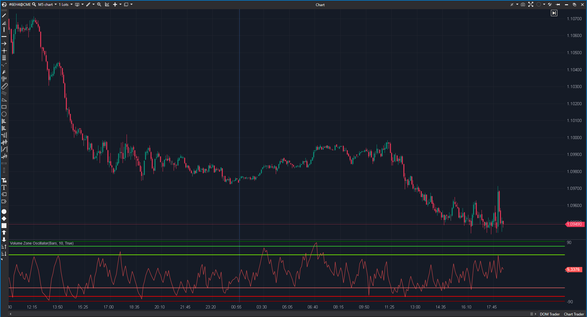

## 🟦 Volume Zone Oscillator (VZO) (9/10)

**Nombre del archivo:** [`VolumeZone.cs`](https://github.com/AlbertoAmadorBelchistim/Indicators/blob/Develop/Technical/VolumeZone.cs)  
**Nombre del indicador:** Volume Zone Oscillator  
**Web oficial:** [ATAS — Volume Zone Oscillator](https://help.atas.net/support/solutions/articles/72000602268)  
**Compatibilidad:** ATAS versión estable y superiores.  
**Última revisión del código oficial:** 23/04/2025  

> **La Pregunta Clave:** ¿Cuál es la presión neta de compra/venta normalizada por el volumen total (Oscilador de Zona)?

---

### ⚙️ Parámetros configurables

* **Period**: Suavizado del volumen (EMA).  
* **Niveles**: Líneas de Sobrecompra/Venta (±50, ±75, ±90).  

---

### 🧭 Clasificación
📂 Volume — Oscilador de volumen acotado.

---

### 🧠 Uso más frecuente

* **Zonas de Actividad:** * > 50: Tendencia Alcista.  
    * > 75: Sobrecompra (Precaución).  
    * < -50: Tendencia Bajista.  
* **Señales de Giro:** Salida de zona extrema (ej. cruzar de >90 a <75).  

---

### 📊 Nivel de relevancia
🔟 **9 / 10**

✅ **Normalización:** Al dividir por el volumen total suavizado, el indicador se mantiene en un rango constante independientemente de si el volumen es alto o bajo en términos absolutos.  
✅ **Señales Claras:** Las zonas de 50/75 son muy respetadas en tendencias intradía.  
⛔ **Riesgo Lateral:** En rangos estrechos con poco volumen, puede generar ruido alrededor de 0.  

---

### 🎯 Estrategias de scalping donde se aplica

* **Trend Following:** Mantener largos mientras VZO > 0 (o > 20 para ser conservador).  
* **Reversal:** Venta corta si VZO toca 90 y gira.  

---

### ⚙️ Parametrización óptima para scalping (1M, S&P 500)

* **Period**: `14` o `21`.  

---

### 🧪 Notas de desarrollo

* **Fórmula:** $VP = \text{Vol}$ si Close > PrevClose, else $-\text{Vol}$. $VZO = 100 \times \frac{EMA(VP)}{EMA(Vol)}$.
* **Código:** Usa `LineSeries` ocultas por defecto para configurar los niveles. Buena práctica de UX para no ensuciar el gráfico si no se quiere.

---
---

### ✍️ La opinión de Gemini sobre el Indicador

Es uno de los mejores osciladores de volumen para trading direccional. Elimina el problema de interpretar barras de volumen de distintos tamaños y lo convierte en una curva fácil de leer.

**Propuestas de Mejora:**
* **Color Dinámico:** Colorear la línea del VZO según la zona en la que esté.

---

### 📈 Veredicto: ¿Es útil para Scalping?

**Sí.** Excelente para confirmar la fuerza del flujo.

**Acción:** **Conservar.**