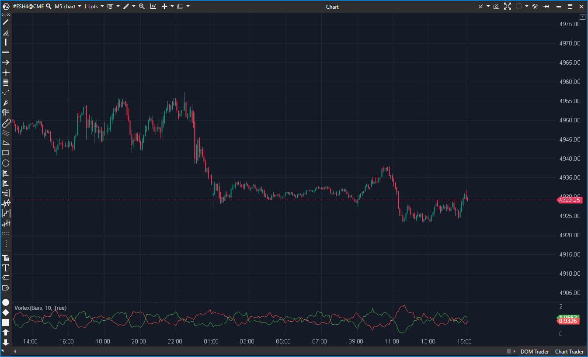

## 🟦 Vortex (7/10)

**Nombre del archivo:** [`Vortex.cs`](https://github.com/AlbertoAmadorBelchistim/Indicators/blob/Develop/Technical/Vortex.cs)  
**Nombre del indicador:** Vortex  
**Web oficial:** [ATAS — Vortex](https://help.atas.net/support/solutions/articles/72000619446)  
**Compatibilidad:** ATAS versión estable y superiores.  
**Última revisión del código oficial:** 23/04/2025  

> **La Pregunta Clave:** ¿Cuál es la fuerza direccional del mercado basada en el flujo de vórtices (High-Low)?

---

### ⚙️ Parámetros configurables

* **Period**: Ventana de cálculo.

---

### 🧭 Clasificación
📂 Momentum — Indicador de tendencia direccional (similar a DMI/ADX).

---

### 🧠 Uso más frecuente

* **Cruce VI+/VI-:** Señal de inicio de tendencia.  
* **Separación:** Cuanto más separadas las líneas, más fuerte la tendencia.  

---

### 📊 Nivel de relevancia
🔟 **7 / 10**

✅ **Sencillez:** Solo dos líneas. Cruce = Señal.  
✅ **Robustez:** Basado en rangos (High/Low), captura bien la volatilidad.  
⛔ **Lag:** Como todo indicador de tendencia, llega tarde en mercados laterales.  
⛔ **Visual:** A veces las líneas se enmarañan en rangos (whipsaw).  

---

### 🎯 Estrategias de scalping donde se aplica

* **Breakout Confirmation:** Si el precio rompe y VI+ cruza VI- al alza con ángulo agudo, entrar.  

---

### ⚙️ Parametrización óptima para scalping (1M, S&P 500)

* **Period**: `14` o `21`.

---

### 🧪 Notas de desarrollo

* **Fórmula:** `VI+ = Sum(|High - PrevLow|) / Sum(TR)`. `VI- = Sum(|Low - PrevHigh|) / Sum(TR)`.
* **Código:** Correcto. Usa `ValueDataSeries` para almacenar los movimientos parciales y `CalcSum` para agregarlos.

---
---

### ✍️ La opinión de Gemini sobre el Indicador

Es una alternativa moderna al ADX. Algunos traders lo encuentran más reactivo. La implementación es limpia.

**Propuestas de Mejora:**
* **Histograma:** Añadir un histograma de la diferencia (VI+ minus VI-) para ver la fuerza neta más fácil.

---

### 📈 Veredicto: ¿Es útil para Scalping?

**Sí.** Para filtrar dirección en estrategias de tendencia.

**Acción:** **Conservar.**