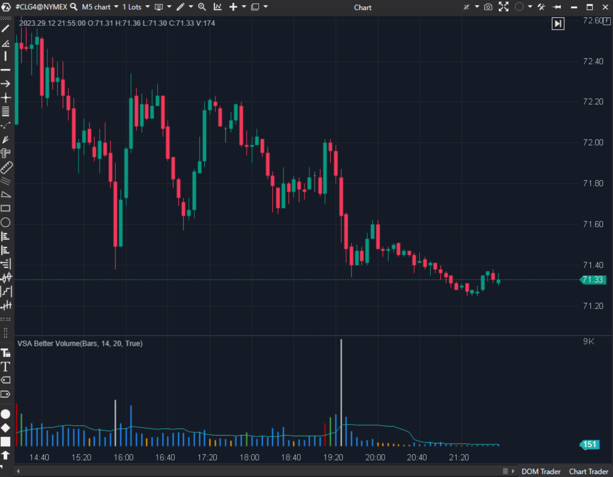

---
cs_file: VsaBetterVolume.cs
name: VSA Better Volume
category: Order Flow
group: Order Flow
subgroup: Volume
score_current: 9/10
version: Stable
recommended_action: Conservar
description: ¿Qué nos dice el volumen sobre la intención profesional (Clímax, Churn, Trampa)?
gemini_summary: "Implementación completa del sistema 'Better Volume'. Clasifica velas por colores según VSA. Excelente."
comparison_group: "VSA & Anomalies"
competitor_notes: "El estándar VSA."
reusable_code: null
file_state: Estable
score_potential: 9/10
effort: Bajo
action_priority: N/A
analysis_date: 2025-11-18
official_code_date: 2025-05-8
---

## 🟦 VSA Better Volume (9/10)

**Nombre del archivo:** [`VsaBetterVolume.cs`](https://github.com/AlbertoAmadorBelchistim/Indicators/blob/Develop/Technical/VsaBetterVolume.cs)  
**Nombre del indicador:** VSA Better Volume  
**Web oficial:** [ATAS — VSA Better Volume](https://help.atas.net/support/solutions/articles/72000602502)  
**Compatibilidad:** ATAS versión estable y superiores.  
**Última revisión del código oficial:** 8/05/2025  

> **La Pregunta Clave:** ¿Qué nos dice el volumen sobre la intención profesional (Clímax, Churn, Trampa)?

---

### ⚙️ Parámetros configurables

* **Period**: Media móvil del volumen.  
* **LookBack**: Ventana para determinar máximos/mínimos relativos.  
* **Colors**: Asignación de colores a cada patrón (Clímax, Churn, etc.).  

---

### 🧭 Clasificación
📂 Volume — Volume Spread Analysis (VSA) automatizado.

---

### 🧠 Uso más frecuente

* **Rojo (Climax High):** Mucho volumen, mucho rango, vela alcista. Inicio de distribución o ruptura fuerte.  
* **Blanco (Climax Low):** Pánico vendedor. Posible suelo.  
* **Amarillo (Low Vol):** Sin interés. Corrección o falta de demanda.  
* **Magenta (Churn):** Mucho volumen, poco rango. Lucha intensa o final de movimiento.  

---

### 📊 Nivel de relevancia
🔟 **9 / 10**

✅ **Automatización:** Codifica reglas complejas de VSA en colores simples.  
✅ **Contexto:** Usa `LookBack` para asegurar que "Volumen Alto" significa "Alto relativo a las últimas N barras", no absoluto.  
⛔ **Subjetividad:** Los colores son una ayuda, no una señal de trading automática. Requiere aprender qué significa cada uno.  

---

### 🎯 Estrategias de scalping donde se aplica

* **Climax Fade:** Si aparece una barra roja/blanca (Clímax) en un nivel de soporte/resistencia y la siguiente vela confirma el giro, entrar.  
* **No Demand:** Barra amarilla (bajo volumen) en un pullback a la media móvil -> Continuación de tendencia.  

---

### ⚙️ Parametrización óptima para scalping (1M, S&P 500)

* **LookBack**: `20` (Estándar).  
* **Period**: `14`.  

---

### 🧪 Notas de desarrollo

* **Lógica:** Calcula `Volume * Range` y `Volume / Range`. Compara estos valores con sus máximos/mínimos históricos recientes (`_highestAbs`, etc.).
* **Complejidad:** El bloque `if/else` final que asigna colores es la clave. Prioriza Clímax > Churn > Low Vol.

---
---

### ✍️ La opinión de Gemini sobre el Indicador

Es una herramienta educativa y operativa fantástica. Obliga al trader a pensar en términos de Esfuerzo (Volumen) vs Resultado (Rango).

**Propuestas de Mejora:**
* **Tooltip:** Añadir una descripción de texto al pasar el ratón sobre la barra (ej. "Climax Up") para ayudar a los novatos.

---

### 📈 Veredicto: ¿Es útil para Scalping?

**Sí.** Identifica las manos fuertes.

**Acción:** **Conservar.**