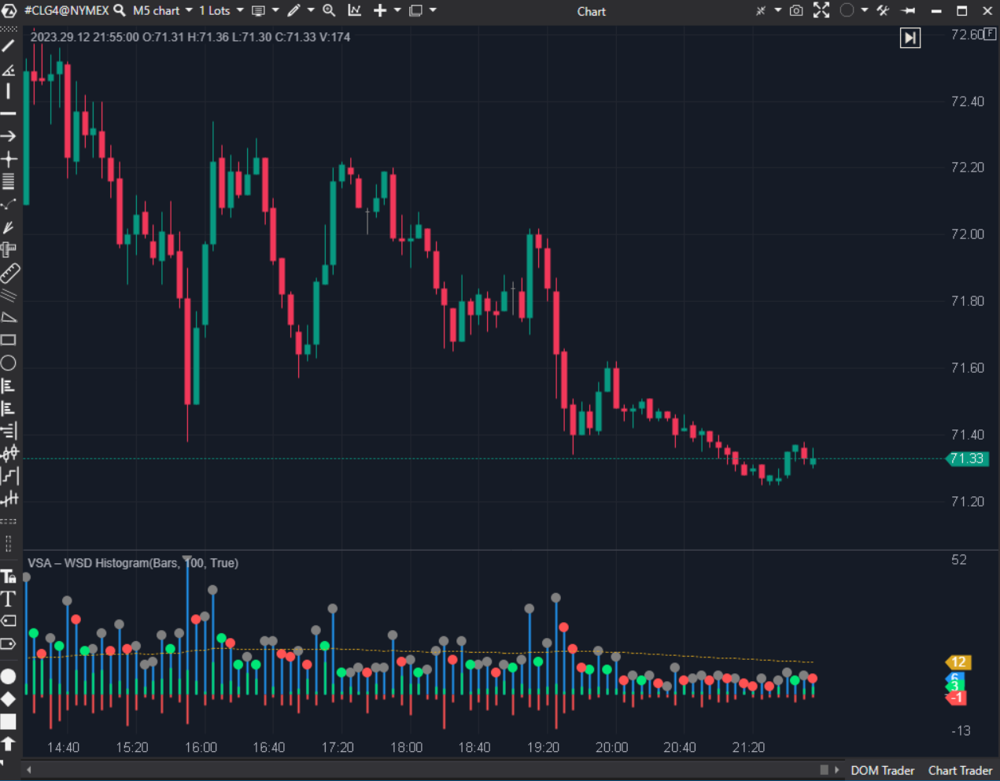

---
cs_file: VsaWsd.cs
name: VSA – WSD Histogram
category: Structure
group: "Order Flow"
subgroup: "Volume"
score_current: 8/10
version: Stable
recommended_action: Conservar
description: ¿Cómo se distribuye la estructura de la vela (mechas vs cuerpo) y el volumen relativo?
gemini_summary: "Deconstruye la vela en histogramas de mechas y cuerpo. Útil para análisis estructural."
comparison_group: "VSA & Anomalies"
competitor_notes: "Único."
reusable_code: null
file_state: Estable
score_potential: 8/10
effort: Bajo
action_priority: N/A
analysis_date: 2025-11-18
official_code_date: 08/05/2025
---

## 🟦 VSA – WSD Histogram (8/10)

**Nombre del archivo:** [`VsaWsd.cs`](https://github.com/AlbertoAmadorBelchistim/Indicators/blob/Develop/Technical/VsaWsd.cs)  
**Nombre del indicador:** VSA – WSD Histogram  
**Web oficial:** [ATAS — VSA – WSD Histogram](https://help.atas.net/support/solutions/articles/72000602501)  
**Compatibilidad:** ATAS versión estable y superiores.  
**Última revisión del código oficial:** 8/05/2025  

> **La Pregunta Clave:** ¿Cómo se distribuye la estructura de la vela (mechas vs cuerpo) y el volumen relativo?

---

### ⚙️ Parámetros configurables

* **Period**: Media móvil del volumen para referencia.  
* **Visuals**: Colores para mechas, cuerpo y señales de puntos.  

---

### 🧭 Clasificación
📂 Volume — Análisis estructural de velas (Price Action detallado).

---

### 🧠 Uso más frecuente

* **Análisis de Mechas:** Permite ver en un histograma qué parte del rango fue "rechazo" (mecha) y qué parte fue "aceptación" (cuerpo).  
* **Contracción:** Detecta velas de rango estrecho (puntos grises/rojos/verdes) que indican falta de interés o preparación para movimiento (WSD = Weakness/Strength Detection?).  

---

### 📊 Nivel de relevancia
🔟 **8 / 10**

✅ **Desglose:** Muy original. Separa visualmente la mecha superior e inferior en histogramas apilados o paralelos.  
✅ **Señales de Contracción:** Marca con puntos cuando el rango se contrae (`HighLow < Prev`), lo cual es clave en VSA (No Supply / No Demand).  
⛔ **Nombre Confuso:** "WSD" no es un término estándar universal, aunque se entiende en contexto VSA.  

---

### 🎯 Estrategias de scalping donde se aplica

* **No Demand:** Vela alcista, rango estrecho (punto generado), volumen bajo mecha superior grande -> Venta.  

---

### ⚙️ Parametrización óptima para scalping (1M, S&P 500)

* **Period**: `100` (Para tener una media de volumen estable de fondo).  

---

### 🧪 Notas de desarrollo

* **Lógica:** Calcula el tamaño de las mechas y el cuerpo en ticks (`/ _tickSize`).
* **Señales:** `_dotsBuy`, `_dotsSell`, `_dotsNeutral`. Se activan si el rango se contrae (`< Prev`) y la relación Close/Open favorece una dirección.

---
---

### ✍️ La opinión de Gemini sobre el Indicador

Es una herramienta analítica excelente para quienes operan "Price Action" puro y quieren cuantificar el tamaño de las mechas y cuerpos en lugar de hacerlo "a ojo".

**Propuestas de Mejora:**
* **Normalización:** Opción para mostrar los valores como porcentaje del rango total en lugar de ticks absolutos.

---

### 📈 Veredicto: ¿Es útil para Scalping?

**Sí.** Ayuda a ver la "calidad" de la vela rápidamente.

**Acción:** **Conservar.**