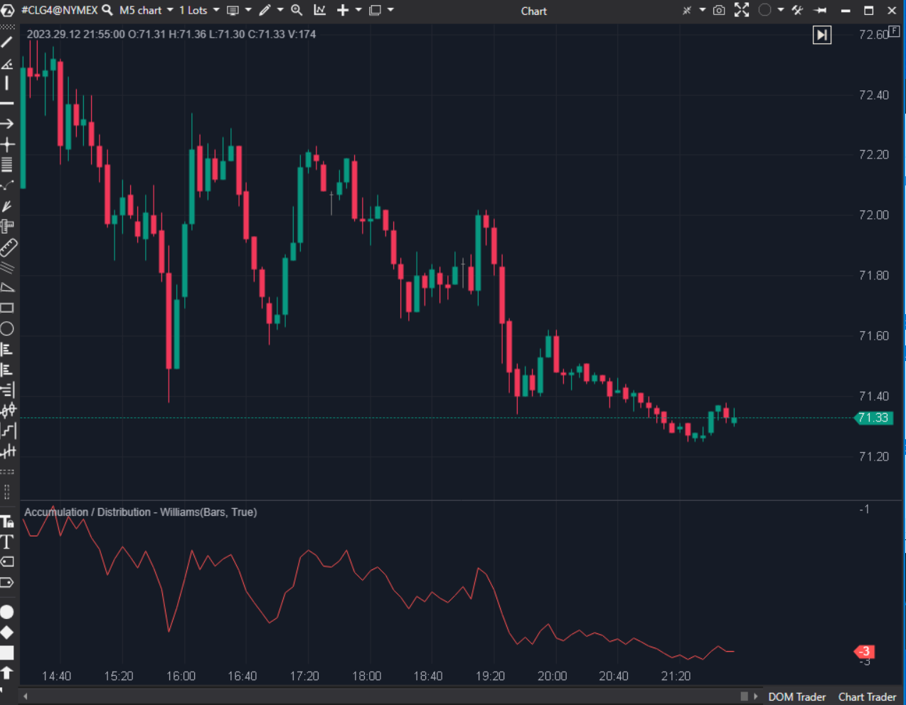

## 🟦 Williams Accumulation / Distribution (WAD) (7/10)

**Nombre del archivo:** [`WAD.cs`](https://github.com/AlbertoAmadorBelchistim/Indicators/blob/Develop/Technical/WAD.cs)  
**Nombre del indicador:** Accumulation / Distribution - Williams  
**Web oficial:** [ATAS — Williams Accumulation / Distribution (WAD)](https://help.atas.net/support/solutions/articles/72000602568)  
**Compatibilidad:** ATAS versión estable y superiores.  
**Última revisión del código oficial:** 23/04/2025  

> **La Pregunta Clave:** ¿Se está acumulando o distribuyendo el activo (basado en la presión de cierre)?

---

### ⚙️ Parámetros configurables

* **Ninguno**: Cálculo acumulativo directo.

---

### 🧭 Clasificación
📂 Volume — Indicador de flujo (aunque curiosamente solo usa precios en su fórmula original de Williams, a diferencia del A/D de Chaikin).

---

### 🧠 Uso más frecuente

* **Divergencias:** Precio sube pero WAD no hace nuevo máximo = Distribución.  
* **Confirmación:** Rompimiento de resistencia en precio confirmado por rompimiento en WAD.  

---

### 📊 Nivel de relevancia
🔟 **7 / 10**

✅ **Concepto:** Intenta medir quién gana la batalla intradía (cierre vs true range).  
⛔ **Nombre Confuso:** A menudo se confunde con la línea A/D de Chaikin que usa volumen. El WAD de Williams es puramente de precio (`True Range High/Low`).  
⛔ **Sin Reset:** Acumula indefinidamente.  

---

### 🎯 Estrategias de scalping donde se aplica

* **Divergencia Oculta:** Precio hace mínimo más alto, WAD hace mínimo más bajo -> Señal de continuación alcista fuerte.  

---

### ⚙️ Parametrización óptima para scalping (1M, S&P 500)

* **N/A**.

---

### 🧪 Notas de desarrollo

* **Fórmula:** * Si Close > PrevClose: `WAD = PrevWAD + Close - Min(Low, PrevClose)`.  
    * Si Close < PrevClose: `WAD = PrevWAD + Close - Max(High, PrevClose)`.  
    * Es una suma de "Buying Pressure" o "Selling Pressure".  
* **Implementación:** Correcta.

---
---

### ✍️ La opinión de Gemini sobre el Indicador

Es útil si entiendes que no mide "Volumen" sino "Presión de Precio". Es un complemento bueno para el RSI.

**Propuestas de Mejora:**
* **Nombre:** Aclarar en la descripción que es "Williams AD" para no confundir.

---

### 📈 Veredicto: ¿Es útil para Scalping?

**Moderadamente.** Bueno para divergencias.

**Acción:** **Conservar.**
