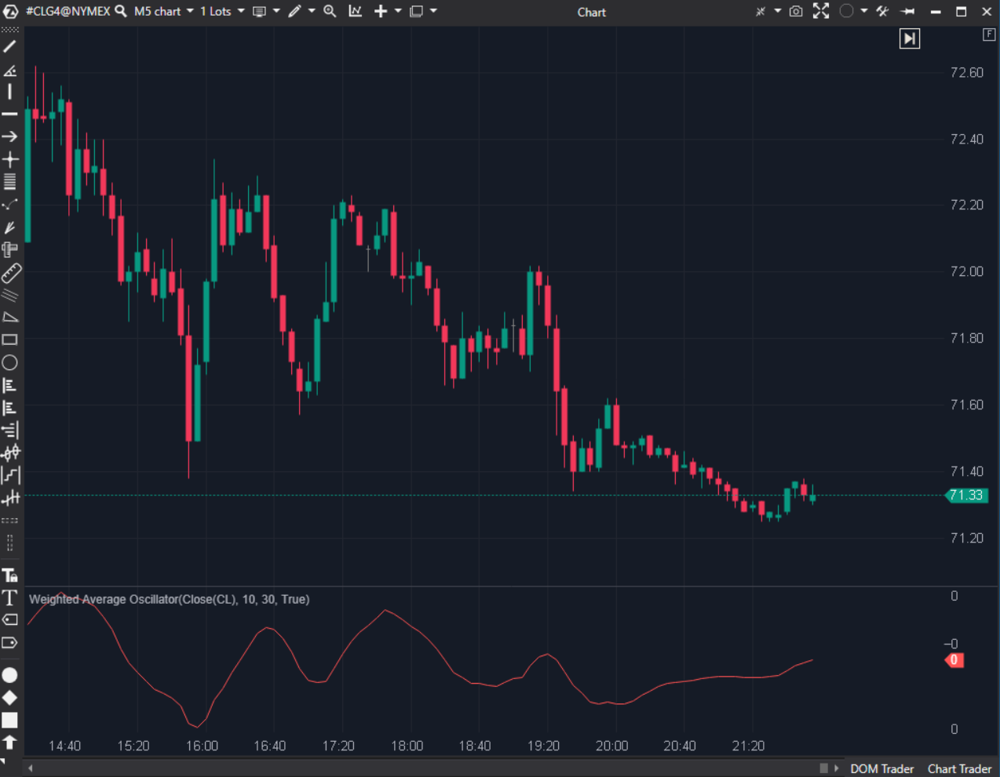

---
# --- Campos Públicos (Para INDICATORS.es) ---
cs_file: WAO.cs
name: Weighted Average Oscillator
category: Momentum
score_current: 7/10
version: Stable
recommended_action: Conservar
description: ¿Cuál es la diferencia entre dos medias móviles ponderadas (WMA)? (MACD rápido).
# --- Campos de Triaje (Para ROADMAP.md) ---
gemini_summary: "Oscilador simple WMA-WMA. Reactivo pero básico. Código correcto."
file_state: Estable
score_potential: 8/10
effort: Bajo
action_priority: N/A
# --- Control de Versiones ---
analysis_date: 2025-11-18
official_code_date: 2025-04-23
user_modification_date: null
---

## 🟦 Weighted Average Oscillator (WAO) (7/10)

**Nombre del archivo:** [`WAO.cs`](https://github.com/AlbertoAmadorBelchistim/Indicators/blob/Develop/Technical/WAO.cs)  
**Nombre del indicador:** Weighted Average Oscillator  
**Web oficial:** [ATAS — Weighted Average Oscillator](https://help.atas.net/support/solutions/articles/72000602506)  
**Compatibilidad:** ATAS versión estable y superiores.  
**Última revisión del código oficial:** 23/04/2025  

> **La Pregunta Clave:** ¿Cuál es la diferencia entre dos medias móviles ponderadas (WMA)? (MACD rápido).

---

### ⚙️ Parámetros configurables

* **ShortPeriod**: Periodo rápido.  
* **LongPeriod**: Periodo lento.  

---

### 🧭 Clasificación
📂 Momentum — Oscilador de medias móviles (tipo MACD).

---

### 🧠 Uso más frecuente

* **Cruces de Cero:** Compra/Venta. Al usar WMA, cruza antes que el MACD (EMA).  
* **Divergencias:** Estándar de osciladores.  

---

### 📊 Nivel de relevancia
🔟 **7 / 10**

✅ **Reactividad:** La WMA da más peso al precio reciente, reduciendo el lag.  
⛔ **Falta Señal:** No tiene línea de señal (Signal Line), lo que dificulta operar cruces suaves.  
⛔ **Visual:** Solo dibuja una línea o histograma simple.  

---

### 🎯 Estrategias de scalping donde se aplica

* **Scalping Rápido:** Usar WAO(5, 13) para entrar y salir rápido en tendencias fuertes.  

---

### ⚙️ Parametrización óptima para scalping (1M, S&P 500)

* **Short**: `5`.  
* **Long**: `15`.  

---

### 🧪 Notas de desarrollo

* **Cálculo:** `_shortWma - _longWma`.
* **Código:** Reutiliza la clase `WMA`. Limpio.

---
---

### ✍️ La opinión de Gemini sobre el Indicador

Es una alternativa válida al MACD para quienes buscan menos retraso.

**Propuestas de Mejora:**
* **Línea de Señal:** Añadir una SMA del WAO para generar señales de cruce más precisas.

---

### 📈 Veredicto: ¿Es útil para Scalping?

**Sí.** Por su rapidez de reacción.

**Acción:** **Conservar.**