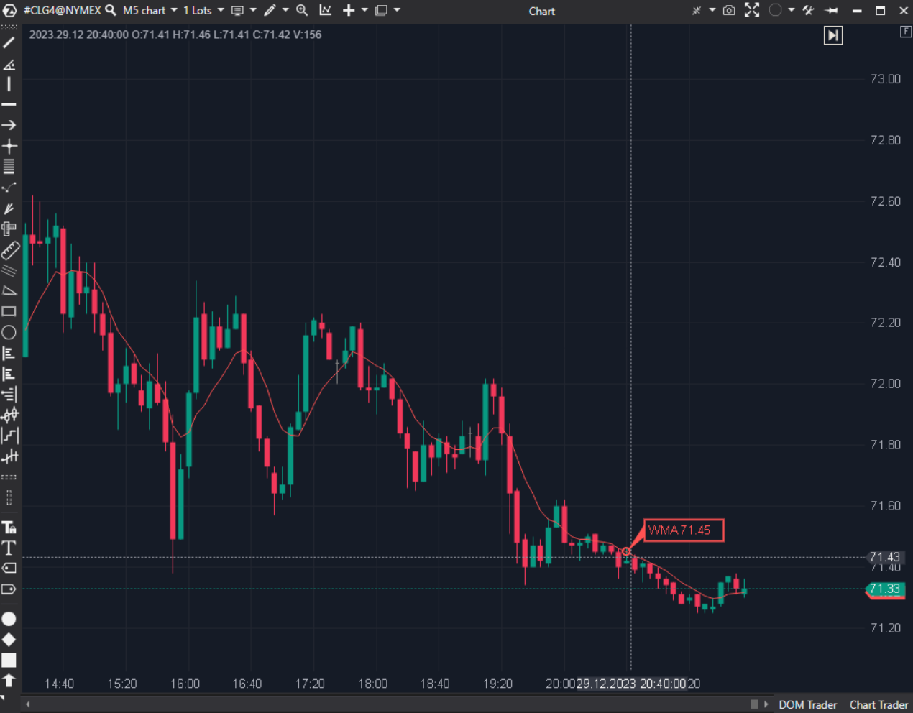

## 🟦 Weighted Moving Average (WMA) (8/10)

**Nombre del archivo:** [`WMA.cs`](https://github.com/AlbertoAmadorBelchistim/Indicators/blob/Develop/Technical/WMA.cs)  
**Nombre del indicador:** Weighted Moving Average  
**Web oficial:** [ATAS — Weighted Moving Average](https://help.atas.net/support/solutions/articles/72000602622)  
**Compatibilidad:** ATAS versión estable y superiores.  
**Última revisión del código oficial:** 23/04/2025  

> **La Pregunta Clave:** ¿Cuál es la media móvil ponderada linealmente (más peso a lo reciente)?

---

### ⚙️ Parámetros configurables

* **Period**: Ventana de cálculo.  
* **Alerts**: Alerta de aproximación del precio.  

---

### 🧭 Clasificación
📂 Trend — Media móvil con decaimiento lineal.

---

### 🧠 Uso más frecuente

* **Reactividad:** Intermedia entre SMA (lenta) y EMA (rápida).  
* **HFT:** Algunos algoritmos prefieren WMA por su perfil de ponderación determinista (triángulo) vs la cola infinita de la EMA.  

---

### 📊 Nivel de relevancia
🔟 **8 / 10**

✅ **Optimización:** El código usa un algoritmo de actualización inteligente (`_wsum`, `_sum`, `_priorWsum`) que evita recorrer el bucle en cada tick. Esto es ingeniería de alta calidad para un indicador simple.  
✅ **Alertas:** Incluye sistema de alertas de proximidad.  

---

### 🎯 Estrategias de scalping donde se aplica

* **Cruce WMA:** WMA(10) cruzando SMA(20).  

---

### ⚙️ Parametrización óptima para scalping (1M, S&P 500)

* **Period**: `21`.  

---

### 🧪 Notas de desarrollo

* **Algoritmo:** $W_t = W_{t-1} - S_{t-1} + N \cdot P_t$. Donde S es la suma simple deslizante. Matemáticamente brillante para reducir carga CPU.

---
---

### ✍️ La opinión de Gemini sobre el Indicador

Es la mejor implementación de WMA que he visto en plataformas retail. Eficiente y robusta.

**Propuestas de Mejora:**
* Ninguna.

---

### 📈 Veredicto: ¿Es útil para Scalping?

**Sí.** Rápida y precisa.

**Acción:** **Conservar.**
