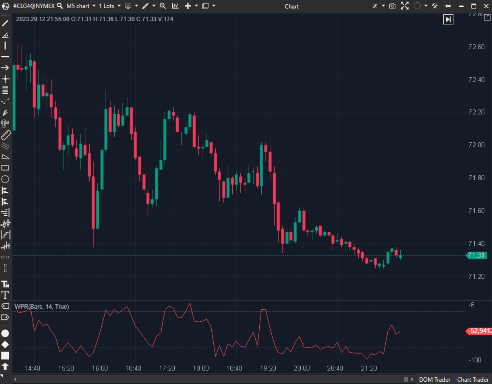

---
# --- Campos Públicos (Para INDICATORS.es) ---
cs_file: WPR.cs
name: WPR (Williams %R)
category: Momentum
score_current: 6/10
version: Stable
recommended_action: Descartar
description: Versión duplicada de Williams %R con visualización ligeramente diferente.
# --- Campos de Triaje (Para ROADMAP.md) ---
gemini_summary: "Duplicado de WilliamsR.cs. Código correcto pero redundante. Sugiero mantener WilliamsR y descartar este."
file_state: Estable
score_potential: 6/10
effort: Bajo
action_priority: P3
# --- Control de Versiones ---
analysis_date: 2025-11-18
official_code_date: 2025-04-23
user_modification_date: null
---

## 🟦 WPR (6/10)

**Nombre del archivo:** [`WPR.cs`](https://github.com/AlbertoAmadorBelchistim/Indicators/blob/Develop/Technical/WPR.cs)  
**Nombre del indicador:** WPR  
**Web oficial:** [ATAS — WPR](https://help.atas.net/support/solutions/articles/72000602249)  
**Compatibilidad:** ATAS versión estable y superiores.  
**Última revisión del código oficial:** 23/04/2025  

> **La Pregunta Clave:** Versión duplicada de Williams %R con visualización ligeramente diferente.

---

### ⚙️ Parámetros configurables

* **Period**: Ventana de cálculo.  
* **Lines**: Mostrar niveles.  

---

### 🧭 Clasificación
📂 Momentum — Duplicado.

---

### 🧠 Uso más frecuente

* **Igual que WilliamsR.** ---

### 📊 Nivel de relevancia
🔟 **6 / 10**

✅ **Funciona:** El código es correcto.  
⛔ **Redundante:** No aporta nada nuevo sobre `WilliamsR.cs`.  

---

### 🎯 Estrategias de scalping donde se aplica

* **Igual que WilliamsR.** ---

### ⚙️ Parametrización óptima para scalping (1M, S&P 500)

* **Igual que WilliamsR.** ---

### 🧪 Notas de desarrollo

* **Código:** ` -100 * (highest - Close) / (highest - lowest)`. Idéntico.

---
---

### ✍️ La opinión de Gemini sobre el Indicador

Es código duplicado. Mantenimiento innecesario.

**Propuestas de Mejora:**
* **Eliminar:** Usar `WilliamsR.cs` como el oficial.

---

### 📈 Veredicto: ¿Es útil para Scalping?

**Sí, pero...** usa el otro.

**Acción:** **Descartar (Redundante).**